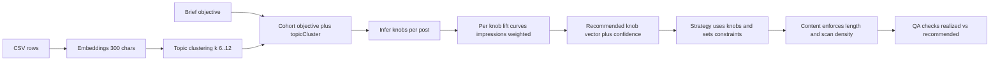

# Analytics MVP Architecture — Knob-centric, Cohort-first (LinkedIn CSV)

Status: Proposed (MVP approved); Scope: LinkedIn only; Data source: CSV uploads
KPI: engagement_rate = (reactions + comments + shares) / impressions; Timeframe: 90 days
Topic derivation: OpenAI embeddings (text-embedding-3-small) on first 300 chars; k=6–12 via silhouette; boosted posts excluded
Cache TTL: 24h; Fallback when below thresholds: objective-only heuristics with low confidence

Why
- Strategy should select 4‑knob settings grounded in platform analytics from similar posts
- “Similar” = same objective + embeddings-derived topic (audience added in Phase 2)
- Output prioritizes a recommended knob vector with expected lift and evidence; hooks are an execution detail

Non-goals (MVP)
- Live LinkedIn API ingestion (CSV only)
- Cross-client benchmarks and audience matching (Phase 2)
- Multivariate modeling beyond univariate knob curves (Phase 2)

High-level architecture

Where this integrates in code
- Strategy agent creation: [awesomeposter/packages/agents-server/src/agents/strategy-manager.ts](awesomeposter/packages/agents-server/src/agents/strategy-manager.ts)
  - Allowlist and instructions: [TypeScript.createStrategyAgent()](awesomeposter/packages/agents-server/src/agents/strategy-manager.ts:77), [TypeScript.STRATEGY_INSTRUCTIONS_APP](awesomeposter/packages/agents-server/src/agents/strategy-manager.ts:15)
- Strategy tools: [awesomeposter/packages/agents-server/src/tools/strategy.ts](awesomeposter/packages/agents-server/src/tools/strategy.ts)
  - Register new tool strategy_get_platform_insights at [TypeScript.registerStrategyTools()](awesomeposter/packages/agents-server/src/tools/strategy.ts:132)
- Orchestrator: [awesomeposter/packages/agents-server/src/services/orchestrator-engine.ts](awesomeposter/packages/agents-server/src/services/orchestrator-engine.ts)
  - Provide objective and topicHint to strategy payload in [TypeScript.runOrchestratorEngine()](awesomeposter/packages/agents-server/src/services/orchestrator-engine.ts:237) at [TypeScript.buildPayloadForCapability()](awesomeposter/packages/agents-server/src/services/orchestrator-engine.ts:317)
- Content tool (enforcement): [awesomeposter/packages/agents-server/src/tools/content.ts](awesomeposter/packages/agents-server/src/tools/content.ts) at [TypeScript.registerContentTools()](awesomeposter/packages/agents-server/src/tools/content.ts:27)
- QA tool (validation): [awesomeposter/packages/agents-server/src/tools/qa.ts](awesomeposter/packages/agents-server/src/tools/qa.ts) at [TypeScript.registerQaTools()](awesomeposter/packages/agents-server/src/tools/qa.ts:7)

Components (MVP)
1) CSV Adapter
- Parses uploaded CSV asset and normalizes fields: created_at, text, impressions, reactions, comments, shares, clicks, media_type, is_boosted, see_more_expands?
- Planned file: [awesomeposter/packages/agents-server/src/services/insights/adapters/csv.ts](awesomeposter/packages/agents-server/src/services/insights/adapters/csv.ts)

2) Topic Builder (embeddings clustering)
- Embeds first 300 chars per row; batches requests; caches by csvAssetId + row hash
- k auto-selected in 6–12 via silhouette; clusters under min size merged to nearest centroid
- Planned files: [awesomeposter/packages/agents-server/src/services/insights/engine/cohort.ts](awesomeposter/packages/agents-server/src/services/insights/engine/cohort.ts)

3) Cohort Filter
- cohort = { platform: linkedin, objective: brief.objective, topicCluster, timeframeDays: 90 }
- Exclude boosted rows from estimates; keep counts in evidence

4) Knob Inference
- formatType: from media_type → enum { text, single_image, multi_image, document_pdf, video }
- hookIntensity: first-line features (numbers, question, contrarian markers, imperative starts, length band) → 0..1
- expertiseDepth: jargon density, how-to signals, tool/library terms → 0..1
- structure.lengthLevel: percentile of first-line length → 0..1
- structure.scanDensity: line breaks and bullets per 200 chars → logistic transform → 0..1
- Planned file: [awesomeposter/packages/agents-server/src/services/insights/engine/knob-inference.ts](awesomeposter/packages/agents-server/src/services/insights/engine/knob-inference.ts)

5) Knob Performance Engine
- KPI: engagement_rate over 90 days; impressions-weighted means per knob bin
- Univariate curves for each knob; per-bin minimums: ≥ 25 posts or ≥ 1k impressions
- Confidence via pooled variance or bootstrap; down-rank unstable bins
- Optional pairwise heatmaps in Phase 2
- Planned file: [awesomeposter/packages/agents-server/src/services/insights/engine/knob-lifts.ts](awesomeposter/packages/agents-server/src/services/insights/engine/knob-lifts.ts)

6) Recommendation Synthesizer
- Choose peak bins accounting for CI overlap; output recommended knob vector with ranges or point
- Compute expectedLiftPct and overall confidence; attach evidence (bin curves, format-type deltas)
- Planned file: [awesomeposter/packages/agents-server/src/services/insights/engine/recommendation.ts](awesomeposter/packages/agents-server/src/services/insights/engine/recommendation.ts)

7) Insights Service and Tool
- InsightsService.getOrComputeInsights: cache lookup → adapter → engines → normalize → cache write → return
- Tool strategy_get_platform_insights: strict zod params; handler calls service and returns PlatformInsights
- Planned files: [awesomeposter/packages/agents-server/src/services/insights/service.ts](awesomeposter/packages/agents-server/src/services/insights/service.ts), [awesomeposter/packages/agents-server/src/tools/strategy.ts](awesomeposter/packages/agents-server/src/tools/strategy.ts)

8) Cache and Persistence
- Cache key: hash(clientId, platform, kpi, timeframeDays, objective, topicCluster)
- DB table platform_insights_cache: { id, clientId, platform, paramsHash, timeframeDays, kpi, payloadJson, evidenceJson, source: csv, createdAt, expiresAt, unique(clientId, platform, paramsHash) }
- Planned migration: [awesomeposter/packages/db/drizzle/0008_platform_insights_cache.sql](awesomeposter/packages/db/drizzle/0008_platform_insights_cache.sql)
- Schema addition: [awesomeposter/packages/db/src/schema.ts](awesomeposter/packages/db/src/schema.ts)

Contracts (shared)
- File: [awesomeposter/packages/shared/src/insights.ts](awesomeposter/packages/shared/src/insights.ts) (export via [awesomeposter/packages/shared/src/index.ts](awesomeposter/packages/shared/src/index.ts))
- PlatformInsightsRequest fields: platform, clientId, briefId?, objective, topicHint?, timeframeDays, kpi, csvAssetId?, columnMap?
- PlatformInsights fields: cohortDescriptor, knobInsights, postingTimes?, mediaRecommendation?, benchmarkEvidence[], complianceNotes?
- knobInsights: recommended knobs, expectedLiftPct, confidence, evidence (univariate bins and format-type deltas), notes?

Strategy, Content, QA behaviors
- Strategy calls strategy_get_platform_insights first, adopts knobInsights.recommended for knobs and writerBrief.knobs, sets writerBrief.constraints (first-line length band, scan density), cites evidence in rationale
- Content enforces constraints (first-line char cap, scan density target) via optimize_for_platform
- QA computes realized knobs on the draft, compares to recommended ranges, and returns impact deltas in feedback

Operational defaults (approved)
- Embeddings: text-embedding-3-small; text window: first 300 chars; k selection: 6–12 via silhouette with small-cluster merge
- Sampling thresholds: cohort ≥ 80 posts; per-bin ≥ 25 posts or ≥ 1k impressions
- Exclude boosted posts from estimates; return boosted counts separately in evidence
- Cache TTL: 24h; Fallback to objective-only heuristics with low confidence below thresholds

Error handling and fallbacks
- Missing columns: attempt columnMap; else return validation error with hints
- Sparse cohort: widen recommended ranges; attach low confidence note; fall back to heuristics if below minimums
- Embedding failures: retry with backoff; if persistent, switch to keyword taxonomy fallback for topics

Observability
- Tool events already surfaced by runtime; attach metrics: tokens, durationMs to tool_result
- Log cohortDescriptor, sampleSize, cache hit or miss, and confidence

Security and privacy
- CSVs processed under client authorization; no scraping; embeddings contain only short text snippets
- No PII required; encrypt secrets; rate limit embedding calls; respect provider terms

Risks and mitigations
- Small accounts: thresholds will often trigger fallbacks; consider lenient thresholds mode later
- Heuristic bias in knob inference: maintain calibration constants; validate against observed outcomes
- Topic drift: refresh cache daily; ensure clustering happens per CSV asset so it reflects recent content

Rollout phases
- Phase 1 (this MVP): CSV adapter, embeddings topics, cohort-first knob lifts, recommended knobs, Strategy/Content/QA wiring, cache and migration
- Phase 2: pairwise interaction surfaces, multivariate estimator, audience matching, durable per-row observations
- Phase 3: provider API ingestion, cross-client anonymized priors by industry

Appendix: Key code points
- Strategy creation: [TypeScript.createStrategyAgent()](awesomeposter/packages/agents-server/src/agents/strategy-manager.ts:77)
- Strategy tools: [TypeScript.registerStrategyTools()](awesomeposter/packages/agents-server/src/tools/strategy.ts:132)
- Orchestrator payload: [TypeScript.runOrchestratorEngine()](awesomeposter/packages/agents-server/src/services/orchestrator-engine.ts:237) → [TypeScript.buildPayloadForCapability()](awesomeposter/packages/agents-server/src/services/orchestrator-engine.ts:317)
- Content optimize: [awesomeposter/packages/agents-server/src/tools/content.ts](awesomeposter/packages/agents-server/src/tools/content.ts)
- QA evaluate: [awesomeposter/packages/agents-server/src/tools/qa.ts](awesomeposter/packages/agents-server/src/tools/qa.ts)