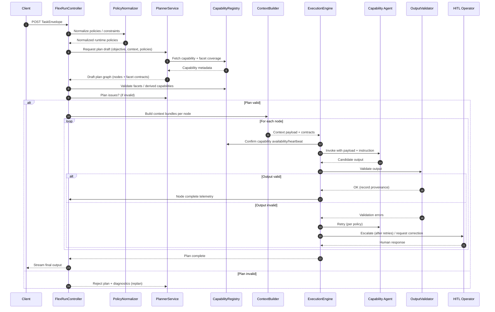
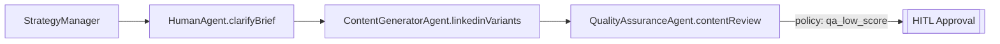
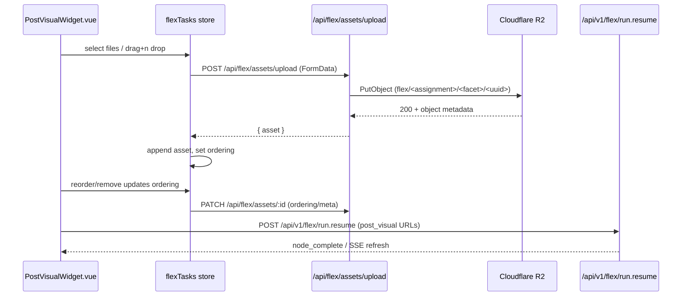

# Flex Agents Server — Architecture Specification

_Last updated: 2025-11-06_


## Table of Contents

- [1. Scope & Goals](#1-scope-goals)
- [2. Non-Goals](#2-non-goals)
- [3. Key Architectural Decisions (Proposed)](#3-key-architectural-decisions-proposed)
- [4. High-Level Architecture](#4-high-level-architecture)
  - [Planner Lifecycle Events](#planner-lifecycle-events)
- [5. Core Concepts](#5-core-concepts)
  - [5.1 TaskEnvelope](#51-taskenvelope)
  - [5.2 OutputContract](#52-outputcontract)
  - [5.3 TaskPolicies](#53-taskpolicies)
    - [PlannerPolicy](#plannerpolicy)
    - [RuntimePolicy](#runtimepolicy)
      - [Runtime Condition Evaluation](#runtime-condition-evaluation)
  - [5.4 PlanGraph](#54-plangraph)
  - [5.5 ContextBundle](#55-contextbundle)
  - [5.6 AgentCapability](#56-agentcapability)
    - [Facet Definition](#facet-definition)
    - [Facet-Aligned Capabilities](#facet-aligned-capabilities)
  - [5.6.1 Capability Registration](#561-capability-registration)
  - [5.6.2 Registration Payload](#562-registration-payload)
  - [5.7 Facet-Based Plan Assembly](#57-facet-based-plan-assembly)
    - [Planning Steps](#planning-steps)
    - [Planner Prompt Blueprint (v2)](#planner-prompt-blueprint-v2)
    - [Story 8.8 Dynamic Assembly Details](#story-88-dynamic-assembly-details)
    - [Execution Runtime](#execution-runtime)
  - [5.8 Planner vs Orchestrator: Hybrid Collaboration](#58-planner-vs-orchestrator-hybrid-collaboration)
    - [Roles & Responsibilities](#roles-responsibilities)
    - [Interaction Sequence](#interaction-sequence)
    - [Collaboration Patterns](#collaboration-patterns)
    - [Derived Capability Handling](#derived-capability-handling)
    - [Failure Modes & Recovery](#failure-modes-recovery)
    - [Why the Hybrid Model Matters](#why-the-hybrid-model-matters)
    - [Planner ↔ Orchestrator Sequence (Mermaid)](#planner-orchestrator-sequence-mermaid)
- [5.9 Output Contracts, Planner Validation, and Policy Semantics](#59-output-contracts-planner-validation-and-policy-semantics)
  - [5.9.1 OutputContract Specification](#591-outputcontract-specification)
  - [5.9.2 Planner Validation and Feedback Loop](#592-planner-validation-and-feedback-loop)
  - [5.9.3 Validator Orchestration, Diagnostics, and Scoring](#593-validator-orchestration-diagnostics-and-scoring)
  - [5.9.4 Feedback Payloads and Telemetry](#594-feedback-payloads-and-telemetry)
  - [5.9.5 Constraints vs. Policies Separation](#595-constraints-vs-policies-separation)
  - [5.9.6 Role Separation and Collaboration](#596-role-separation-and-collaboration)
  - [5.9.7 Policies as Orthogonal Guardrails](#597-policies-as-orthogonal-guardrails)
  - [5.9.8 Conceptual Flow Summary](#598-conceptual-flow-summary)
- [5.10 Policy Simplification (Remove Flow-Control Actions)](#510-policy-simplification-remove-flow-control-actions)
  - [Background](#background)
  - [Deprecated Elements](#deprecated-elements)
  - [Updated RuntimePolicy Action Union](#updated-runtimepolicy-action-union)
  - [Policy Purpose (Post-cleanup)](#policy-purpose-post-cleanup)
  - [Execution Engine Behavior Change](#execution-engine-behavior-change)
  - [Rationale](#rationale)
- [5.11 Reference capability registry](#511-reference-capability-registry)
- [5.12 Reference facet catalog](#512-reference-facet-catalog)
  - [Facet post_context](#facet-post_context)
  - [Facet creative_brief](#facet-creative_brief)
  - [Facet strategic_rationale](#facet-strategic_rationale)
  - [Facet handoff_summary](#facet-handoff_summary)
  - [Facet company_information](#facet-company_information)
  - [Facet feedback](#facet-feedback)
  - [Facet post_copy](#facet-post_copy)
  - [Facet post_visual](#facet-post_visual)
  - [Facet post](#facet-post)
  - [Facet positioning_context](#facet-positioning_context)
  - [Facet positioning_recommendation](#facet-positioning_recommendation)
  - [Facet messaging_stack](#facet-messaging_stack)
  - [Facet: positioning](#facet-positioning)
  - [Facet value_canvas](#facet-value_canvas)
  - [Facet positioning_opportunities](#facet-positioning_opportunities)
- [6. Component Responsibilities](#6-component-responsibilities)
  - [Telemetry & Metrics Parity](#telemetry-metrics-parity)
- [7. Execution Flow](#7-execution-flow)
- [8. HITL and Rehydration Strategy](#8-hitl-and-rehydration-strategy)
- [9. Data Model & Persistence](#9-data-model-persistence)
- [9.1 Capability Registration Flow](#91-capability-registration-flow)
- [10. API Surface (Initial)](#10-api-surface-initial)
  - [10.0.1 Flex Run Streaming Contract](#1001-flex-run-streaming-contract)
  - [10.1 Flex Run Debugging](#101-flex-run-debugging)
  - [10.1 Sample TaskEnvelope](#101-sample-taskenvelope)
- [11. Capability Registry & Agent Contracts](#11-capability-registry-agent-contracts)
  - [Marketing Catalog Rollout & Rollback](#marketing-catalog-rollout-rollback)
  - [Facet Catalog](#facet-catalog)
  - [Current Inventory](#current-inventory)
    - [Contract Compiler & Validation Helpers](#contract-compiler-validation-helpers)
  - [Supporting Utilities](#supporting-utilities)
  - [Developer Sandbox](#developer-sandbox)
  - [Maintenance Checklist](#maintenance-checklist)
- [12. UI & Client Integration](#12-ui-client-integration)
- [13. Migration & Rollout Strategy](#13-migration-rollout-strategy)
- [13. Verification](#13-verification)
- [14. Risks & Open Questions](#14-risks-open-questions)
- [15. Supporting Human Agents](#15-supporting-human-agents)
  - [15.1 Concept Overview](#151-concept-overview)
  - [15.x HITL Clarify Extension](#15x-hitl-clarify-extension)
  - [15.2 Design Principles](#152-design-principles)
  - [15.3 Implementation Alignment](#153-implementation-alignment)
  - [15.4 Facet-Driven Task Surfaces](#154-facet-driven-task-surfaces)
    - [15.4.1 Facet Widget Namespace Convention](#1541-facet-widget-namespace-convention)
  - [15.5 Notification and Assignment Model](#155-notification-and-assignment-model)
  - [15.6 Planner Behavior](#156-planner-behavior)
  - [15.7 Benefits and Alignment](#157-benefits-and-alignment)
  - [15.8 Example](#158-example)
  - [15.9 Offline and Notification Semantics](#159-offline-and-notification-semantics)
  - [15.10 Registration & Governance Notes](#1510-registration-governance-notes)
- [15.11 Post Visual R2 Endpoint Patterns](#1511-post-visual-r2-endpoint-patterns)
  - [Summary](#summary)
  - [Goals](#goals)
  - [Non-Goals](#non-goals)
  - [Existing Pattern: Brief Uploads](#existing-pattern-brief-uploads)
  - [Flex Post Visual Flow](#flex-post-visual-flow)
    - [Storage Key & Metadata](#storage-key-metadata)
    - [Endpoint Contracts](#endpoint-contracts)
    - [Sequence](#sequence)
  - [Implementation Notes](#implementation-notes)
  - [Error Handling & Observability](#error-handling-observability)
  - [Open Questions](#open-questions)
- [16. Retrieval Knowledge Stores](#16-retrieval-knowledge-stores)

## 1. Scope & Goals
- Deliver a runtime-adaptable orchestration service where clients submit natural-language objectives and exact JSON output contracts.
- Support planner-driven decomposition that uses an agent capability registry and real-time preferences rather than hard-coded workflows.
- Preserve human-in-the-loop (HITL) interrupts, rehydration, and streaming telemetry already trusted in the existing agents server.
- Provide a drop-in backend for the new “Create Post” popup while staying generically useful for future marketing and ops use cases.
- Allow new policy needs (for example “produce two variants”) to be satisfied at runtime without shipping server code or configuration changes.

## 2. Non-Goals
- Replace or refactor the current agents server until the flex variant reaches feature parity.
- Redesign the SPA/Nitro API beyond the new flex entry point and popup wiring.
- Introduce new specialist agents that are unrelated to marketing flows; focus first on orchestrator flexibility.
- Deliver comprehensive analytics dashboards; basic logging and metrics parity with the current server is sufficient for launch.

## 3. Key Architectural Decisions (Proposed)
- Clone `packages/agents-server/` into `packages/flex-agents-server/`, retaining the Nitro runtime, shared utilities, and deployment footprint.
- Expose a new SSE endpoint `POST /api/v1/flex/run.stream` that accepts a `TaskEnvelope` containing objectives, constraints, and a client-supplied JSON Schema contract.
- Rely on the `TaskEnvelope` to carry all runtime policies (client-specific variants, brand safety directives, etc.); the orchestrator remains stateless with no separate preference lookup layer.
- Represent agent abilities in a `CapabilityRegistry` (static metadata plus optional embeddings) so the planner can map requested outcomes to available agents/tools.
- Use `Zod + Ajv` validation to enforce the client schema before emitting final responses, returning structured validation errors over the stream if expectations are not met.
- Keep persistence and HITL semantics compatible with the existing schema, extending tables where necessary rather than starting a separate database.

## 4. High-Level Architecture
The flex server keeps the familiar Nitro deployment but swaps the orchestration core for task envelopes, runtime planning, and dynamic context packaging.

```

### Planner Lifecycle Events

1. **`plan_requested`** – After policies are normalized the controller emits this frame, capturing the active capability snapshot, normalized policy keys, and the planner attempt number so clients can render a pending state.
2. **`plan_rejected`** – `PlannerValidationService` validates facet coverage, capability availability, and schema compilation. Failures surface as diagnostics inside `plan_rejected`; the controller immediately requests a revised draft while the run remains paused.
3. **`plan_generated`** – On acceptance the finalized `PlanGraph` (version, node summaries, derived metadata) is emitted and execution begins.
4. **`policy_triggered` + `plan_updated`** – Runtime policy breaches (variant limits, operator feedback, enforcement results) emit `policy_triggered`, request a planner delta, persist a new plan version, and stream `plan_updated` so clients reconcile the new graph before dispatch resumes.

+-----------+      +--------------------+      +--------------------+      +------------------+
| Client UI | ---> | Flex Agents API    | ---> | Planner & Policies | ---> | Execution Engine |
+-----------+      +--------------------+      +--------------------+      +------------------+
      ^                     |                              |                          |
      |                     v                              v                          v
      |            +----------------+            +-------------------+      +----------------------+
      +------------| HITL & Resume  |<-----------| Persistence Layer |<-----| Capability Registry  |
                   +----------------+            +-------------------+      +----------------------+
```

## 5. Core Concepts
All canonical types and Zod validators for the concepts below are exported from `@awesomeposter/shared/flex` (source: `packages/shared/src/flex/types.ts`). Planner, agents, and UI code should import from that module to stay in sync.
### 5.1 TaskEnvelope
Canonical request payload containing `objective`, `inputs`, `constraints`, `outputContract`, `policies`, `goal_condition` and caller metadata. The orchestrator never assumes fields beyond what the envelope expresses.

**Facet goal predicates.** `goal_condition` is an optional array of `FacetCondition` objects exported from `@awesomeposter/shared/flex`. Each condition targets a facet (for example `post_copy`), drills into its payload via a JSON-pointer-style `path`, and wraps a Condition DSL envelope (`{ dsl, canonicalDsl?, jsonLogic?, warnings?, variables? }`). The planner and runtime treat the array with AND semantics: every listed facet predicate must evaluate truthy before the run is considered complete. This keeps completion logic explicit, reusable for capability pre/post guards, and aligned with the shared Condition DSL tooling described in [Condition DSL Parser & Validation](../condition-dsl.md#condition-dsl-parser--validation).

**Facet state references.** Callers should reference paths that resolve within the facet snapshot published by the capability (for example `/value[0].status`). The orchestrator forwards the condition payloads unchanged so downstream services can evaluate them beside facet catalogs and capability provenance.

**Runtime evaluation + telemetry.** The execution engine evaluates every `goal_condition` entry once terminal nodes succeed and exposes the results as `payload.goal_condition_results` on the final `complete` SSE frame. Each result includes the facet name, JSON-pointer path, canonical expression, satisfaction flag, and any runtime error message. The same array is stored in `flex_run_outputs.goal_condition_results_json` so replans and operator tools can see which predicates failed without replaying the run. Telemetry publishes aggregate counts via the `flex_goal_condition_evaluated` log and the `flex.goal_condition.*` histograms.

### 5.2 OutputContract
Client-supplied JSON Schema plus optional post-processing hints (for example field ordering). The validator enforces the schema before finalizing a run; the orchestrator may also use it to derive intermediate expectations.

### 5.3 TaskPolicies
`TaskEnvelope.policies` carries caller-authored guidance that shapes both the graph the planner proposes and the way the runtime reacts while executing it. The payload is strictly declarative – the orchestrator never infers hidden defaults – and is normalized before any planning begins.

```ts
export interface TaskPolicies {
  /** Policies that influence how the plan is generated. */
  planner?: PlannerPolicy;

  /** Policies that govern runtime behavior after planning. */
  runtime?: RuntimePolicy[];
}
```

All helpers inside `@awesomeposter/shared/flex` import these definitions, keeping the planner, runtime, and UI in lockstep.

#### PlannerPolicy
Planner policies constrain graph generation (structure, required capabilities, optimisation goals) and surface free-form hints the planner can serialize directly into prompts.

```ts
export interface PlannerPolicy {
  /** Structural constraints on the plan itself */
  topology?: {
    variantCount?: number;
    maxDepth?: number;
    requiredKinds?: string[];
    forbiddenKinds?: string[];
  };

  /** Unified capability and node selection preferences */
  selection?: {
    require?: string[];
    forbid?: string[];
    prefer?: string[];
    avoid?: string[];
  };

  /** High-level optimisation intent */
  optimisation?: {
    objective?: "speed" | "quality" | "diversity" | "token_efficiency";
    maxTokens?: number;
  };

  /** Free-form hints for planner prompt injection */
  directives?: Record<string, unknown>;
}
```

#### RuntimePolicy
Runtime policies watch execution signals and request a unified `Action` when their trigger criteria match. The orchestrator evaluates these policies deterministically, records the trigger metadata, and hands control to the requested action handler.

```ts
export type Action =
  | { type: "goto"; next: string; maxAttempts?: number }
  | { type: "replan"; rationale?: string }
  | {
      type: "hitl"
      rationale?: string
      approveAction?: Action
      rejectAction?: Action
    }
  | { type: "fail"; message?: string }
  | { type: "pause"; reason?: string }
  | { type: "emit"; event: string; payload?: Record<string, any> };

export interface RuntimePolicy {
  id: string
  enabled?: boolean
  trigger: PolicyTrigger
  action: Action
}

export type PolicyTrigger =
  | { kind: "onStart" }
  | { kind: "onNodeComplete"; selector?: NodeSelector; condition?: Record<string, any> }
  | { kind: "onValidationFail"; selector?: NodeSelector; condition?: Record<string, any> }
  | { kind: "onTimeout"; ms: number }
  | { kind: "onMetricBelow"; metric: string; threshold: number }
  | { kind: "manual" };

export interface NodeSelector {
  nodeId?: string;
  kind?: string;
  capabilityId?: string;
}
```

Runtime policy validation now rejects unknown action names with migration hints (for example `hitl_pause → hitl`) so callers only reference the canonical union above. `goto` handlers track per-policy attempt counts and stop retrying once `maxAttempts` (default `1`) is exhausted. `hitl` directives can chain follow-up `Action`s that execute once the operator approves or rejects a request; approval defaults to “resume” when no nested action is supplied while rejection falls back to a terminal `fail`. `pause` actions persist the full execution snapshot – including policy state – so resumptions continue deterministically without re-planning.

##### Runtime Condition Evaluation

- Supported JSON-Logic operators: logical combinators (`and`, `or`, `!`), comparison operators (`==`, `!=`, `<`, `<=`, `>`, `>=`), variable references (`var`), and array quantifiers (`some`, `all`).
- `some` returns `true` once any element in the target array satisfies the predicate; missing or empty arrays resolve to `false`.
- `all` returns `true` only when every element satisfies the predicate; empty arrays resolve to `false`.
- When referencing array payloads (for example `{"var": "metadata.runContextSnapshot.facets.recommendationSet.value"}`) callers must ensure the path resolves to an array. Non-array values trigger `invalid_condition` errors with descriptive messaging so misconfigured policies surface quickly.
- Predicate expressions execute in the scope of each element, so `{"var": "resolution"}` and nested paths like `{"var": "item.score"}` refer to fields on the current element while still allowing access to the root payload.

**Condition DSL metadata.** Task envelopes may now submit a DSL string instead of raw JSON-Logic under `trigger.condition`. The policy normalizer compiles the DSL with the shared catalog, stores the canonical JSON-Logic output, and preserves the original DSL (plus any parser warnings and referenced variable paths) so the UI can round-trip edits without lossy conversions. The normalized shape is:

```ts
{
  jsonLogic: JsonLogicExpression
  dsl?: string
  canonicalDsl?: string
  warnings?: ConditionDslWarning[]
  variables?: string[]
}
```

Legacy JSON-only policies continue to work unchanged—the runtime will treat any plain object as JSON-Logic and skip DSL metadata.

Example payload:

```json
{
  "policies": {
    "planner": {
      "topology": { "variantCount": 3 },
      "selection": {
        "require": ["QualityAssuranceAgent.contentReview"],
        "forbid": ["LegacyGeneratorAgent"],
        "prefer": ["ContentGeneratorAgent.linkedinVariants"]
      },
      "optimisation": { "objective": "quality" }
    },
    "runtime": [
      {
        "id": "low_quality_replan",
        "trigger": {
          "kind": "onNodeComplete",
          "selector": { "kind": "validation" },
          "condition": {
            "dsl": "facets.planKnobs.hookIntensity < 0.6",
            "canonicalDsl": "facets.planKnobs.hookIntensity < 0.6",
            "jsonLogic": { "<": [{ "var": "metadata.runContextSnapshot.facets.planKnobs.value.hookIntensity" }, 0.6] }
          }
        },
        "action": { "type": "replan", "rationale": "Low QA score" }
      },
      {
        "id": "medium_quality_hitl",
        "trigger": {
          "kind": "onNodeComplete",
          "selector": { "kind": "validation" },
          "condition": {
            "dsl": "facets.planKnobs.hookIntensity >= 0.6 && facets.planKnobs.hookIntensity < 0.9",
            "canonicalDsl": "facets.planKnobs.hookIntensity >= 0.6 && facets.planKnobs.hookIntensity < 0.9",
            "jsonLogic": {
              "and": [
                { ">=": [{ "var": "metadata.runContextSnapshot.facets.planKnobs.value.hookIntensity" }, 0.6] },
                { "<": [{ "var": "metadata.runContextSnapshot.facets.planKnobs.value.hookIntensity" }, 0.9] }
              ]
            }
          }
        },
        "action": { "type": "hitl", "rationale": "Medium quality requires review" }
      }
    ]
  }
}
```

> **Note:** Action verb names (`hitl`, `fail`, `emit`, etc.) reflect the canonical shared enum. Execution stories (8.23, 8.24) will align dispatcher terminology so runtime wiring matches these identifiers.

> **Adapter Today:** The orchestrator emits canonical `Action.type` values in telemetry and attaches the policy ID that triggered a replan. Internal handlers still translate to legacy dispatcher verbs (`hitl_pause`, `fail_run`, ...) until Stories 8.23/8.24 land.

### 5.4 PlanGraph
A DAG generated per run describing specialist tasks, dependencies, and guard conditions. Nodes capture the selected agent/tool, expected `ContextBundle`, and the return contract the orchestrator expects (structured schema or free-form instructions the orchestrator can post-process).

### 5.5 ContextBundle
Payload compiled for each agent invocation that includes the relevant slice of the envelope, prior validated outputs, knowledge snippets, and explicit return expectations.

### 5.6 AgentCapability
Registry entries advertising an agent’s competencies, IO expectations, cost profile, and preferred models. The planner matches plan nodes to capabilities at runtime.

#### Facet Definition
- `Facet` objects are the semantic primitives the planner uses when composing contracts. Each facet defines a reusable slice of meaning – tone, brief, compliance rubric – that can be merged into node contracts.
- Author and register facets in `packages/shared/src/flex/facets/catalog.ts` using the shared `FacetCatalog` utilities. The catalog is loaded everywhere via `getFacetCatalog()` so the planner, execution layer, and tests read the same source of truth.
- Core what
Example:

```json
{
  "name": "toneOfVoice",
  "title": "Tone of Voice",
  "description": "Adjusts emotional style and diction of the generated text.",
  "schema": {
    "type": "string",
    "enum": ["friendly", "professional", "inspiring"]
  },
  "semantics": "Agent should skew language, phrasing, word choice to reflect the tone value.",
  "metadata": {
    "version": "v1",
    "directionality": "input"
  }
}
```

#### Facet-Aligned Capabilities
- Each capability declares the facets it consumes via its `inputContract` (array of facet names) and the facets it produces via its `outputContract`.
- Declared facets must remain a subset of what the owning agent can support; this keeps planner reasoning consistent even if the agent serves many roles.
- During planning, the orchestrator can **derive** a capability by checking whether an agent’s supported facets can satisfy the requested facet mix, even if that exact capability was not explicitly registered. Derived capabilities are flagged on the plan node for auditing.
- Contracts are assembled dynamically by merging the schema of all selected facets, so new facets can be introduced without editing planner code.

### 5.6.1 Capability Registration
Agents self-register with the orchestrator during startup (or when hot-loaded). Each agent posts a `CapabilityRegistration` payload describing its identifiers, strengths, supported locales, preferred models, facet coverage (`inputContract`/`outputContract` arrays), and heartbeat metadata. The orchestrator persists the record, tracks health/heartbeat metadata, and updates the `CapabilityRegistry` so planners always operate on live data. Multiple instances of the same capability can register with distinct scopes (for example `writer.en`, `writer.fr`), enabling runtime selection and graceful degradation when one instance is unavailable.

### 5.6.2 Registration Payload
Registration payloads share a stable contract so the orchestrator can validate and cache metadata.

```json
{
  "capabilityId": "writer.en",
  "agentType": "ai",
  "version": "2025.03.02",
  "displayName": "Content Writer (English)",
  "summary": "Creates long-form and social copy in English with brand-aware tone controls.",
  "inputTraits": {
    "languages": ["en"],
    "formats": ["linkedIn_post", "twitter_thread"],
    "strengths": ["brand_voice_alignment", "cta_generation"],
    "limitations": ["no_paid_ads_claims"]
  },
  "inputContract": ["toneOfVoice", "writerBrief", "audienceProfile"],
  "outputContract": ["copyVariants", "rationaleSummary"],
  "cost": { "tier": "standard", "estimatedTokens": 6000 },
  "preferredModels": ["gpt-5.1"],
  "heartbeat": { "intervalSeconds": 60 },
  "metadata": {
    "owner": "marketing-ai",
    "docsUrl": "https://internal.docs/agents/writer-en"
  }
}
```

**Field overview**
- `capabilityId` (string, required): globally unique identifier used in plan nodes.
- `agentType` (string, required "human" | "ai")
- `version` (string, required): semantic or timestamp version of the agent configuration.
- `displayName` (string, required): human-readable name shown in tooling and logs.
- `summary` (string, required): concise capability description.
- `inputTraits` (object, optional): declared coverage such as supported languages, formats, strengths, and limitations.
- `inputContract` (array of strings, required): facet names this capability consumes when invoked.
- `outputContract` (array of strings, required): facet names this capability produces; planner merges them into downstream contracts.
- `cost` (object, optional): estimates around token usage or pricing tier for planner budgeting.
- `preferredModels` (array, optional): ranked list of model IDs the agent is tuned for.
- `heartbeat` (object, optional): heartbeat expectations (intervals/timeout) so the orchestrator can mark stale registrations.
- `metadata` (object, optional): free-form key/value pairs (owner, documentation URLs, rollout flags).
- Legacy JSON Schema contracts are deprecated in favor of facet arrays; remove any freeform payloads during migration.

### 5.7 Facet-Based Plan Assembly
Facet-driven contracts let the planner assemble dynamic graphs without hard-coding role sequences. Every node’s contract is stitched together at runtime by selecting the right facets, merging their schemas, and attaching the semantics needed for downstream agents (or humans) to act predictably.

#### Planning Steps
1. **Select agent and capability.**
   - Prefer an agent that already publishes a matching capability.
   - If none exist, derive a capability by confirming the agent supports the required facets; mark the node as derived for traceability.
2. **Activate the facets to use.**
   - Examine envelope objective, policies, constraints, and prior outputs.
   - For declared capabilities, choose a subset of the published `inputContract`/`outputContract` facets.
   - For derived capabilities, pick the facet mix that best covers the requested outcome.
3. **Merge schemas into contracts.**
   - `inputSchema = FacetContractCompiler.compileContracts(selectedInputFacets)`
   - `outputSchema = FacetContractCompiler.compileContracts(selectedOutputFacets)`
   - Preserve facet provenance so validators and telemetry can explain where each schema fragment originated. The compiler already returns provenance metadata and Ajv validators via `CompiledFacetSchema`.
4. **Compose the system instruction.**
   - Concatenate guidance from the selected facets’ `semantics`.
   - Example: “Use toneOfVoice to adjust diction; apply writerBrief context; emit copyVariants output.”
5. **Annotate the plan node.**
   - Store `agentId`, `capabilityId` (or `derivedFrom`), the selected facet arrays, resolved schemas, merged system instruction, retry/fallback policy, and a rationale blob for debugging.

#### Planner Prompt Blueprint (v2)
- **System message framing:** The PlannerService system prompt is partitioned into clearly labeled sections—`SYSTEM`, `SCHEMA DEFINITION`, `CONTEXT`, `FACET CATALOG SUMMARY`, `CAPABILITY REGISTRY SUMMARY`, `PLANNER RULES`, `INTERNAL CHECKLIST`, `EXAMPLE REASONING`, and `OUTPUT INSTRUCTIONS`. The schema block mirrors the PlanGraph contract verbatim so downstream validation stays in sync while the facet/capability sections direct the model to the tables rendered in the user prompt.
- **System prompt data tables:** The generated system message injects facet (`Facet`, `Direction`, `Description`) and capability (`Capability ID`, `Display Name`, `Kind`, `Input Facets`, `Output Facets`, `Summary`) tables built from the live catalog/registry snapshot. Rows are trimmed to context-relevant entries while preserving catalog ordering so the LLM operates on authoritative metadata without bloating the user prompt.
- **User prompt focus:** The user message now concentrates on the task envelope, planner hints, policies, special instructions, and current graph context, reducing duplication while keeping the planner grounded in run-specific details.
- **Context walkthrough:** Envelope objective, planner directives, policies, inputs, output contract, and any existing graph context are summarized in compact sections ahead of the tables. Special instructions and legacy policy markers surface inline so the planner can reason about constraints before composing nodes.
- **Checklist + diagnostics guardrails:** The internal checklist from the Prompt Blueprint now lives in both the system instructions and the user message reminder to reinforce facet coverage, capability validity, and rationale requirements. Guidance about diagnostics vs. invented nodes is word-for-word with the blueprint to maintain orchestration parity.
- **Prompt telemetry:** PlannerService records system/user character counts and rendered row counts through `flex.planner.prompt.*` histograms. This enables the orchestrator telemetry feed to track prompt efficiency regressions and correlate token budgets to plan quality.

#### Story 8.8 Dynamic Assembly Details
- **Live registry hydration:** During planning the orchestrator hydrates the latest capability snapshot (strategy, generation, QA, transformation helpers) and facet catalog definitions. Capability selections record coverage gaps so derived nodes are transparent.
- **Capability scoring:** Candidates are scored on facet alignment, envelope-derived channel/format hints, language support, and declared costs. A configurable cutoff prevents low-confidence matches from entering the graph; derived selections are annotated when the planner leans on a capability outside its highest-confidence traits.
- **Plan taxonomy:** Generated plan graphs now include `structuring`, optional `branch`, `routing`, `execution`, `transformation`, `validation`, and `fallback` nodes. Each node carries compiled input/output schemas (via `FacetContractCompiler`), provenance arrays, and expectations the execution engine reuses for validation. Routing nodes declare `routes[]`/`elseTo` entries using the Condition DSL so the deterministic step can emit explicit DAG edges while keeping runtime scheduling immutable.
- **Branch expansion:** Pre-execution branch directives (e.g., `policies.branchVariants`) produce dedicated branch nodes linked between strategy and execution nodes. Branch nodes inherit facet provenance and node metadata so downstream tooling can visualise the branch origin.
- **Normalization nodes:** When caller output contracts require JSON schema enforcement the planner injects a `transformation` node after the execution stage. The node is virtual (orchestrator-managed) but records provenance, instructions, and plan wiring so downstream services can normalise outputs without custom glue code.
- **Fallback wiring:** Every plan terminates with a fallback/HITL node that references the terminal execution node. The fallback node captures escalation instructions, facet rationale, and policy triggers so the execution engine can enter HITL mode without regenerating the plan.
- **PlannerService (LLM-backed):** Planner prompts an LLM for draft nodes, capturing `plannerRuntime`/`plannerModel` metadata. A deterministic fallback draft keeps runs functional when the model is unavailable.
- **Metadata & versioning:** Plans include `planVersion`, `planVersionTag`, branch counts, derived capability lists, and a `normalizationInjected` flag. Telemetry surfaces this metadata alongside SSE `plan_generated` events, enabling UI clients to highlight active branches, derived nodes, and policy wiring.

#### Execution Runtime
1. **Validate inputs.** Reject immediately if the payload fails the resolved `inputSchema`; do not call the agent.
2. **Invoke the agent or human.** Provide the payload, merged instruction, and any facet-specific metadata.
3. **Validate outputs.** Run contract checks against the resolved `outputSchema`; on failure, follow node retry strategy, then fallback (alternate capability or HITL) once retries exhaust.
4. **Persist state.** Record inputs, outputs, validation errors, derived capability markers, and node status to support rehydration and audits.
5. **Propagate downstream.** On success, hand the validated output to dependent nodes. For fallbacks, follow the alternate edges defined during planning.

> Intermediate artifacts (writer briefs, rubric scores, normalization transforms) are represented as facet-driven contracts just like client deliverables. When transformation or post-processing is required, the planner injects dedicated nodes so conversions remain in-band and fully traceable.

### 5.8 Planner vs Orchestrator: Hybrid Collaboration
The flex stack pairs the LLM-backed `PlannerService` with the deterministic orchestration layer (`FlexRunController`, `PolicyNormalizer`, `CapabilityRegistry`, `ContextBuilder`, `ExecutionEngine`, `OutputValidator`, `PersistenceService`, `TelemetryService`). The planner excels at interpreting fuzzy objectives; the orchestration layer guarantees contracts, execution order, and safety. Planner proposes; orchestrator compiles, enforces, and executes.

#### Roles & Responsibilities

| Component | Role | Strengths / Why Use It | Boundaries / Constraints |
| --- | --- | --- | --- |
| `PlannerService` (LLM-backed) | Interpret objectives, decompose into subtasks, recommend agent + capability pairings, suggest facet activation, and draft system instructions. | Flexible reasoning, rapid adaptation to new objectives, can infer structure from context. | Must not commit irreversible state changes; every plan is validated before execution. |
| Orchestration Layer (`FlexRunController` + `PolicyNormalizer` + `CapabilityRegistry` + `ContextBuilder` + `ExecutionEngine` + `OutputValidator`) | Validate the draft plan, compile explicit contracts, enforce constraints, route tasks, coordinate retries/fallbacks/HITL, and drive execution while persisting telemetry. | Predictable, auditable, reliable; maintains invariants and compliance. | Must not guess beyond deterministic rules; rejects invalid plans or sends them back for revision. |

#### Interaction Sequence
1. **Objective submission.** Client posts a `TaskEnvelope` containing the objective, context, and constraints.
2. **Planning phase (`PlannerService`).**
   - `PlannerService` inspects objective, context, facet registry, and capability metadata (via `CapabilityRegistry` read APIs).
   - It assembles a draft plan graph: nodes include `agentId`, `capabilityId` (declared or derived), `inputContract`/`outputContract` facet arrays, and proposed system instructions.
3. **Plan validation & compilation (orchestration layer).**
   - `FlexRunController`, working with `CapabilityRegistry`, merges facets into explicit input/output schemas.
   - `CapabilityRegistry` confirms the agent supports every referenced facet; derived capability safeguards are applied when needed.
   - Contracts are compiled with Ajv/Zod; `PlannerService` receives rejection diagnostics if inconsistencies surface.
4. **Execution (`ContextBuilder` + `ExecutionEngine` + `OutputValidator`).**
   - `ContextBuilder` prepares inputs for each node; `ExecutionEngine` validates them before dispatch.
   - `ExecutionEngine` invokes the agent (or human) with payload + compiled instruction.
   - `OutputValidator` checks outputs, applies retry policy, and escalates to fallbacks or HITL through `ExecutionEngine` when retries exhaust.
   - `PersistenceService` and `TelemetryService` capture status, inputs, outputs, and diagnostics.
5. **Replanning (optional).**
   - `ExecutionEngine` or `PolicyNormalizer` can request a revised plan when constraints shift or nodes fail.
   - `PlannerService` returns deltas; orchestration components revalidate, patch the graph, and resume.
6. **Completion.**
   - `ExecutionEngine` confirms terminal nodes succeeded, `OutputValidator` verifies caller contracts, and `FlexRunController` emits the final response.

#### Collaboration Patterns
- **Plan-and-Solve:** Planner generates the full plan up front; orchestrator executes sequentially. High predictability, lower adaptability mid-run.
- **Interleaved / ReAct style:** Planner and orchestrator alternate—plan a node, execute, reassess. Adapts quickly but requires stronger guardrails.
- **Fallback proposals:** Planner may pre-encode alternates or fallbacks; orchestrator chooses the best candidate at runtime based on health, cost, or performance.

#### Derived Capability Handling
- Planner may target an agent for an unlisted capability by proposing facet arrays.
- `CapabilityRegistry` verifies facet support, `ExecutionEngine` flags the node as derived, tightens retries/logging, and routes through HITL if needed.
- Stable success across runs is a signal to formalize the pairing as a declared capability owned by the responsible agent team.

#### Failure Modes & Recovery

| Failure Mode | Detection Point | Recovery Strategy |
| --- | --- | --- |
| Invalid facet combination | `CapabilityRegistry` / `PlannerService` validation | Reject node, return diagnostics to `PlannerService` for regeneration. |
| Schema compilation conflict | `FlexRunController` / contract compiler | Filter conflicting facets or request planner revisions. |
| Input validation failure | `ExecutionEngine` pre-dispatch | Fail fast, surface to planner or caller; optionally replan upstream. |
| Output validation failure | `OutputValidator` post-dispatch | Retry per policy, then fallback to alternate agent or HITL. |
| Agent crash / runtime error | `ExecutionEngine` runtime | Retry, switch to fallback, or escalate to human operator. |
| Mid-flow constraint drift | `ExecutionEngine` / `TelemetryService` monitoring | Trigger replanning to insert corrective nodes or adjust routing. |

#### Why the Hybrid Model Matters
- **Balanced flexibility and control:** Planner adapts to ambiguous objectives while orchestrator enforces invariants.
- **Safety net for generative systems:** All planner proposals are validated before any side effects occur.
- **Traceability:** Every node records provenance, instructions, and validation outcomes for auditing.
- **Iterative evolution:** Responsibilities can shift over time—formalize successful patterns deterministically or give the planner more autonomy once guardrails prove effective.

> The sequence below illustrates planner ↔ orchestrator loops, highlighting guardrails, validation gates, and replanning hooks.

#### Planner ↔ Orchestrator Sequence (Mermaid)



## 5.9 Output Contracts, Planner Validation, and Policy Semantics

**Overview**

This section defines how envelopes express outcome contracts, how the planner/validator loop proves symbolic satisfiability, and how runtime policies remain orthogonal guardrails. The intent is a contract → plan → proof → run → guardrail pipeline with deterministic validation at every gate.

### 5.9.1 OutputContract Specification

```ts
export interface OutputContract {
  /** JSON Schema describing expected shape and type of the result. */
  schema: JSONSchema7

  /** Optional post-processing hints (field order, normalization preferences, etc.). */
  hints?: Record<string, unknown>

  /** Declarative constraints that must hold true on the final output. */
  constraints?: ConstraintSpec[]
}

export interface ConstraintSpec {
  /** JSONLogic-style expression over the output structure. */
  expr: Record<string, any>

  /** Severity of the constraint. Determines planner responsibility. */
  level: 'hard' | 'soft' | 'informational'

  /** Optional description or rationale for planner feedback. */
  rationale?: string
}
```

**Semantics**

- `schema` defines the full merged contract a valid output must satisfy.
- `constraints` declare truths about that structure; they never encode actions or procedural hints.
- The planner must produce a plan graph that can, in principle, satisfy every `hard` constraint using the capabilities it selects.
- The validator operates symbolically over node metadata and merged contracts; runtime validation simply confirms the already-proven truths.

**Severity semantics (hard/soft/informational)**

- `hard`
  - Effect: any unsatisfied hard constraint blocks `plan_generated` (validator emits `plan_rejected`).
  - Planner responsibility: propose a plan that can satisfy every hard constraint symbolically (producer + enforcement path).
- `soft`
  - Effect: never blocks `plan_generated`. Unsatisfied soft rules lower `satisfactionScore` and surface as diagnostics with `cause: unsatisfied_soft`. Missing producers still emit non-blocking guidance so the planner can optimize subsequent drafts.
- `informational`
  - Effect: does not influence acceptance or scoring. Serves as advisory context for the planner and UI only.

### 5.9.2 Planner Validation and Feedback Loop

Planner validation is a deterministic, test-driven cycle:

1. **Draft proposal** – `PlannerService` (LLM-backed) receives the normalized `TaskEnvelope` (objective, outputContract, constraints, policies) and emits a candidate `PlanGraph`.
2. **Structural validation** – `PlannerValidationService` proves DAG integrity, node completeness, facet directionality, and schema compilability (Ajv/Zod).
3. **Constraint satisfaction testing** – `PlanSatisfactionTester` evaluates the plan symbolically, confirming a producer/enforcer exists for every declared constraint level and recording per-constraint scores.
4. **Feedback emission**
   - If all hard constraints are satisfiable → emit `plan_generated`.
   - If any hard constraint fails → emit `plan_rejected` with structured diagnostics specific to the failing node or capability.
5. **Planner iteration** – the LLM receives deterministic diagnostics and regenerates until acceptance. Prompt scaffolding references `constraintId`, `cause`, and `suggestion` directly so the loop converges quickly.

### 5.9.3 Validator Orchestration, Diagnostics, and Scoring

```
PlannerService (LLM draft PlanGraph)
        │
        ▼
StructuralValidator ─┐
  - DAG integrity     │
  - node shape        │
                      │
FacetValidator ───────┤   → PlanDiagnostic[]
  - input/output      │
  - facet coverage    │
                      │
ConstraintValidator ──┘
  - hard/soft/info constraints

           ▼
DiagnosticsMerger
  - dedupe key: (constraintId∥hash, nodeId∥*, cause)
  - severity dominance (hard > soft > informational)
  - aggregate unique suggestions (newline separated)
  - sort: severity → constraintId → nodeId
  - compute bundle status + satisfactionScore
           │
           ├─ status = rejected              → emit plan_rejected.payload
           └─ status = accepted/with_findings → emit plan_generated.payload
```

```ts
export interface PlanDiagnostic {
  severity: 'hard' | 'soft' | 'informational'
  status: 'unsatisfied' | 'satisfied' | 'unknown'
  constraint?: string
  constraintId?: string
  nodeId?: string
  capabilityId?: string
  cause: 'missing_producer' | 'missing_enforcer' | 'schema_incompatible' | 'unsatisfied_soft' | 'advisory'
  suggestion?: string
  details?: Record<string, any>
}
```

**Merge algorithm**

1. Dedupe key: `(constraintId || hash(constraint), nodeId || '*', cause)`.
2. Severity dominance: retain the highest-severity diagnostic; merge unique suggestions separated by newlines.
3. Stable ordering: sort by severity (`hard` > `soft` > `informational`), then `constraintId`, then `nodeId`.
4. Bundle status:
   - `rejected` if any `severity = hard` diagnostic is `unsatisfied`.
   - `accepted_with_findings` if no hard failures exist but any soft/informational diagnostic is `unsatisfied` or `advisory`.
   - `accepted` otherwise.

**Satisfaction score**

- Per-constraint score `s_i`:
  - Hard → `1` if satisfiable, else `0`.
  - Soft → `1` if satisfiable, else `0` (lower weight).
  - Informational → excluded from scoring.
- Default weights: `w_hard = 1.0`, `w_soft = 0.5`.
- Overall: `satisfactionScore = (Σ w_i * s_i) / (Σ w_i)`.
- Persistence:
  - Emit on `plan_generated.payload.satisfactionScore` and store on the `flex_runs` record for analytics.
  - Execution engine recomputes `observedSatisfaction` after runtime validations complete to compare symbolic vs. realized quality.

### 5.9.4 Feedback Payloads and Telemetry

All validator outputs use the normalized diagnostic buckets below so planner prompts can be templated without guesswork:

```json
{
  "status": "rejected | accepted | accepted_with_findings",
  "satisfactionScore": 0.0,
  "failures": [
    {
      "severity": "hard",
      "status": "unsatisfied",
      "constraint": "metadata.runContextSnapshot.facets.planKnobs.value.hookIntensity >= 0.8",
      "constraintId": "min_qa",
      "cause": "missing_producer",
      "nodeId": "publish-1",
      "capabilityId": "QualityAssuranceAgent.contentReview",
      "suggestion": "Insert QualityAssuranceAgent.contentReview before Publish."
    }
  ],
  "warnings": [
    {
      "severity": "soft",
      "status": "unsatisfied",
      "constraint": "copyVariants.length == 2",
      "constraintId": "exact_two",
      "cause": "unsatisfied_soft",
      "suggestion": "Expand branch node to produce exactly 2 variants."
    }
  ],
  "infos": [
    {
      "severity": "informational",
      "status": "unknown",
      "constraint": "toneOfVoice documented",
      "constraintId": "tone_hint",
      "cause": "advisory",
      "details": { "note": "Planner may prefer 'professional' for B2B." }
    }
  ]
}
```

- Field names are fixed: `constraint`, `constraintId`, `cause`, `suggestion`.
- Buckets: `failures[]` (hard), `warnings[]` (soft), `infos[]` (informational).
- `plan_rejected.payload` carries the merged diagnostics; the controller immediately requests a revised draft while the stream stays open.
- `plan_generated.payload` includes `planVersion`, trimmed node metadata (`nodeId`, `capabilityId`, `provides[]`, `enforces[]`), and the same diagnostic buckets for transparency.
- `policy_triggered` and `plan_updated` events reuse the schema when policies introduce additional findings (topology only changes after a replan).

### 5.9.5 Constraints vs. Policies Separation

- **Rule of separation**
  - Constraints define what must be true at completion (design/compile time).
  - Policies govern runtime guardrails; they react to events and never reshape topology.
- **Use the contract when** you assert properties of the final artifact (for example `exactly 2 variants`, DSL shorthand `facets.planKnobs.hookIntensity >= 0.8` which persists as `metadata.runContextSnapshot.facets.planKnobs.value.hookIntensity`, `CTA present`). Encode these in `outputContract.schema` and `constraints`.
- **Use policies when** you control runtime behaviour (timeouts, retries, HITL gates, replans, brand-risk pauses). These live under `TaskEnvelope.policies.runtime`.

Examples:

```ts
// Constraint (belongs in contract)
constraints: [
  {
    constraintId: 'min_qa',
    expr: { '>=': [{ var: 'metadata.runContextSnapshot.facets.planKnobs.value.hookIntensity' }, 0.8] },
    level: 'hard'
  }
]
```

```json
{
  "id": "qa_runtime_guardrail",
  "trigger": { "kind": "onNodeComplete", "nodeId": "publish-1" },
  "condition": { "between": [{ "var": "metadata.runContextSnapshot.facets.planKnobs.value.hookIntensity" }, 0.6, 0.8] },
  "action": { "type": "hitl", "rationale": "Score between 0.6 and 0.8 requires human review" }
}
```

Authoring the same guard via the DSL looks like `facets.planKnobs.hookIntensity >= 0.6 && facets.planKnobs.hookIntensity < 0.8`. Legacy expressions that include `.value` remain accepted, and the runtime normalises any alias back to the canonical run-context path when persisting JSON-Logic.

**Conflict resolution**

- Plan acceptance: contract rules win. Any unsatisfied hard constraint rejects the plan; policies cannot override.
- During execution: policies may pause, escalate, or trigger replans even if the contract is satisfiable. Plan topology remains unchanged except through explicit replanning.
- If caller policies contradict the contract schema (for example `variantCount = 3` while schema `maxItems = 2`), the validator surfaces a `schema_incompatible` hard diagnostic. The planner must reconcile the conflict before acceptance.

### 5.9.6 Role Separation and Collaboration

| Layer | Responsibility | Determinism |
| --- | --- | --- |
| TaskEnvelope | Declares objective and desired outcome (OutputContract). | Declarative |
| PlannerService (LLM) | Synthesizes plan graph that satisfies constraints. | Probabilistic proposal, deterministically validated |
| PlannerValidationService / PlanSatisfactionTester | Validate structure and constraint satisfiability; emit feedback. | Deterministic |
| ExecutionEngine | Executes only validated plans; enforces schema and constraints. | Deterministic |
| Policies Layer | Orthogonal runtime guardrails (timeouts, retries, HITL). | Deterministic but event-driven |

### 5.9.7 Policies as Orthogonal Guardrails

Policies operate outside of planning and constraint satisfaction. They do not alter topology or structure and instead monitor runtime telemetry to enforce safety, compliance, or operator rules.

- Reactive, not predictive — triggered by execution events.
- Non-topological — never add, remove, or rewire plan nodes.
- Guardraily, not generative — constrain behaviour rather than define it.
- Typical actions: retries, timeouts, HITL enforcement, compliance failsafes, metric-triggered replans or emissions.

### 5.9.8 Conceptual Flow Summary

```
TaskEnvelope
  └─ OutputContract (schema + constraints)
        ↓
    PlannerService (LLM)
        ↓ proposes
    PlannerValidationService + PlanSatisfactionTester
        ↓ validate + emit diagnostics
    plan_generated → ExecutionEngine
        ↓ executes
    Policies Layer
        ↳ monitors runtime signals (timeouts, validation failures)
        ↳ triggers guardrail actions (pause, replan, fail)
```

**Design principle**: contracts define what must be true; planners decide how to make it true; validators prove it could be true; policies ensure nothing breaks while trying.

## 5.10 Policy Simplification (Remove Flow-Control Actions)

### Background

Earlier versions allowed **runtime policies** to trigger direct flow manipulation via goto actions.

These policies referenced specific NodeSelector criteria (nodeId, kind, capabilityId, etc.) to jump execution to another node.

Example (to be deprecated):

```
{
  "id": "hitl_reject_goto_previous",
  "trigger": { "kind": "manual" },
  "action": {
    "type": "goto",
    "next": { "relation": { "direction": "previous", "filter": { "kind": "execution" } } }
  }
}
```

This approach conflated **control flow** (a planner concern) with **guardrail enforcement** (a runtime concern).

Under the new model, plan topology is immutable once validated; policies may **pause**, **fail**, or **request replanning**, but they never re-route nodes.

### Deprecated Elements

| Type | Name | Replacement | Notes |
| ----- | ----- | ----- | ----- |
| **Action** | goto | — | Removed entirely. Flow changes now require replanning. |
| **Action** | goto.previous, goto.next, etc. | — | Deprecated synonyms; no replacements. |
| **Action Property** | onEmpty | — | No longer relevant once goto is removed. |
| **Trigger Kind** | Any trigger relying on node navigation (e.g., selector.relation) | Simplify to direct event-based triggers | Only event detection remains. |
| **NodeSelector.relation** | previous / next navigation | — | Removed; selectors remain static (by kind or capability only). |


### Updated RuntimePolicy Action Union

Replace the previous union:

```
export type Action =
  | { type: "goto"; next: NodeSelector; maxAttempts?: number }
  | { type: "replan"; rationale?: string }
  | { type: "hitl"; rationale?: string; approveAction?: Action; rejectAction?: Action }
  | { type: "fail"; message?: string }
  | { type: "pause"; reason?: string }
  | { type: "emit"; event: string; payload?: Record<string, any> }
```

with:

```
export type Action =
  | { type: "replan"; rationale?: string }
  | { type: "hitl"; rationale?: string; approveAction?: Action; rejectAction?: Action }
  | { type: "fail"; message?: string }
  | { type: "pause"; reason?: string }
  | { type: "emit"; event: string; payload?: Record<string, any> }
```

goto is fully removed.

### Policy Purpose (Post-cleanup)

Policies are now strictly **orthogonal** to plan control flow.

They operate as *guardrails* responding to signals emitted by the execution engine.

| Category | Example | Action |
| ----- | ----- | ----- |
| **Safety** | Output validation failed repeatedly | replan |
| **Compliance** | Detected brand-risk phrase | pause \+ operator HITL |
| **Operational** | Timeout exceeded | fail or replan |
| **Observability** | Threshold event or custom metric | emit |

Policies **never** mutate the plan graph or redirect node order.

If control-flow correction is needed, the policy requests a **replan**, prompting the planner to regenerate a graph that satisfies constraints anew.

### Execution Engine Behavior Change

* Execution engine now treats PlanGraph as immutable during runtime.

* Any flow adjustment (skipping, inserting, or reordering nodes) must originate from a new planner revision, not an action.

* When a policy triggers a replan, the engine emits policy\_triggered → plan\_requested → plan\_generated sequence and resumes from the newly validated graph version.


### Rationale

* **Clear semantics:** Plan graphs become the sole representation of flow.

* **Predictable execution:** Runtime never alters topology.

* **Simpler validation:** Plan satisfiability only needs to be proven once.

* **Fewer edge cases:** Eliminates state divergence between planner and runtime.

* **More declarative consistency:** All changes to flow originate from revised planning, not procedural hops.


**Design Principle**

*Policies guard the run; planners shape the path.*  
Once validated, the plan graph is the single source of truth for control flow.

## 5.11 Reference capability registry

| capabilityId | AgentType | summary | inputTraits | inputContract | outputContract |
| :---- | :---- | :---- | :---- | :---- | :---- |
| strategist.SocialPosting | AI | Generates a strategic rationale and creative brief for social posts (e.g., new case, new employee). | Reasoning, Planning, Context extraction | post\_context, company\_information | creative\_brief, strategic\_rationale, handoff\_summary |
| strategist.Positioning | AI | Analyzes a competitive positioning and produces a clear value proposition with reasoning. | Analysis, Synthesis, Market Reasoning | positioning\_context, feedback | value\_canvas, positioning\_opportunities, positioning\_recommendation |
| copywriter.SocialpostDrafting | AI | Drafts social post copy using strategist’s creative brief. | Writing, Tone adaptation, Channel adaptation, | creative\_brief,handoff\_summary, feedback | post\_copy,handoff\_summary |
| copywriter.Messaging | AI | Takes positioning and creates a messaging stack. | Copy Editing, Style Adaptation | positioning\_context, positioning\_recommendation, feedback | messaging\_stack, handoff\_summary |
| designer.VisualDesign | Human | Creates visual assets for a post using strategists’ creative brief. | Visual design, Brand alignment | creative\_brief, handoff\_summary, feedback | post\_visual,handoff\_summary |
| director.SocialPostingReview | Human | Approves final post (copy \+ visuals), or provides feedback on rationale,visuals or copy. | Evaluation, Brand Consistency | post\_context, strategic\_rationale, post\_copy, post\_visual | post, feedback |
| director.PositioningReview | Human | Approves positioning recommendation and messaging stack, or provides feedback on positioning or messaging stack | Evaluation, Brand strategy | positioning\_context, value\_canvas, positioning\_opportunities, positioning\_recommendation, messaging\_stack | positioning, feedback |

**Marketing sandbox tagging**
- Every capability above publishes `metadata.catalogTags = ["marketing-agency", "sandbox"]` and `metadata.collection = "flex.marketing"` in its registration payload.
- Registry and sandbox clients can continue to consume the full payload; the Vue sandbox filters to the curated set by checking these tags without changing the transport contract.

## 5.12 Reference facet catalog 

### Facet post\_context

**name**: post\_context

**title**: Post Context

**description**

Type-specific context for a social post (currently supports new\_case and new\_employee) plus shared narrative and optional attached assets (R2 URLs). Used by Strategist → Copywriter → Designer to plan, draft, and assemble a post.

**schema** (JSON Schema fragment)

```
{
  "type": "object",
  "required": ["type", "data"],
  "properties": {
    "type": {
      "type": "string",
      "enum": ["new_case", "new_employee"],
      "description": "Post variant."
    },
    "data": {
      "type": "object",
      "description": "Contextual fields for the selected post type.",
      "properties": {
        "content_description": {
          "type": "string",
          "description": "Free-text narrative describing the core message."
        },
        "assets": {
alig          "type": "array",
          "description": "R2 asset URLs (images, PDFs, etc.).",
          "items": { "type": "string", "format": "uri" }
        },
        "case_url": {
          "type": "string",
          "description": "URL of the published customer case. (for type==new_case)"
        },
        "customer_name": {
          "type": "string",
          "description": "Customer/company name. (for type==new_case)"
        },
        "employee_name": {
          "type": "string",
          "description": "Full name of the new employee. (for type==new_employee)"
        },
        "role": {
          "type": "string",
          "description": "Job title or position. (for type==new_employee)"
        },
        "start_date": {
          "type": "string",
          "format": "date",
          "description": "Employee start date (optional). (for type==new_employee)"
        }
      },
      "additionalProperties": false
    }
  },
  "additionalProperties": false,
  "examples": [
    {
      "type": "new_case",
      "data": {
        "content_description": "Acme Corp achieved a 32% efficiency boost using our platform.",
        "case_url": "https://companyx.com/cases/acme-efficiency",
        "customer_name": "Acme Corp",
        "assets": [
          "https://r2.companyx.com/social/acme_case_banner.jpg"
        ]
      }
    },
    {
      "type": "new_employee",
      "data": {
        "content_description": "Jane joins the design team after five years at DesignCo.",
        "employee_name": "Jane Doe",
        "role": "UX Designer",
        "start_date": "2025-10-01",
        "assets": [
          "https://r2.companyx.com/employees/jane_doe_portrait.jpg"
        ]
      }
    }
  ]
}
```

**semantics**

* type selects the reasoning frame inside Strategist.SocialPosting.  
* data.content\_description is the canonical short narrative  
* data.assets\[\] are source materials (R2 URLs)

**metadata**

* version: 1.0.0  
* direction: input  
* requiredByDefault: true
* catalogTags: ["marketing-agency", "sandbox"]

Here’s the facet definition for **creative\_brief**, formatted in the same markdown \+ schema structure you’re using.

### Facet creative\_brief

**name**: creative\_brief

**title**: Creative Brief

**description**

Structured summary of how a social post or campaign should be executed — the strategist’s distilled plan for creative direction. It provides downstream agents (copywriter, designer, reviewer) with the key message, audience focus, tone, and structure.

**schema** (JSON Schema fragment)

```
{
  "type": "object",
  "required": ["core_message", "structure", "tone", "audience"],
  "properties": {
    "core_message": {
      "type": "string",
      "description": "The central message or idea the content should communicate."
    },
    "supporting_points": {
      "type": "array",
      "description": "Optional list of subpoints, stats, or proof points that support the core message.",
      "items": { "type": "string" }
    },
    "structure": {
      "type": "string",
      "description": "Recommended structure for the post, e.g., 'Problem → Solution → Result → CTA'."
    },
    "tone": {
      "type": "string",
      "description": "Desired voice or emotional tone (e.g., 'grateful', 'authoritative', 'playful')."
    },
    "audience": {
      "type": "string",
      "description": "Intended audience or persona (e.g., 'B2B buyers', 'new employees')."
    },
    "visual_guidelines": {
      "type": "object",
      "description": "High-level guidance for the visual execution of the post.",
      "properties": {
        "layout_type": {
          "type": "string",
          "enum": ["single_image", "carousel", "video", "animation", "none"],
          "description": "Recommended layout or post type."
        },
        "format": {
          "type": "string",
          "enum": ["square", "portrait", "landscape", "story"],
          "description": "Preferred aspect ratio or format."
        },
        "image_count": {
          "type": "integer",
          "minimum": 1,
          "description": "Suggested number of images or frames for carousels."
        },
        "design_notes": {
          "type": "string",
          "description": "Free-text notes for the designer (e.g., 'feature customer logo prominently')."
        }
      },
      "additionalProperties": false
    }
  },
  "additionalProperties": false,
  "examples": [
    {
      "core_message": "Acme Corp achieved 32% higher production efficiency using our platform.",
      "supporting_points": [
        "Customer-first partnership",
        "Data-driven impact"
      ],
      "structure": "Problem → Solution → Result → CTA",
      "tone": "grateful",
      "audience": "Manufacturing operations leaders",
      "visual_guidelines": {
        "layout_type": "carousel",
        "format": "square",
        "image_count": 3,
        "design_notes": "Include before/after charts and customer logo on first frame."
      }
    }
  ]
}
```

**semantics**

**metadata**

* version: 1.0.0  
* direction: bidirectional  
* requiredByDefault: true
* catalogTags: ["marketing-agency", "sandbox"]

Got it — you want strategic\_rationale to serve as a simple, human- and model-readable text field that explains *why* a plan was made, without structure or nested fields.

Here’s the minimal, consistent facet definition in your schema format:

---

### Facet strategic\_rationale

**name**: strategic\_rationale

**title**: Strategic Rationale

**description**

Plain-text explanation of the reasoning behind a strategist’s recommendations or creative plan.

It captures context and intent so that reviewers understand *why* specific choices were made.

**schema** (JSON Schema fragment)

```
{
  "type": "string",
  "description": "Free-text explanation of the reasoning and intent behind a strategy or creative decision.",
  "examples": [
    "The goal is to reinforce credibility through real customer outcomes. A customer success post with measurable impact performs best for our audience."
  ]
}
```

**semantics**

* Treated as descriptive text, not machine-interpreted structure.

* Copied forward unchanged through downstream steps (copywriter, designer, director).

* Provides understanding for human review and audit and can  be supplied to customer alongside the post.

**metadata**
* version: 1.0.0 
* direction: bidirectional  
* requiredByDefault: true
* catalogTags: ["marketing-agency", "sandbox"]

Here’s the facet definition for **handoff\_summary**, following your simplified metadata convention.

---

### Facet handoff\_summary

**name**: handoff\_summary

**title**: Handoff Summary

**description**

A running textual log of decisions, notes, or key observations that each agent appends as work progresses through the task envelope. It provides continuity and traceability between capabilities in a chain.

**schema** (JSON Schema fragment)

```
{
  "type": "array",
  "description": "Ordered list of textual notes created by agents as work passes between capabilities.",
  "items": {
    "type": "string",
    "description": "A short free-text summary of what was produced, decided, or recommended in this step."
  },
  "examples": [
    [
      "Strategist: Created plan emphasizing measurable customer results.",
      "Copywriter: Drafted post highlighting 32% efficiency gain with a grateful tone.",
      "Designer: Selected banner image showing before/after production metrics."
    ]
  ]
}
```

**semantics**

* Each generating agent **appends** a new text entry summarizing its contribution.

* The array accumulates across all capability executions within the task envelope.

* Used for handover context, reasoning visibility, and audit trails.

* Human and AI agents can both write to it.

**metadata**
* version: 1.0.0 
* direction: input
* requiredByDefault: true
* catalogTags: ["marketing-agency", "sandbox"]


### Facet company_information

**name**: company_information

**title**: Company Information

**description**

Canonical profile of a company, capturing core identity details, audience guidance, and brand assets that downstream agents reference for consistent positioning and execution.

**schema** (JSON Schema fragment)

```
{
  "type": "object",
  "required": ["name", "brand_assets"],
  "properties": {
    "name": {
      "type": "string",
      "description": "Official company name."
    },
    "website": {
      "type": "string",
      "format": "uri",
      "description": "Primary website URL."
    },
    "industry": {
      "type": "string",
      "description": "Industry or sector the company operates in."
    },
    "tone_of_voice": {
      "type": "string",
      "description": "Preferred tone or voice guidelines."
    },
    "special_instructions": {
      "type": "string",
      "description": "Additional guidance or caveats for representing the company."
    },
    "audience_segments": {
      "type": "string",
      "description": "Target audience segments or personas."
    },
    "preferred_channels": {
      "type": "string",
      "description": "Preferred distribution or communication channels."
    },
    "brand_assets": {
      "type": "array",
      "description": "Canonical brand asset URLs (logos, templates, etc.).",
      "items": { "type": "string", "format": "uri" }
    }
  },
  "additionalProperties": false,
  "examples": [
    {
      "name": "Acme Analytics",
      "website": "https://acmeanalytics.io",
      "industry": "Industrial IoT",
      "tone_of_voice": "Authoritative but friendly",
      "special_instructions": "Always include certified partner badge.",
      "audience_segments": "Operations leaders in mid-market manufacturing",
      "preferred_channels": "LinkedIn, industry newsletters",
      "brand_assets": [
        "https://assets.acmeanalytics.io/logos/wordmark.svg",
        "https://assets.acmeanalytics.io/templates/presentation-template.pdf"
      ]
    }
  ]
}
```

**semantics**

* Provides brand guardrails and references required by strategist, copywriter, designer, and reviewer agents.

* Ensures tone, audience, and asset usage remain consistent across content variants.

* brand_assets values are resolvable URIs; downstream systems handle retrieval and caching.

**metadata**
* version: 1.0.0 
* direction: bidirectional
* requiredByDefault: true
* catalogTags: ["marketing-agency", "sandbox"]


### Facet feedback

**name**: feedback

**title**: Feedback

**description**

Records comments, change requests, or revision notes tied to specific **facets**.

Each entry references the facet affected so the planner can map feedback to producing or consuming capabilities and decide what to recompute—without procedural hints.

**schema** (JSON Schema fragment)

```
{
  "type": "array",
  "description": "Feedback items associated with specific facets; used for targeted replanning or review.",
  "items": {
    "type": "object",
    "required": ["author", "facet", "message"],
    "properties": {
      "author": {
        "type": "string",
        "description": "Name or role of the person or agent giving feedback."
      },
      "facet": {
        "type": "string",
        "description": "Facet key this feedback relates to (e.g., 'post_copy', 'creative_brief', 'strategic_rationale')."
      },
      "path": {
        "type": "string",
        "description": "Optional JSON pointer within the facet (e.g., '/headline')."
      },
      "message": {
        "type": "string",
        "description": "Feedback text or change request."
      },
      "note": {
        "type": "string",
        "description": "Optional note from the agent who acted on the feedback (e.g., 'adjusted headline')."
      },
      "severity": {
        "type": "string",
        "enum": ["info", "minor", "major", "critical"],
        "description": "Relative importance or impact of the feedback."
      },
      "timestamp": {
        "type": "string",
        "format": "date-time",
        "description": "When the feedback was created."
      },
      "resolution": {
        "type": "string",
        "enum": ["open", "addressed", "dismissed"],
        "description": "Current resolution state."
      }
    },
    "additionalProperties": false
  },
  "examples": [
    [
      {
        "author": "Director",
        "facet": "post_copy",
        "path": "/headline",
        "message": "Tone is too self-promotional; make it more grateful.",
        "severity": "major",
        "timestamp": "2025-10-28T09:15:00Z",
        "resolution": "open"
      },
      {
        "author": "Copywriter",
        "facet": "post_copy",
        "message": "Tone feedback addressed.",
        "note": "Softened headline and CTA phrasing.",
        "timestamp": "2025-10-28T10:02:00Z",
        "resolution": "addressed"
      }
    ]
  ]
}
```

**semantics**

* facet binds feedback to a well-known contract element.

* The planner uses these references to identify affected graph nodes automatically (no embedded logic or directives).

* path narrows scope for fine-grained feedback targeting.

* Agents addressing items append their own entry with a note and updated resolution.

* Serves both as conversational context and as a change log for future learning loops.

**metadata**
* version: 1.0.0 
* direction: bidirectional
* requiredByDefault: true
* catalogTags: ["marketing-agency", "sandbox"]

Understood — keeping post\_copy as a single, minimal text field makes it clean and consistent with how you simplified strategic\_rationale.

Here’s the revised definition.

---

### Facet post\_copy

**name**: post\_copy

**title**: Post Copy

**description**

The written text of a social post. This is the composed copy.

**schema** (JSON Schema fragment)

```
{
  "type": "string",
  "description": "Full text of the social post",
  "examples": [
    "Efficiency by Choice. /n /n We’re grateful to Acme Corp for sharing how they achieved 32% higher efficiency using our platform. Real results, real partnership. /n #partnership #acme"
  ]
}
```

**semantics**

* Overwrites previous versions rather than appending.

**metadata**
* version: 1.0.0 
* direction: bidirectional
* requiredByDefault: true
* catalogTags: ["marketing-agency", "sandbox"]


### Facet post\_visual

**name**: post\_visual

**title**: Post Visual

**description**

References to one or more visual assets associated with a social post.

Produced by the Designer agent and consumed by reviewers and publishers.

**schema** (JSON Schema fragment)

```
{
  "type": "array",
  "description": "List of R2 asset URLs representing the visuals for the post.",
  "items": {
    "type": "string",
    "format": "uri",
    "description": "Direct URL to a visual asset (e.g., image, PDF, or short video)."
  },
  "examples": [
    [
      "https://r2.companyx.com/social/acme_case_banner_final.jpg",
      "https://r2.companyx.com/social/acme_chart.pdf"
    ]
  ]
}
```

**semantics**

* Produced by designer.VisualDesign; reviewed by director.SocialPostingReview.

* Contains publication-ready asset references (stored in R2).

* The first URL is treated as the primary visual when needed by downstream systems.

* Each execution replaces the array with an updated list of current visual assets (so no versioning)

**metadata**
* version: 1.0.0 
* direction: bidirectional
* requiredByDefault: true
* catalogTags: ["marketing-agency", "sandbox"]


### Facet post

**name**: post

**title**: Social Post

**description**

The complete, ready-to-publish social post content, combining approved text and associated visuals.

Represents the final creative deliverable produced by the review stage.

**schema** (JSON Schema fragment)

```
{
  "type": "object",
  "required": ["copy", "visuals"],
  "properties": {
    "copy": {
      "type": "string",
      "description": "Final text of the social post."
    },
    "visuals": {
      "type": "array",
      "description": "R2 asset URLs for the final visuals associated with this post.",
      "items": { "type": "string", "format": "uri" }
    }
  },
  "additionalProperties": false,
  "examples": [
    {
      "copy": "We’re grateful to Acme Corp for sharing how they achieved 32% higher efficiency using our platform. Real results, real partnership.",
      "visuals": ["https://r2.companyx.com/social/acme_case_banner_final.jpg"]
    }
  ]
}
```

**semantics**

* Produced by director.SocialPostingReview.

* Consumed by publishing or external distribution systems.

* Represents the canonical output of the creative process — content-only, free of workflow or approval metadata.

* Downstream systems attach runtime policy data (approval state, versioning, audit trail) separately within the task envelope.

**metadata**
* version: 1.0.0 
* direction: bidirectional
* requiredByDefault: true
* catalogTags: ["marketing-agency", "sandbox"]


### Facet positioning\_context

**name**: positioning\_context

**title**: Positioning Context

**description**

Structured input describing a company’s market, audience, and competitive environment.

Provides the grounding context for agents evaluating or refining company positioning.

**schema** (JSON Schema fragment)

```
{
  "type": "object",
  "required": ["company_name", "company_url"],
  "properties": {
    "company_name": {
      "type": "string",
      "description": "Official name of the company being positioned."
    },
    "company_url": {
      "type": "string",
      "format": "uri",
      "description": "Primary website or landing page for the company."
    },
    "sector": {
      "type": "string",
      "description": "Industry or market sector (e.g., 'Industrial IoT', 'B2B SaaS')."
    },
    "target_audience": {
      "type": "string",
      "description": "Primary audience or buyer persona the positioning should address."
    },
    "target_geography": {
      "type": "string",
      "description": "Geographic focus or markets where the company operates (e.g., 'Europe', 'North America', 'Global')."
    },
    "competing_factors": {
      "type": "array",
      "description": "Key factors buyers use to evaluate companies in this space (e.g., price, innovation, reliability).",
      "items": { "type": "string" }
    },
    "competitors": {
      "type": "array",
      "description": "List of competitor URLs or profiles for benchmarking.",
      "items": { "type": "string", "format": "uri" }
    }
  },
  "additionalProperties": false,
  "examples": [
    {
      "company_name": "Acme Analytics",
      "company_url": "https://acmeanalytics.io",
      "sector": "Industrial IoT",
      "target_audience": "Operations and plant managers in mid-sized manufacturing firms",
      "target_geography": "Europe",
      "competing_factors": ["Data reliability", "Ease of integration", "Support responsiveness"],
      "competitors": [
        "https://contosoindustrial.com",
        "https://factoryinsights.ai"
      ]
    }
  ]
}
```

**semantics**

* Used primarily by strategist.Positioning and copywriter.Messaging.

* Captures external context: audience, geography, and the competitive landscape.

* competing\_factors describe buyer evaluation dimensions, enabling comparison across competitors.

* competitors provides reference entities for market analysis; data retrieval or scoring is handled dynamically from public information.

**metadata**
* version: 1.0.0 
* direction: bidirectional
* requiredByDefault: true
* catalogTags: ["marketing-agency", "sandbox"]


### Facet positioning\_recommendation

**name**: positioning\_recommendation

**title**: Positioning Recommendation

**description**

Represents the recommended company positioning expressed as a set of **competing factors** with target scores.

Each factor reflects how strongly the company should aim to perform relative to competitors.

Includes accompanying rationale that explains why this configuration is optimal based on analytical and language-model reasoning.

**schema** (JSON Schema fragment)

```
{
  "type": "object",
  "required": ["factors", "rationale"],
  "properties": {
    "factors": {
      "type": "array",
      "description": "List of competing factors with target positioning scores (0–10).",
      "items": {
        "type": "object",
        "required": ["name", "target_score"],
        "properties": {
          "name": {
            "type": "string",
            "description": "Name of the competing factor (e.g., 'ease of integration', 'local consulting partners')."
          },
          "target_score": {
            "type": "number",
            "minimum": 0,
            "maximum": 10,
            "description": "Target positioning score for this factor."
          },
          "current_score": {
            "type": "number",
            "minimum": 0,
            "maximum": 10,
            "description": "Optional current observed score, used to measure positioning distance."
          },
          "trend_alignment": {
            "type": "string",
            "enum": ["positive", "neutral", "negative"],
            "description": "Alignment of this factor with current market trends."
          },
          "comment": {
            "type": "string",
            "description": "Short reasoning comment for this factor (e.g., 'Integration is a differentiator for industrial clients')."
          }
        },
        "additionalProperties": false
      }
    },
    "fit_analysis": {
      "type": "string",
      "description": "Short summary evaluating whether this positioning fits the company’s current capabilities and brand trajectory."
    },
    "rationale": {
      "type": "string",
      "description": "Free-text explanation of why this positioning configuration is recommended."
    }
  },
  "additionalProperties": false,
  "examples": [
    {
      "factors": [
        {
          "name": "ease of integration",
          "target_score": 8.5,
          "current_score": 7,
          "trend_alignment": "positive",
          "comment": "Integration remains a strong buying driver in B2B analytics."
        },
        {
          "name": "local consulting partners",
          "target_score": 8,
          "current_score": 6.5,
          "trend_alignment": "neutral",
          "comment": "Expanding partnerships will increase accessibility and trust in regional markets."
        },
        {
          "name": "AI-driven insights",
          "target_score": 7.5,
          "current_score": 8,
          "trend_alignment": "positive",
          "comment": "Already strong, should maintain but not overspend relative to competitors."
        }
      ],
      "fit_analysis": "Recommended configuration aligns with Acme’s operational strengths and market direction, with manageable distance from current positioning.",
      "rationale": "Based on statistical benchmarking of 12 competitors and qualitative LLM reasoning, this balance improves differentiation and trend alignment while maintaining authenticity."
    }
  ]
}
```

**semantics**

* Produced by strategist.Positioning.

* Consumed by copywriter.Messaging and director.PositioningReview.

* factors\[\] quantify desired positioning targets; numeric values allow comparison, tracking, and visual mapping.

* fit\_analysis describes feasibility relative to the company’s current state.

* rationale captures overall justification and ties the quantitative and qualitative reasoning together.

* Enables data-driven positioning recommendations while preserving interpretability for human review.

**metadata**
* version: 1.0.0 
* direction: bidirectional
* requiredByDefault: true
* catalogTags: ["marketing-agency", "sandbox"]

### Facet messaging\_stack

**name**: messaging\_stack

**title**: Messaging Stack

**description**

Translates the company’s positioning into a structured hierarchy of key messages.

Each entry defines one message pillar, an associated proof point, and the suggested phrasing used to express it publicly.

**schema** (JSON Schema fragment)

```
{
  "type": "object",
  "required": ["core_message", "messages"],
  "properties": {
    "core_message": {
      "type": "string",
      "description": "The high-level value proposition that summarizes the company's market position."
    },
    "message_pillars": {
      "type": "array",
      "description": "Message pillars derived from the positioning recommendation.",
      "items": {
        "type": "object",
        "required": ["pillar", "proof_point", "message"],
        "properties": {
          "pillar": {
            "type": "string",
            "description": "Name or short summary of the message pillar."
          },
          "proof_point": {
            "type": "string",
            "description": "Short fact, data point, or example supporting this pillar."
          },
          "message": {
            "type": "string",
            "description": "20–30 word phrasing showing how this message should be expressed in copy."
          }
        },
        "additionalProperties": false
      }
    },
    "tone": {
      "type": "string",
      "description": "Recommended tone or voice for communicating the overall message stack (e.g., 'authoritative', 'confident', 'pragmatic')."
    },
    "alignment_summary": {
      "type": "string",
      "description": "Short explanation linking each message to the underlying positioning factors."
    }
  },
  "additionalProperties": false,
  "examples": [
    {
      "core_message": "The trusted partner helping manufacturers turn industrial data into operational excellence.",
      "message_pillars": [
        {
          "pillar": "Seamless integration",
          "proof_point": "Connects with all major MES and SCADA systems.",
          "message": "We make factory data flow effortlessly, so insights reach the people who can act on them fastest."
        },
        {
          "pillar": "Local expertise",
          "proof_point": "Partner network in 12 European markets.",
          "message": "Our local partners combine global tech with regional know-how to deliver impact that fits each plant."
        },
        {
          "pillar": "Reliable results",
          "proof_point": "Average 30% efficiency gains across deployments.",
          "message": "Every engagement is measured by one thing: consistent, proven results on the factory floor."
        }
      ]
    }
  ]
}
```

**semantics**

* Produced by copywriter.Messaging; consumed by director.PositioningReview.

* core\_message expresses the overarching proposition.

* Each item in message\_pillars\[\] forms a coherent unit: pillar → proof → phrasing.

* Encourages clear alignment between strategic factors and creative execution.

**metadata**
* version: 1.0.0 
* direction: bidirectional
* requiredByDefault: true
* catalogTags: ["marketing-agency", "sandbox"]


### Facet: positioning

**name**: positioning

**title**: Final Positioning

**description**

Represents the company’s approved market positioning after review.

It consolidates the quantitative factor-based recommendation and the qualitative messaging into a single, publishable strategic artifact.

**schema** (JSON Schema fragment)

```
{
  "type": "object",
  "required": ["positioning_summary", "factors", "messaging_stack"],
  "properties": {
    "positioning_summary": {
      "type": "string",
      "description": "A concise paragraph summarizing the company’s agreed market position and differentiation focus."
    },
    "factors": {
      "type": "array",
      "description": "Set of competing factors and their final target scores after review.",
      "items": {
        "type": "object",
        "required": ["name", "target_score"],
        "properties": {
          "name": {
            "type": "string",
            "description": "Competing factor name (e.g., 'ease of integration', 'local expertise')."
          },
          "target_score": {
            "type": "number",
            "minimum": 0,
            "maximum": 10,
            "description": "Final agreed positioning score for this factor."
          },
          "trend_alignment": {
            "type": "string",
            "enum": ["positive", "neutral", "negative"],
            "description": "Alignment of the factor with market trends."
          }
        },
        "additionalProperties": false
      }
    },
    "messaging_stack": {
      "type": "object",
      "description": "The approved messaging structure derived from this positioning.",
      "properties": {
        "core_message": { "type": "string" },
        "message_pillars": {
          "type": "array",
          "items": {
            "type": "object",
            "required": ["pillar", "proof_point", "message"],
            "properties": {
              "pillar": { "type": "string" },
              "proof_point": { "type": "string" },
              "message": { "type": "string" }
            },
            "additionalProperties": false
          }
        }
      },
      "required": ["core_message", "message_pillars"],
      "additionalProperties": false
    }
  },
  "additionalProperties": false,
  "examples": [
    {
      "positioning_summary": "Acme Analytics is Europe’s most reliable industrial data partner, helping manufacturers achieve measurable efficiency through seamless integration and local expertise.",
      "factors": [
        {
          "name": "ease of integration",
          "target_score": 8.5,
          "trend_alignment": "positive"
        },
        {
          "name": "local consulting partners",
          "target_score": 8.0,
          "trend_alignment": "neutral"
        },
        {
          "name": "reliability",
          "target_score": 9.0,
          "trend_alignment": "positive"
        }
      ],
      "messaging_stack": {
        "core_message": "The trusted partner helping manufacturers turn industrial data into operational excellence.",
        "message_pillars": [
          {
            "pillar": "Seamless integration",
            "proof_point": "Connects with all major MES and SCADA systems.",
            "message": "We make factory data flow effortlessly, so insights reach the people who can act on them fastest."
          },
          {
            "pillar": "Local expertise",
            "proof_point": "Partner network in 12 European markets.",
            "message": "Our local partners combine global tech with regional know-how to deliver impact that fits each plant."
          }
        ]
      }
    }
  ]
}
```

**semantics**

* Produced by director.PositioningReview after approval.

* Combines the quantitative factor model from positioning\_recommendation and the narrative framework from messaging\_stack.

* Serves as the single source of truth for future brand, marketing, and product communication decisions.

* Downstream systems or agents (e.g., campaign planners, content generators) can consume this facet to ensure consistency.

**metadata**
* version: 1.0.0 
* direction: output
* requiredByDefault: true
* catalogTags: ["marketing-agency", "sandbox"]

### Facet value\_canvas

**name**: value\_canvas

**title**: Value Canvas

**description**

A comparative dataset showing competing factor scores across the focal company and its competitors.

Used to analyze relative strengths, weaknesses, and opportunities in the market.

Serves as the analytical input for the strategist when generating the positioning recommendation.

**schema** (JSON Schema fragment)

```
{
  "type": "object",
  "required": ["companies", "factors", "scores"],
  "properties": {
    "companies": {
      "type": "array",
      "description": "List of companies included in the comparison (including the focal company).",
      "items": { "type": "string" }
    },
    "factors": {
      "type": "array",
      "description": "List of competing factors being evaluated.",
      "items": { "type": "string" }
    },
    "scores": {
      "type": "array",
      "description": "Matrix of scores for each company and competing factor.",
      "items": {
        "type": "object",
        "required": ["company", "factor", "score"],
        "properties": {
          "company": {
            "type": "string",
            "description": "Company name corresponding to the entry in `companies`."
          },
          "factor": {
            "type": "string",
            "description": "Name of the competing factor being scored."
          },
          "score": {
            "type": "number",
            "minimum": 0,
            "maximum": 10,
            "description": "Normalized score for this company on this factor (0–10 scale)."
          },
          "trend_alignment": {
            "type": "string",
            "enum": ["positive", "neutral", "negative"],
            "description": "Optional indicator of how the factor aligns with current market trends for this company."
          }
        },
        "additionalProperties": false
      }
    },
    "source": {
      "type": "string",
      "description": "Brief description or URL of the data source or benchmark used to derive scores (e.g., public data, analyst report)."
    }
  },
  "additionalProperties": false,
  "examples": [
    {
      "companies": [
        "Acme Analytics",
        "Contoso Industrial",
        "FactoryInsights"
      ],
      "factors": [
        "ease of integration",
        "local consulting partners",
        "reliability",
        "AI-driven insights"
      ],
      "scores": [
        { "company": "Acme Analytics", "factor": "ease of integration", "score": 8.2 },
        { "company": "Acme Analytics", "factor": "local consulting partners", "score": 6.5 },
        { "company": "Acme Analytics", "factor": "reliability", "score": 9.0 },
        { "company": "Acme Analytics", "factor": "AI-driven insights", "score": 7.8 },
        { "company": "Contoso Industrial", "factor": "ease of integration", "score": 7.0 },
        { "company": "Contoso Industrial", "factor": "local consulting partners", "score": 8.0 },
        { "company": "FactoryInsights", "factor": "reliability", "score": 7.5 },
        { "company": "FactoryInsights", "factor": "AI-driven insights", "score": 8.4 }
      ],
      "source": "Derived from public product data and analyst reports."
    }
  ]
}
```

**semantics**

* Produced by strategist.Positioning or an analytical sub-agent.

* Consumed by the same agent (for iterative reasoning) and by director.PositioningReview for transparency.

* Provides a structured **competitive benchmark** that feeds directly into the positioning\_recommendation.

* Each (company, factor) pair represents one datapoint; together, the facet forms a normalized scoring matrix.

**metadata**
* version: 1.0.0 
* direction: bidirectional
* requiredByDefault: true
* catalogTags: ["marketing-agency", "sandbox"]


### Facet positioning\_opportunities

**name**: positioning\_opportunities

**title**: Positioning Opportunities

**description**

Represents potential opportunity areas derived from the **value\_canvas** analysis.

Each opportunity highlights an under-served or emerging factor where the focal company can credibly differentiate, improve, or reposition.

It’s a structured map of *where to move next* based on current performance, competitor gaps, and market trends.

**schema** (JSON Schema fragment)

```
{
  "type": "object",
  "required": ["opportunities"],
  "properties": {
    "opportunities": {
      "type": "array",
      "description": "List of identified positioning opportunities.",
      "items": {
        "type": "object",
        "required": ["factor", "opportunity_type", "description"],
        "properties": {
          "factor": {
            "type": "string",
            "description": "The competing factor this opportunity relates to (e.g., 'local consulting partners')."
          },
          "opportunity_type": {
            "type": "string",
            "enum": ["improve_own_score", "fill_market_gap", "exploit_trend", "defend_position"],
            "description": "Type of opportunity detected."
          },
          "description": {
            "type": "string",
            "description": "Free-text description explaining the nature of the opportunity."
          },
          "current_score": {
            "type": "number",
            "minimum": 0,
            "maximum": 10,
            "description": "Current company score for this factor from the value_canvas."
          },
          "average_competitor_score": {
            "type": "number",
            "minimum": 0,
            "maximum": 10,
            "description": "Average competitor score for the same factor."
          },
          "trend_alignment": {
            "type": "string",
            "enum": ["positive", "neutral", "negative"],
            "description": "How this factor aligns with market trends."
          },
          "potential_gain": {
            "type": "number",
            "minimum": 0,
            "maximum": 10,
            "description": "Estimated potential improvement if the company addresses this opportunity (0–10 scale)."
          },
          "confidence": {
            "type": "number",
            "minimum": 0,
            "maximum": 1,
            "description": "Relative confidence score for this opportunity assessment (0–1)."
          }
        },
        "additionalProperties": false
      }
    },
    "summary": {
      "type": "string",
      "description": "Narrative summary describing overall opportunity landscape and key recommended focus areas."
    }
  },
  "additionalProperties": false,
  "examples": [
    {
      "opportunities": [
        {
          "factor": "local consulting partners",
          "opportunity_type": "improve_own_score",
          "description": "Acme’s partner network lags behind competitors; expanding coverage can strengthen trust and customer proximity.",
          "current_score": 6.5,
          "average_competitor_score": 8.0,
          "trend_alignment": "neutral",
          "potential_gain": 2.0,
          "confidence": 0.85
        },
        {
          "factor": "AI-driven insights",
          "opportunity_type": "exploit_trend",
          "description": "High market momentum for explainable AI in industrial data — potential to emphasize transparency and control.",
          "current_score": 8.0,
          "average_competitor_score": 7.4,
          "trend_alignment": "positive",
          "potential_gain": 1.0,
          "confidence": 0.9
        }
      ],
      "summary": "Acme has clear differentiation potential in AI transparency and local expertise expansion. Focus investment on partnership ecosystem and narrative consistency."
    }
  ]
}
```

**semantics**

* Produced by strategist.Positioning; consumed by director.PositioningReview.

* Derived from value\_canvas using a mix of statistical comparison and LLM reasoning.

* Each opportunity quantifies a potential move — improving weak factors, defending strong ones, or exploiting trend shifts.

* The summary gives a human-readable synthesis for presentation or rationale generation.

* Feeds directly into positioning\_recommendation creation as the strategic input.

**metadata**
* version: 1.0.0 
* direction: bidirectional
* requiredByDefault: true
* catalogTags: ["marketing-agency", "sandbox"]

## 6. Component Responsibilities
- `FlexRunController`: validates envelopes, seeds correlation IDs, and emits initial SSE frames.
- `PolicyNormalizer`: validates and normalizes caller-supplied policies (personas, variant counts, compliance rules) before the planner consumes them.
- `CapabilityRegistry`: accepts registration payloads from agents, persists capability metadata, performs similarity search, and resolves fallbacks when the ideal agent is unavailable.
- `PlannerService`: synthesizes `PlanGraph` nodes from the objective, policies, and capabilities, and updates the plan if policies change mid-run.
  - The planner prompt now provides **capability contract schemas** (input/output JSON Schema or facet lists) so the planner can reason about required fields and enumerations before emitting nodes.
  - Normalisation nodes (`kind: transformation`) are injected only when the planner detects a contract mismatch; if the capability already satisfies the caller schema the plan omits the extra node and execution proceeds directly.
- `ContextBuilder`: assembles `ContextBundle` instances, redacting sensitive inputs when necessary, and attaches return schemas.
- `ExecutionEngine`: resolves capabilities via the registry, sequences node execution, streams `flex_capability_dispatch_*` telemetry, handles retries, and coordinates with the HITL gateway for approval-required tasks.
- `OutputValidator`: runs Ajv against caller contracts and capability defaults, emits structured `validation_error` frames with scope/context, and prompts rewrites when agents fail validation.
- `PersistenceService`: stores run metadata, plan graphs, and variant outputs to support rehydration, analytics, and audit trails.
- `TelemetryService`: streams normalized `FlexEvent` frames (`plan_requested`, `plan_rejected`, `plan_generated`, `plan_updated`, `policy_triggered`, `node_*`, `hitl_request`, `validation_error`, `complete`) for UI consumption.

### Telemetry & Metrics Parity

- **Event payloads** now include `planVersion`, `correlationId`, and `facetProvenance` for every planner/node/policy/HITL/validation/complete frame to keep dashboards aligned with the legacy orchestrator. `facetProvenance` mirrors the facet compiler output so operators can trace schema provenance without replaying a run.
- **Structured logs** emitted alongside the frames use the legacy names (`flex_plan_requested`, `flex_node_complete`, `flex_policy_triggered`, `flex_validation_failed`, etc.) with the expanded fields above. This keeps Loki/Grafana queries working while enabling richer faceting.
- **Metrics** captured for parity:
  - Counters: `flex.planner.requests`, `flex.planner.rejections`, `flex.planner.generated`, `flex.planner.updated`, `flex.policy.triggers`, `flex.hitl.requests`, `flex.hitl.resolved`, `flex.validation.retries`, `flex.run.status{status=completed|awaiting_hitl|failed|cancelled}`.
  - Histogram: `flex.node.duration_ms{capabilityId}` measures per-node runtime.
- **In-memory stream**: `TelemetryService.subscribeToLifecycle` exposes planner + policy events for future dashboard consumers without touching SSE clients.
- **Dashboard guidance**: update Grafana panels to use the new `planVersion` field for flex runs, surface `facetProvenance.output[].facet` in node troubleshooting tables, and add alerts on `flex.run.status{status=failed}` using the counters above.

## 7. Execution Flow
1. Client submits `TaskEnvelope` to `run.stream`; controller authenticates, normalizes, and persists an initial `flex_runs` record.
2. `PolicyNormalizer` validates caller-supplied policies (persona defaults, experiment toggles) and injects the result into the execution context.
3. `PlannerService` generates a `PlanGraph` after the controller emits a `plan_requested` frame. The prompt includes capability facets and JSON Schema snippets so the planner only chooses capabilities whose contracts it can satisfy (adding upstream structuring nodes if required). `PlannerValidationService` compiles facet contracts and either allows the draft to proceed (emitting `plan_generated`) or returns diagnostics that surface as `plan_rejected` over SSE before any execution begins.
4. `ExecutionEngine` walks the graph, building `ContextBundle`s per node, validating inputs against capability metadata, and dispatching them to agents via the shared runtime.
5. Agents respond with payloads; `OutputValidator` enforces facet-derived capability contracts alongside the caller schema, emits scoped errors when expectations are not met, and prompts retries or HITL escalation before persisting results.
6. HITL interrupts pause the run; operator responses trigger plan resumption. Policy deltas or operator feedback can emit `policy_triggered`, request a revised planner draft, and stream `plan_updated` once a new version is persisted. Rehydration rebuilds remaining graph state and context bundles.
7. Once all terminal nodes succeed, the engine composes the final response by combining the validated or normalized artifacts that fulfill the envelope schema and ends the SSE stream.

## 8. HITL and Rehydration Strategy
- Maintain existing HITL tables (`hitl_requests`, `hitl_events`) while persisting plan checkpoints to `flex_plan_snapshots` so every pause captures outstanding nodes, facet snapshots, and pending node IDs.
- When a HITL request fires, the execution engine writes a transactional snapshot pairing the paused node’s bundle, compiled input/output schemas, and provenance metadata with the current facet state so operators have full context.
- Rehydration reconstructs the `PlanGraph` from the latest `flex_plan_snapshots` row plus persisted outputs. Pending node IDs and stored facet provenance restore execution deterministically before policy refresh and resume.
- HITL request rows now persist `pending_node_id`, `contract_summary_json`, and `operator_prompt`, allowing the coordinator to replay the exact node contract (facets + schema expectations) and the orchestrator-authored guidance string without recomputing metadata during resume.
- Persisted plan checkpoints capture each node’s runtime `status` (`pending`, `running`, `completed`, `awaiting_hitl`, `awaiting_human`, `error`) alongside the incremented `plan_version`. Resume requests stream the snapshot verbatim so completed nodes remain locked and replans only touch pending work.

## 9. Data Model & Persistence
- `flex_runs`: mirrors `orchestrator_runs` but records envelope metadata (`objective`, `schema_hash`, `persona`, `variant_policy`) plus persisted run context (`hitlClarifications` storing the structured clarify question/answer history).
- `flex_plan_nodes`: stores node-level state, selected capability IDs, context hashes, and validation status for auditing and resumption.
- `flex_plan_snapshots`: versioned checkpoints serializing plan graphs (node facets, compiled contracts, provenance, pending node IDs) and the facet snapshot used for resume/HITL flows.
- `flex_run_outputs`: captures validated final payloads, schema hashes, plan version, facet snapshot, provenance map, goal-condition evaluation results, completion status, and timestamps so downstream systems can audit or resume runs.
- `flex_capabilities`: stores registered agent metadata, heartbeat timestamps, availability state, and facet coverage hints.
- Reuse `agent_messages` and `hitl_requests` tables, adding `flex_run_id` foreign keys for joint reporting.

## 9.1 Capability Registration Flow
1. Agent instance boots and gathers its metadata (capability ID, name, summary, supported locales/tones/formats, preferred models, facet coverage arrays, cost tier, health status).
2. Agent calls `POST /api/v1/flex/capabilities/register` with that payload and an auth token issued for agent services.
3. Orchestrator validates the payload, upserts the record in `flex_capabilities`, and emits an internal event so the in-memory `CapabilityRegistry` refreshes.
4. Periodic heartbeats (either repeated registrations or lightweight `PATCH` calls) keep availability status current; stale capabilities are marked `inactive` so the planner can fall back automatically.
5. When an agent shuts down gracefully, it deregisters (optional) so capacity metrics stay accurate.

## 10. API Surface (Initial)
- `POST /api/v1/flex/run.stream`: primary SSE entry point; accepts `TaskEnvelope`, streams `FlexEvent` frames, and enforces output schema validation.
- `POST /api/v1/flex/run.resume`: resumes paused runs after HITL resolution; accepts the run ID and operator payload.
- `GET /api/v1/flex/tasks`: lists pending flex human assignments with filter support (`capabilityId`, `status`).
- `POST /api/v1/flex/tasks/:taskId/decline`: records a structured decline for a flex task, ending the run according to policy.
- `POST /api/v1/flex/hitl/resolve`: records operator decisions that originate from the SPA; reuses existing auth model.
- `POST /api/v1/flex/capabilities/register`: agents call this on boot to advertise or refresh their `CapabilityRegistration`; orchestrator updates the registry and acknowledges health status.
- `GET /api/v1/flex/runs/:id`: debugging endpoint returning persisted envelope, plan graph, and outputs (auth-gated).

### 10.0.1 Flex Run Streaming Contract
The `/api/v1/flex/run.stream` controller validates the incoming envelope, persists an initial `flex_runs` row, and streams `FlexEvent` frames for planner lifecycle updates. Frames conform to `{ type, id?, timestamp, payload?, message?, runId?, nodeId? }`. Supported event types in this release:

- `start`: emitted after persistence with `payload.runId` and optional `threadId`.
- `plan_requested`: planner handshake has started; payload includes attempt number, normalized policy keys, and capability snapshot metadata.
- `plan_rejected`: validation failed; payload surfaces structured diagnostics aligned with planner feedback loops.
- `plan_generated`: contains trimmed plan metadata (`nodes[{ id, capabilityId, label }]`).
- `plan_updated`: new plan version persisted after replanning or HITL resume; payload includes `previousVersion`, `version`, summary node statuses, and the trigger metadata.
- `node_start` / `node_complete` / `node_error`: per-node execution lifecycle.
- `policy_triggered`: emitted when runtime policies fire (including during resume); payload includes canonical `actionDetails` (type, metadata, nested follow-ups) alongside legacy fields so clients can identify the requested behaviour.
- `hitl_request`: surfaced when policies require human approval; downstream UI pauses the run.
-  `hitl_request` payloads include `pendingNodeId`, `contractSummary` (compiled facets + contracts), and `operatorPrompt` so clients can render enriched approval context. Resume streams emit the same structure until the request resolves.
- `validation_error`: Ajv validation failures (payload contains `scope` and `errors[]` for structured UI handling).
- `complete`: final frame containing `payload.output` that satisfies the caller schema.
- `log`: informational/debug messages.

Each frame carries `runId` (and `nodeId` for node-scoped events) at the top level, allowing consumers to correlate updates without re-parsing payloads.

**Resume after HITL/Flex Task Submission:** Once the operator submits via `/api/v1/flex/run.resume`, the client should open a fresh stream with the same `threadId` and set `constraints.resumeRunId` to the previous `runId`. The coordinator will rehydrate the persisted plan, emit `plan_generated`/`node_complete` frames, validate the stored output, and finish with `complete`. Declines go through `/api/v1/flex/tasks/:taskId/decline`, triggering policy-defined fail paths without attempting resume.

**Facet goal predicates.** Envelopes may include an optional `goal_condition` array. Each entry names the facet being inspected, points to a path within that facet payload, and supplies the shared Condition DSL envelope. The runtime ANDs the entries together—callers can require multiple facets to satisfy their predicates before the run is marked complete while still keeping the planner contracts immutable.

Example `curl` invocation:

```bash
curl -N \
  -H "Content-Type: application/json" \
  -H "Accept: text/event-stream" \
  -H "Authorization: Bearer $FLEX_TOKEN" \
  -d @envelope.json \
  http://localhost:3003/api/v1/flex/run.stream
```

Sample envelope payload (`envelope.json`):

```json
{
  "objective": "Create LinkedIn post variants promoting AwesomePoster",
  "inputs": {
    "channel": "linkedin",
    "goal": "attract_new_employees",
    "variantCount": 2,
    "contextBundles": [
      {
        "type": "company_profile",
        "payload": {
          "companyName": "AwesomePoster",
          "coreValue": "Human-first automation",
          "recentEvent": "Summer retreat in Tahoe"
        }
      }
    ]
  },
  "policies": {
    "brandVoice": "inspiring",
    "requiresHitlApproval": false
  },
  "goal_condition": [
    {
      "facet": "post_copy",
      "path": "/variants[0]",
      "condition": {
        "dsl": "quality_score >= 0.8",
        "jsonLogic": {
          ">=": [
            { "var": "quality_score" },
            0.8
          ]
        }
      }
    },
    {
      "facet": "post_visual",
      "path": "/asset/status",
      "condition": {
        "dsl": "status == \"approved\"",
        "jsonLogic": {
          "==": [
            { "var": "status" },
            "approved"
          ]
        }
      }
    }
  ],
  "specialInstructions": [
    "Variant A should highlight team culture.",
    "Variant B should highlight career growth opportunities."
  ],
  "outputContract": {
    "mode": "json_schema",
    "schema": {
      "type": "object",
      "required": ["copyVariants"],
      "properties": {
        "copyVariants": {
          "type": "array",
          "minItems": 2,
          "maxItems": 2,
          "items": {
            "type": "object",
            "required": ["headline", "body", "callToAction"],
            "properties": {
              "headline": { "type": "string" },
              "body": { "type": "string" },
              "callToAction": { "type": "string" }
            }
          }
        }
      }
    }
  }
}
```

**Resume example:**

```bash
curl -N \
  -H "Content-Type: application/json" \
  -H "Accept: text/event-stream" \
  -H "Authorization: Bearer $FLEX_TOKEN" \
  -d '{"runId":"flex_resume_123","expectedPlanVersion":4}' \
  http://localhost:3003/api/v1/flex/run.resume
```

The resume stream rehydrates the latest persisted plan snapshot, validates that the caller provided the current plan version, and emits `plan_updated` + `policy_triggered` frames if the HITL operator responses require replanning. Consumers should handle the same event catalogue as the initial stream and expect the `plan_generated` frame to include `metadata.resumed: true` for traceability.

### 10.1 Flex Run Debugging

`GET /api/v1/flex/runs/:id` returns a redacted snapshot of persisted state for support tooling:

- `run`: envelope metadata, schema hash, plan version, and the most recent facet snapshot (sensitive keys such as `token`, `secret`, `apiKey`, etc. are redacted by default).
- `output`: latest recorded result plus facet provenance when available.
- `planVersions`: plan history with timestamps, pending node IDs, and planner metadata.
- `latestSnapshot`: raw snapshot payload (`nodes`, `edges`, compiled contracts) for visual debuggers.
- `nodes`: current node ledger (status, context, output, provenance) to diagnose partial executions.

```bash
curl \
  -H "Accept: application/json" \
  -H "Authorization: Bearer $FLEX_TOKEN" \
  http://localhost:3003/api/v1/flex/runs/flex_resume_123
```

Example response excerpt:

```json
{
  "ok": true,
  "run": {
    "runId": "flex_resume_123",
    "planVersion": 4,
    "metadata": { "lastOperator": { "displayName": "HITL Agent" } }
  },
  "planVersions": [
    { "version": 3, "pendingNodeIds": ["node_policy"], "schemaHash": "c0ffee" }
  ],
  "latestSnapshot": {
    "version": 4,
    "pendingNodeIds": [],
    "facets": { "copyVariants": { "value": [{ "headline": "Resume complete" }] } }
  }
}
```

Use this endpoint during incident response to validate operator guidance, inspect planner revisions, or export artifacts for external ticketing systems.

### 10.1 Sample TaskEnvelope
```json
{
  "objective": "Generate LinkedIn post variants promoting Akkuro's AI compliance tooling launch.",
  "inputs": {
    "companyProfile": {
      "name": "Akkuro",
      "positioning": "AI compliance copilots for regulated teams"
    },
    "toneOfVoice": ["confident", "supportive"],
    "contentBrief": "Launch announcement focused on risk reduction."
  },
  "policies": {
    "persona": "marketer",
    "variantCount": 2,
    "hitlRequiredFor": ["final_publish"]
  },
  "goal_condition": [
    {
      "facet": "handoff_summary",
      "path": "/status",
      "condition": {
        "dsl": "status == \"ready\"",
        "jsonLogic": {
          "==": [
            { "var": "status" },
            "ready"
          ]
        }
      }
    }
  ],
  "specialInstructions": [
    "Highlight the new real-time audit trail feature.",
    "Avoid claims about replacing human reviewers."
  ],
  "outputContract": {
    "schema": {
      "type": "object",
      "properties": {
        "copyVariants": {
          "type": "array",
          "minItems": 2,
          "items": {
            "type": "object",
            "properties": {
              "headline": { "type": "string" },
              "body": { "type": "string" },
              "callToAction": { "type": "string" }
            },
            "required": ["headline", "body", "callToAction"]
          }
        }
      },
      "required": ["copyVariants"]
    }
  }
}
```

## 11. Capability Registry & Agent Contracts
- Capability metadata now lives alongside each agent (for example `packages/flex-agents-server/src/agents/marketing/strategist-social-posting.ts`); the module exports the capability payload with facet-based `inputContract` / `outputContract` arrays alongside prompt assets.
- A Nitro startup plugin consumes these exports and POSTs them to `/api/v1/flex/capabilities/register`, exercising the same validation/logging path as external registrants, and re-registers on an interval (`FLEX_CAPABILITY_SELF_REGISTER_REFRESH_MS`, default 5 minutes) to keep heartbeat status active.
- `PlannerService` uses the registry to resolve capabilities by matching facet coverage alongside envelope-driven channel/format hints surfaced from TaskEnvelope inputs and planner policies.
- `ContextBuilder` translates high-level objectives (for example “two variants”) into per-agent instructions so strategists craft briefs and writers fill slots without code changes.
- Agents continue to rely on natural-language prompts but receive machine-readable facet contracts and validation hints alongside human context.
- The registry service (`packages/flex-agents-server/src/services/flex-capability-registry.ts`) caches active entries in memory with a configurable TTL (`FLEX_CAPABILITY_CACHE_TTL_MS`) and automatically marks records inactive once their heartbeat timeout elapses.
- Facet declarations are validated against the shared catalog at registration time; the registry compiles merged JSON Schemas, persists `input_facets` / `output_facets` coverage hints, and rejects unknown facets or direction mismatches before capabilities become available.
- Legacy `defaultContract` fallbacks have been removed—registrations must provide explicit facet-backed `outputContract` payloads and the registry persists the compiled JSON Schema as the single source of truth.
- The database layer persists metadata to the shared `flex_capabilities` table (Drizzle schema + migration), keyed by `capability_id` with timestamps for `registered_at`, `last_seen_at`, and rolling `status` (`active`/`inactive`).
- Each agent module schedules a self-registration with the capability registry during bootstrap so the flex server advertises its capabilities without relying on a separate startup plugin.
- Planner consumers should retrieve capabilities via the registry service (`listActive`, `getCapabilityById`) to honour cache/heartbeat semantics instead of querying the database directly.
- SSE telemetry for `plan_generated` events now echoes per-node contract modes and facet coverage so downstream consumers can observe the facet-derived contract model in real time.

### Marketing Catalog Rollout & Rollback

- The curated marketing capability library lives in `packages/shared/src/flex/marketing-catalog.ts`. It exposes the marketing-aligned entries (`strategist.SocialPosting`, `strategist.Positioning`, `copywriter.SocialpostDrafting`, `copywriter.Messaging`, `designer.VisualDesign`, `director.SocialPostingReview`, `director.PositioningReview`) and the sandbox metadata route now responds with this set by default. All of these capabilities now declare the shared `company_information` facet as part of their `inputContract` to enforce consistent brand guardrails.
- Facets tagged with `["marketing-agency", "sandbox"]` – including `company_information` – are served through the same route by filtering the shared `FacetCatalog`. UI surfaces only render those tagged facets, keeping the legacy definitions available for regression fixtures while automatically advertising the new facet to downstream consumers.
- Deployment checklist:
  1. Run `npm run test:unit -- packages/flex-agents-server/__tests__/flex-sandbox-metadata.spec.ts` to verify the metadata response (the payload should now list the `company_information` facet alongside the curated marketing set).
  2. Spot-check the flex sandbox UI to confirm capability cards reflect the marketing taxonomy and that templates still load.
- Rollback plan:
  - Revert the marketing catalog deployment (reinstate the legacy capability modules and registry wiring) if regression fixtures must become the active catalog again—there is no runtime flag for toggling between catalogs.

### Facet Catalog

Facet definitions are centralised in `packages/shared/src/flex/facets/catalog.ts`. The exported `FacetCatalog` supplies typed lookups (`get`, `list`, `resolveMany`) while enforcing directionality (`input`, `output`, `bidirectional`) and uniqueness. Extend this module whenever new facets are introduced—planner helpers automatically start serving the new schema fragments without additional wiring.

| Facet | Direction | Description | Schema Sketch |
| --- | --- | --- | --- |
| `objectiveBrief` | input | Structured summary of the client’s stated objective, constraints, and success criteria. | Object with `objective` (string), optional `successCriteria[]` (string). |
| `audienceProfile` | input | Audience attributes (personas, segments, geography) that influence strategy and tone. | Object with `persona` (string), `segments[]` (string), optional `regions[]`. |
| `toneOfVoice` | input | Desired emotional/style tone for downstream copy. | Enum string (`friendly`, `professional`, `inspiring`, etc.). |
| `assetBundle` | input | Links or embedded assets (docs, images) to ground planning. | Array of `{ type, payload }` objects with typed payload per asset. |
| `writerBrief` | input/output | Narrative direction, key points, blockers for writers; produced by strategy, consumed by execution. | Object with `angle`, `keyPoints[]`, `constraints[]`. |
| `planKnobs` | input/output | Normalised levers the orchestrator can tweak (variant counts, CTA emphasis, length). | Object with numeric/string knobs (`variantCount`, `ctaFocus`, `length`). |
| `strategicRationale` | output | Strategy justification and high-level narrative reasoning. | Object with `northStar`, `whyItWorks`, optional `risks`. |
| `copyVariants` | input/output | Structured set of draft variants for distribution downstream. | Array of `{ headline, body, callToAction }` objects. |
| `qaRubric` | input | Policy and quality rubric settings QA should enforce. | Object with `checks[]` (enum), `thresholds` (object). |
| `metadata.runContextSnapshot.facets.qaFindings.value` | output | QA results with scores and compliance flags. | Object with `scores`, `issues[]`, `overallStatus`. |
| `recommendationSet` | output | Normalised follow-up actions for editors or writers. | Array of `{ severity, recommendation, rationale }`. |
| `clarificationRequest` | input | Outstanding questions and rationale requiring human strategist input. | Object with `pendingQuestions[]` containing `{ id, question, priority, required, context }`. |
| `clarificationResponse` | output | Structured answers or declines supplied by human strategists. | Object with `responses[]` capturing `{ questionId, status, response, notes }` plus optional attachments. |

### Current Inventory

| Capability ID | Display Name | Responsibilities | Input Facets | Output Facets | Source |
| --- | --- | --- | --- | --- | --- |
| `strategist.SocialPosting` | Strategist – Social Posting | Plans social campaign briefs, rationale, and handoff notes from marketing-context inputs. | `company_information`, `post_context` | `creative_brief`, `strategic_rationale`, `handoff_summary` | `packages/flex-agents-server/src/agents/marketing/strategist-social-posting.ts` |
| `strategist.Positioning` | Strategist – Positioning | Transforms market inputs into an updated positioning canvas, opportunity list, and recommendation. | `company_information`, `positioning_context` | `value_canvas`, `positioning_opportunities`, `positioning_recommendation`, `handoff_summary` | `packages/flex-agents-server/src/agents/marketing/strategist-positioning.ts` |
| `copywriter.SocialpostDrafting` | Copywriter – Social Drafting | Generates or revises campaign copy using strategist output and reviewer feedback. | `company_information`, `creative_brief`, `handoff_summary` | `post_copy`, `handoff_summary` | `packages/flex-agents-server/src/agents/marketing/copywriter-socialpost-drafting.ts` |
| `copywriter.Messaging` | Copywriter – Messaging Stack | Converts positioning recommendations into a structured messaging hierarchy. | `company_information`, `positioning_context`, `positioning_recommendation` | `messaging_stack`, `handoff_summary` | `packages/flex-agents-server/src/agents/marketing/copywriter-messaging.ts` |
| `designer.VisualDesign` | Designer – Visual Design | Creates or sources campaign visuals aligned with strategist guidance and reviewer feedback. | `company_information`, `creative_brief`, `handoff_summary`, `feedback` | `post_visual`, `handoff_summary` | `packages/flex-agents-server/src/agents/marketing/designer-visual-design.ts` |
| `director.SocialPostingReview` | Director – Social Review | Reviews campaign deliverables, approves final social posts, or records structured feedback. | `company_information`, `post_context`, `strategic_rationale`, `post_copy`, `post_visual` | `post`, `feedback` | `packages/flex-agents-server/src/agents/marketing/director-social-review.ts` |
| `director.PositioningReview` | Director – Positioning Review | Approves positioning recommendations and messaging stacks or records actionable feedback. | `company_information`, `positioning_context`, `value_canvas`, `positioning_opportunities`, `positioning_recommendation`, `messaging_stack` | `positioning`, `feedback` | `packages/flex-agents-server/src/agents/marketing/director-positioning-review.ts` |
| `HumanAgent.clarifyBrief` | Human Operator – Brief Clarification | Resolves planner clarification requests with structured human responses; declines or missed SLAs fail the run. | `objectiveBrief`, `audienceProfile`, `toneOfVoice`, `writerBrief`, `clarificationRequest` | `clarificationResponse` | `packages/flex-agents-server/src/agents/human-clarify-brief.ts` |

> Capability metadata, facet coverage, costs, and heartbeat settings are the source of truth—update the tables above and the corresponding agent module together during future agent work. Add new facets to the catalog before referencing them in capabilities.

#### Contract Compiler & Validation Helpers

- `packages/shared/src/flex/facets/contract-compiler.ts` exposes `FacetContractCompiler`, which composes deterministic `inputSchema` / `outputSchema` payloads, tracks provenance, and hands back Ajv validators for the execution engine.
- Planner-facing helpers live in `packages/flex-agents-server/src/utils/facet-contracts.ts`; use `buildFacetAwareNodeContracts` to attach compiled facet contracts to plan nodes and derive human-readable instructions.
- Fixtures under `packages/flex-agents-server/src/utils/__fixtures__/facet-node.fixture.ts` illustrate how nodes carry compiled schemas for testing and planner prototyping.
- Validation helpers (`validateFacetInputs`/`validateFacetOutputs`) surface `FacetValidationError` objects that include the originating facet, JSON pointer, and Ajv keyword—ExecutionEngine and OutputValidator can adopt them without additional plumbing.

### Supporting Utilities

- Marketing specialists rely on the shared HITL adapters (`packages/flex-agents-server/src/tools/hitl.ts`) for escalation; legacy strategy/content/qa tool bundles have been retired with the capability catalog rip-and-replace.

### Developer Sandbox

- Enable the flex planner sandbox by setting `USE_FLEX_DEV_SANDBOX=true` on the agents server and `VITE_USE_FLEX_DEV_SANDBOX=true` in the SPA build (both names are accepted by the server so scripts can export a single value). With the flag disabled the `/flex/sandbox` route, metadata API, and navigation entry stay hidden from production users.
- The curated marketing experience is driven by registry metadata: each Story 11.1 capability now registers with `metadata.catalogTags = ["marketing-agency", "sandbox"]` and the corresponding facets advertise `catalogTags` in the shared catalog. The sandbox metadata response already includes these fields, so the Vue client filters to the seven marketing capabilities (and their tagged facets) without changing transport contracts.
- The SPA fetches registry data from `GET /api/v1/flex/sandbox/metadata`, which returns facet catalog entries, capability snapshots (`active` + `all`), capability catalog prompts, and any `tmp/flex-*.json` TaskEnvelope templates. Override the template source via `FLEX_SANDBOX_TEMPLATE_DIR` when running custom experiments.
- The guided conversational builder is gated by the same sandbox flag. The UI calls `POST /api/v1/flex/sandbox/envelope/conversation/start` followed by `POST /api/v1/flex/sandbox/envelope/conversation/{id}/respond`, both of which run only when `USE_FLEX_DEV_SANDBOX` is truthy and never persist envelope drafts server-side.
- Assistant responses contain compact JSON Patch operations (`[{ op, path, value }]`) that the server applies to the current envelope before re-validating with `TaskEnvelopeSchema`. Empty patches leave the draft untouched while still surfacing missing-field guidance.
- Conversation turns use GPT-5 by default. To target a different model set `FLEX_OPENAI_DEFAULT_MODEL` (the agents service also honours `OPENAI_DEFAULT_MODEL` / `OPENAI_MODEL` overrides). If the service returns a 429 the SPA surfaces a retry banner; otherwise the response payload embeds validation/missing-field messaging and is echoed back to the Vue JSON tree.
- Troubleshooting: ensure `FLEX_OPENAI_API_KEY` (or `OPENAI_API_KEY`) is present, verify the sandbox feature flag is enabled in both the server and SPA, and confirm legacy templates still load (`/tmp/flex-*.json`) so operators can fall back to manual editing when LLM guidance is unavailable.
- Sandbox runs use the existing `/api/v1/flex/run.stream` endpoint, so the feature inherits auth and SSE limits. The view streams `FlexEvent` frames with the shared `postFlexEventStream` helper to keep line with operator tooling.
- The Vue workspace persists draft envelopes in `localStorage`, performs schema and capability validation client-side with `TaskEnvelopeSchema`, and surfaces planner telemetry through `FlexSandboxPlanInspector.vue`. Derived capability provenance, policy triggers, and node statuses reflect the enriched `plan_generated` / `plan_updated` events emitted by `FlexRunCoordinator`.
- Treat the sandbox as non-production tooling: it never mutates registry state, respects existing API keys, and should only run in secure dev/staging environments. Disable the flag before shipping a prod build to guarantee the UI and routes are omitted.

### Maintenance Checklist

1. Update the capability payload inside the relevant agent module when prompts, facet coverage, or preferred models change.
2. Mirror those edits in the facet catalog and capability inventory tables so downstream teams know where source lives and what constraints apply.
3. Run `npm run test:unit -- packages/shared/__tests__/flex/facet-contract-compiler.spec.ts packages/flex-agents-server/__tests__/facets/facet-contracts.spec.ts packages/flex-agents-server/__tests__/capability-registry-facets.spec.ts packages/flex-agents-server/__tests__/docs/facet-inventory.spec.ts` (plus the capability registry suite) to confirm catalog integrity, registry validation, and documentation alignment before hand-off.
4. If heartbeat expectations change, adjust `FLEX_CAPABILITY_REFRESH_INTERVAL_MS` or the per-capability heartbeat fields so registry status stays accurate.

## 12. UI & Client Integration
- Introduce a feature-flagged “Create Post (Flex)” popup (gated via env var such as `USE_FLEX_AGENTS_POPUP`) that targets `/api/v1/flex/run.stream`, keeping legacy flows untouched.
- The popup constructs `TaskEnvelope`s from existing brief forms, plus any marketing persona defaults resolved by the SPA.
- SSE frames preserve the current envelope signature (`type`, `id`, `timestamp`, `payload`), so the existing `useHitlStore` wiring continues to parse events; only the event `type` values expand to cover new planner states (`FlexEvent` namespace).
- Upon HITL prompts, the UI redirects operators to the same approval modal, now carrying the node artifact contract so reviewers see exactly what is pending.
- The approval modal surfaces the orchestrator-authored operator guidance string and the serialized contract summary (capability label, plan version, facet provenance). Operators can review the pending node contract without additional lookups before approving or rejecting the run.
- The sandbox plan inspector validates streamed plan snapshots; payloads missing `status` or `version` now raise a blocking banner instructing operators to retry the resume. This guards against silent downgrades when upstream services regress resume contracts.

## 13. Migration & Rollout Strategy
- Phase 0: clone repository package, share utilities via `packages/shared`, and stub the new endpoint returning mocked events for UI integration.
- Phase 1: implement planner, policy normalization, and dynamic bundling for the create-post use case; run dual writes to existing agents server for comparison.
- Phase 2: enable HITL + rehydration parity, then allow selected operator accounts to use the flex popup in production via feature flag.
- Phase 3: migrate additional workflows (brief creation, QA scoring) once parity confidence is high; plan eventual retirement of legacy orchestrator.

## 13. Verification
- `packages/shared/__tests__/flex/policies.spec.ts` validates the canonical runtime action union, nested HITL follow-ups, and legacy name guards.
- `packages/flex-agents-server/__tests__/flex-run-coordinator.spec.ts` covers goto retry limits, explicit fail actions, pause/resume snapshots, and HITL rejection defaults to prevent runtime regressions.

## 14. Risks & Open Questions
- Planner correctness: dynamic graph generation increases complexity; we need strong telemetry and debug tooling to trace decisions.
- Policy conflicts: inconsistent caller-supplied directives (for example variant counts versus schema `minItems`) can break runs; conflict resolution rules must be explicit.
- Validation cost: Ajv on large schemas may slow runs; consider caching compiled schemas and streaming partial validation errors.
- Capability drift: registry metadata must stay synchronized with actual agent prompts to avoid mismatched expectations.

## 15. Supporting Human Agents
### 15.1 Concept Overview
- Human agents perform tasks side-by-side ai agents, fulfilling work.
- HITL remains a policy-triggered governance layer. Runtime policies still issue `Action.type === "hitl"` events for approvals, rejections, and compliance checkpoints that pause the run until an operator responds. 

### 15.x HITL Clarify Extension
> *Extension of existing HITL mechanism — adds node-initiated clarify flow.*

- Nodes can call `hitl.clarify()` when missing or ambiguous inputs block forward progress. The call captures a single textual question and suspends execution until a human supplies a single textual response.
- The ExecutionEngine emits a `hitl_request` with `kind: "clarify"`, persists the active snapshot, and pauses the run. When `/api/v1/flex/run.resume` returns, the engine **reruns the same node that issued the clarify call** so it can evaluate the answer with no topology changes.
- Clarify requests never create a new plan version and do not mutate the `PlanGraph`; they are treated as deterministic pauses against the existing node contract.
- `/api/v1/flex/run.resume` validates the supplied textual answer, appends an entry to `runContext.hitlClarifications[]`, and restarts the issuing node with the enriched context. Multiple clarification cycles can accumulate in this array over the lifetime of a run.
- Each clarification entry is stored with rich metadata so downstream LLM executions can map answers back to the exact questions they asked:

```ts
interface ClarificationEntry {
  nodeId: string
  capabilityId?: string
  questionId: string
  question: string
  answer?: string
  createdAt: string
  answeredAt?: string
}
```

- The metadata (`nodeId`, `questionId`, etc.) ensures the LLM processing a rerun node can identify which outstanding clarifications it requested and which answers are now available.
- Division of responsibilities remains clean: **policies continue to trigger approve/reject HITL for output governance**, while **nodes initiate clarify HITL when they require missing or ambiguous inputs resolved by a human**.

- Human Agents extend the CapabilityRegistry with `agentType: "human"` entries so the planner can emit plan nodes that resolve to human-executed capabilities. The ExecutionEngine dispatches them like any other capability node.
- These nodes target work that demands human judgment, creative input or work that we want to be performed by humans. They are deterministic plan graph nodes with explicit inputs/outputs, not ad-hoc runtime pauses.
- Pause/resume semantics, schema compilation, and validation operate identically across AI and human nodes, preserving deterministic execution and a complete audit trail.

### 15.2 Design Principles
- HITL governs; agents perform. Runtime policies still gate plan progress, while agent nodes (AI or human) fulfill structured work.
- Human agents adopt the same capability model—`capabilityId`, `inputContract`, `outputContract`, and facet metadata—ensuring registry, planner, and execution code paths stay uniform.
- Governance events continue to route through HITL flows; Human Agent nodes execute structured tasks under the planner’s control.
- Plan topology is immutable. Once compiled, Human Agent nodes resume deterministically after output validation, just like AI nodes.
- All human interaction uses structured schema contracts defined by facets; no untyped or freeform fields are accepted.

### 15.3 Implementation Alignment
- Register human operators in the CapabilityRegistry with `agentType: "human"`, facet-driven contracts, and instruction templates that mirror AI entries.
- When the planner emits `HumanAgent.*` nodes, the ExecutionEngine raises the standard node lifecycle events (`node_start`, `node_complete`, `node_error`); no HITL-specific events are produced for these nodes.
- `node_start` payloads include `executorType: "human"` plus the compiled node contract: node ID, capability ID, input/output facets, schemas, and instruction text.
- The SPA or operator UI subscribes to these lifecycle events to render a facet-driven task surface whenever a human node begins execution.
- On submission, the UI POSTs structured JSON to `/api/v1/flex/run.resume`; the orchestrator validates against the node’s `outputContract` and emits `node_complete` when validation passes.
- Resume handling and contract validation reuse the same deterministic pipeline that already powers AI agent nodes.

### 15.4 Facet-Driven Task Surfaces
- Facets now double as UI composition primitives. Each facet definition contributes schema fragments and semantic hints so the UI can render and validate human input appropriately.
- A facet widget registry (for example `PostVisualWidget`, `CompanyInformationWidget`) maps facet names to reusable UI components that assemble into the task surface.
- Each widget owns one facet’s schema slice; the framework composes widgets according to the paused node’s facet list to build the end-to-end task view.
- The same registry can declaratively attach decorators (e.g. `feedback.inline`) so capabilities that emit a facet automatically gain contextual UI affordances—Flex Human renders an inline composer + badge beside every input facet whenever the capability advertises the `feedback` output facet, and removing that facet immediately disables the decorator.
- Adding a new facet automatically enriches planner reasoning and the available human task interfaces—the UI evolves alongside the facet catalog without manual form building.
- Flex human task UI lives in a distinct module (`flexTasks` Pinia store plus `FlexTaskPanel.vue` host) separate from legacy HITL approval flows; shared utilities (SSE bridge, notification helpers) may be reused, but state machines and components MUST stay isolated so approvals remain binary while flex tasks render facet-driven forms.
- Detailed widget/decorator guidance for future facets lives in [`docs/architecture/flex-agents-server/1512-facet-widget-surfaces.md`](./flex-agents-server/1512-facet-widget-surfaces.md); keep that doc current whenever you add or refactor widgets.

#### 15.4.1 Facet Widget Namespace Convention
- Facets that need different UX on the read-only (input) side versus the authoring (output) side register widgets under namespaced keys: `facetName.input` for the contextual surface humans consume, and `facetName.output` for any authoring surface that writes back to the node payload.
- Namespaced entries allow the registry to coexist with legacy single-surface widgets; if no suffix is provided the base `facetName` key continues to resolve to the existing widget until it is migrated.
- The `company_information` facet is the first adopter: the registry now resolves `company_information.input` to `CompanyInformationWidget`, which renders the contextual brief for Story 10.7 while leaving any future output experience isolated under `company_information.output`.
- `flexTasks` store helpers must pass the facet identifier with the namespace suffix so that Pinia state, analytics, and toast telemetry can differentiate input versus output flows without additional branching.
- Upcoming output-focussed stories will migrate write surfaces to the `.output` namespace; until then, default fallbacks remain under their original facet keys.
- Example facet/widget mappings:

| Facet | Example Widget | User Role |
| --- | --- | --- |
| `post_visual` | Post visual asset manager | Designer |
| `company_information.input` | Company Information widget (name, tone, assets) | Marketing operators |

### 15.5 Notification and Assignment Model
- `node_start` events for human-executed nodes include capability metadata (`capabilityId`, `kind`, `inputFacets`, `outputFacets`, `rationale`) plus optional `dueAt` hints so downstream tooling can route work using information already present in the plan graph.
- The SPA or a notification service subscribes to these events and surfaces tasks via in-app queues, email, or chat integrations.
- Operators query their backlog with `GET /api/v1/flex/tasks?capabilityId=HumanAgent.clarifyBrief` (or status-only filters) and launch the facet-driven task surface to work the node.
- Once structured output is submitted, the orchestrator validates it, marks the node resolved, and the plan continues.
- Declines call `POST /api/v1/flex/tasks/:taskId/decline` with structured reason codes, triggering policy-driven failure paths without altering node contracts or assignment metadata.
- This approach adds traceability and capability-aligned routing without altering the orchestrator’s core execution loop.

> **Endpoint Boundary:** `/api/v1/flex/tasks` serves the human work queue. Legacy `/api/hitl/*` endpoints remain reserved for policy approvals/declines; if compatibility is required, they may proxy into the flex task APIs without exposing HITL semantics to routine human work.

### 15.6 Planner Behavior
- The planner can inject `HumanAgent.*` nodes explicitly when replanning requires human clarification (for example rationale: “Need clarification on objective”).
- Validator and runtime treat these nodes the same as AI capabilities—facet coverage, schema compilation, and dependency checks all run through the shared pathways.

### 15.7 Benefits and Alignment
- Unified participation model for human and AI agents—both live in the CapabilityRegistry and execute under the same lifecycle semantics.
- Facet-aware, schema-driven UIs evolve automatically with the facet catalog, reducing bespoke form work.
- Governance boundaries stay clear: HITL handles policy-triggered approvals, while Human Agents execute planned work.
- Deterministic pause/resume semantics and full audit trails persist across human participation.
- Minimal new infrastructure: reuse existing HITL persistence, telemetry streams, and validation plumbing.

### 15.8 Example



### 15.9 Offline and Notification Semantics
- If no operator UI is connected, execution suspends deterministically when a Human Agent node starts; the run enters an `awaiting_human` state persisted in `flex_plan_nodes`.
- Telemetry frames (`node_start`, `executorType: "human"`) still emit, but live delivery is optional; durable state in the database keeps the run recoverable.
- Pending tasks remain discoverable through APIs such as `GET /api/v1/flex/tasks?status=pending` or via services monitoring `flex_plan_nodes`.
- The orchestrator does not require active SSE listeners—it idles safely until `/api/v1/flex/run.resume` receives valid output.
- Optional runtime policies (for example `onTimeout`, `onMetricBelow`) can detect long-idle human tasks and trigger replanning or escalation actions without duplicating records.
- Persistent execution plus eventual UI delivery keeps the system resilient to operator downtime and ensures safe resumption once human input arrives.

### 15.10 Registration & Governance Notes
- Human capabilities register via `/api/v1/flex/capabilities/register` with `agentType: "human"`; the registry compiles facet-backed contracts identically to AI entries.
- Capability payloads include `instructionTemplates` for UI copy and `assignmentDefaults` so operator tooling can render consistent guidance without custom configuration.
- Response SLAs derive from the `FLEX_HUMAN_ASSIGNMENT_TIMEOUT_SECONDS` environment variable (default 15 minutes). Missed SLAs fail the active run with a recorded rationale.
- Each assignment sends a single notification (`maxNotifications: 1`). Operators are expected to complete all clarifications in one submission.
- Declining any clarification item triggers `onDecline: "fail_run"`, causing the orchestrator to terminate the run and surface the decline reason for follow-up triage.

## 15.11 Post Visual R2 Endpoint Patterns

### Summary
- Establishes how the post visual widget (Story 10.6) uploads and manages assets in Cloudflare R2 using a flex-specific pipeline that avoids legacy client coupling.  
- Flex uploads use `/api/flex/assets/upload` and persist records in the new `flex_assets` table, while the legacy `/api/assets` endpoints continue to power brief/client asset flows.  
- Documents storage key conventions, request payloads, and Pinia store hooks so development can begin without revisiting higher-level architecture decisions.  

> References: `docs/architecture/flex-agents-server.md#facet-post_visual`, `docs/architecture/flex-agents-server/512-reference-facet-catalog.md`, `server/api/assets/upload.post.ts`

### Goals
- Describe client ↔ server ↔ R2 interactions for post visual assets.  
- Define the additional metadata needed to associate uploads with a flex run node + facet.  
- Provide implementation notes for wiring uploads, deletions, and ordered persistence into `flexTasks` and `/api/v1/flex/run.resume`.  

### Non-Goals
- Redesigning asset persistence tables (reuses `assets` with flex metadata in `metaJson`).  
- Introducing presigned PUTs direct from the browser (continues to stream via Nitro).  
- Defining thumbnail rendering or UI composition details (covered by Story 10.6 component tasks).  

### Existing Pattern: Brief Uploads
| Step | Component | Notes |
|------|-----------|-------|
| 1 | `BriefsNewView.vue` | Collects assets via `<input type="file">`, posts `FormData` with `clientId` to `/api/assets/upload`. |
| 2 | `server/api/assets/upload.post.ts` | Validates R2 env, stores file under `clients/{clientId}/…`, records row in `assets`. |
| 3 | `server/api/assets/[id]/index.patch.ts` | Associates upload to an entity (`briefId`) after main form submission. |
| 4 | `server/utils/storage.ts` | Normalizes endpoint + bucket, streams to R2, returns public HTTPS URL. |

Flex uploads intentionally diverge from this flow: they never provide a `clientId`, rely on assignment + facet identifiers, and persist into `flex_assets`.

### Flex Post Visual Flow
#### Storage Key & Metadata
- When `clientId` is provided (e.g., legacy brief uploads), keep the existing layout `clients/<clientId>/<uuid>.<ext>`.
- Flex widgets can omit `clientId`; in that case the handler prefixes keys with `flex/<assignmentId>/<facet>/<uuid>.<ext>` so every assignment owns an isolated namespace. Use the `assignmentId` surfaced by `/api/v1/flex/tasks`.  
- Persist association inside `assets.metaJson` (existing JSON column) instead of adding new columns.

```json
{
  "scope": "flex.post_visual",
  "clientId": null,
  "flexRunId": "run_123",
  "nodeId": "node_designer_1",
  "facet": "post_visual",
  "assignmentId": "task_789", // unique task identifier surfaced to the widget
  "uploadedBy": "<userId>",
  "ordering": 0
}
```

> `ordering` reflects the drag-and-drop index when the widget persists state; update on reorder.

#### Endpoint Contracts
| Endpoint | Method | Payload | Response | Notes |
|----------|--------|---------|----------|-------|
| `/api/flex/assets/upload` | `POST` (multipart) | `file`, `assignmentId`, `facet`, optional `flexRunId`, `nodeId`, `uploadedBy` | `{ ok, asset }` | Stores objects under `flex/<assignment>/<facet>/…`, writes to `flex_assets`, and returns public URL + metadata. |
| `/api/flex/assets/:id` | `PATCH` (JSON) | `{ ordering?, metaOverrides? }` | `{ ok }` | Updates ordering or metadata for the flex asset (used by drag-and-drop reordering). |
| `/api/flex/assets/:id` | `DELETE` | — | `{ ok }` | Removes database record and purges the corresponding R2 object. |
| `/api/v1/flex/run.resume` | `POST` | Existing payload + `post_visual` facet array using stored HTTPS URLs | `{ ok }` | Widget submits ordered URLs from local Pinia state (synced with `metaJson.ordering`). |

#### Sequence


### Implementation Notes
- **Flex Upload Handler (`server/api/flex/assets/upload.post.ts`)**  
  - Requires `assignmentId` + `facet`; optionally records run/node metadata and uploader identifier.  
  - Generates keys under `flex/<assignmentId>/<facet>/…` and stores rows in `flex_assets` with facet-scoped metadata.  
  - Returns the public HTTPS URL (already produced by `putAssetObject`) together with the persisted asset payload so Pinia state can stay in sync.
- **Legacy Upload Handler (`server/api/assets/upload.post.ts`)**  
  - Continues to back brief/client workflows with `clientId` + `assets` table persistence.
- **Pinia Store (`src/stores/flexTasks.ts`)**  
  - Mirror `uploadedAssets` array pattern from `BriefsNewView`, but store `{ assetId, url, ordering, meta }`.  
  - Persist ordering updates via PATCH. On deletes, issue `DELETE /api/assets/:id` before pruning local state.  
  - Keep state source of truth for the widget; SSE refresh merges on `assetId`.
- **Resume Submission**  
  - During `/api/v1/flex/run.resume`, derive the outbound `post_visual` array by sorting assets by `ordering` and mapping to HTTPS URLs.  
  - Include `assetId` list in `metaJson` within the resume payload to facilitate auditing or later asset reconciliation.
- **Retention**  
  - Assets remain in R2 after completion; cleanup will be handled in a future story.

### Error Handling & Observability
- Upload failures should bubble `Asset storage is not configured` or validation messages already produced by the shared handler.  
- Widget surfaces toast notifications; Store logs errors to `debugLog` using existing Toast utilities.  
- Server logs include key prefixes and outcome (`putAssetObject` already logs) so operations can trace R2 issues.  
- On delete failures, follow the brief pattern: log server-side, keep client optimistic removal but surface warning toast.

### Open Questions
- **Bandwidth:** if uploads become large, consider presigned direct PUTs; out of scope for Story 10.6 but noted here.

## 16. Retrieval Knowledge Stores

- **Strategist corpus source**: Snippets are persisted in Postgres (`flex_capability_snippets`) via pgvector, defined in `packages/db/src/schema.ts`. Each record stores the chunk text, metadata, and a 1,536‑dimension embedding generated with the `text-embedding-3-small` model.
- **Refresh cadence**: Marketing operations rebuilds the corpus monthly. Updated embeddings are imported through the ingestion tooling that upserts into the pgvector table—no application restart is required beyond a standard deploy.
- **Runtime wiring**: `FlexPlanner.buildContextBundle` delegates to `StrategistRetrievalService`, which embeds the current envelope objective/context and queries pgvector for nearest snippets. The retrieved snippets populate `ContextBundle.knowledge` so downstream orchestration consumes a consistent contract.
- **Fallback expectations**: If embeddings cannot be generated or the repository returns no matches, the bundle is marked `status="fallback"` and includes the shared fallback snippet. When the embedding client cannot initialise (for example, missing OpenAI credentials), the bundle reports `status="unavailable"`. Capability metadata advertises the associated health signals so registry snapshots surface degraded behaviour.
- **Observability**: Retrieval errors emit `strategist_retrieval_*` warnings through the shared logger. SSE telemetry carries the `ContextBundle.knowledge.status` value, letting dashboards track ready/fallback/unavailable rates alongside strategist throughput.
- **Seeding the corpus**: Convert Markdown guidance into snippets with `node scripts/seed-strategist-corpus.mjs <file.md>`. Set both `OPENAI_API_KEY` (or `FLEX_OPENAI_API_KEY`) *and* `DATABASE_URL` in the environment before running so the script can call OpenAI for embeddings and connect to Postgres. Update the script inputs whenever the curated strategist corpus changes.
