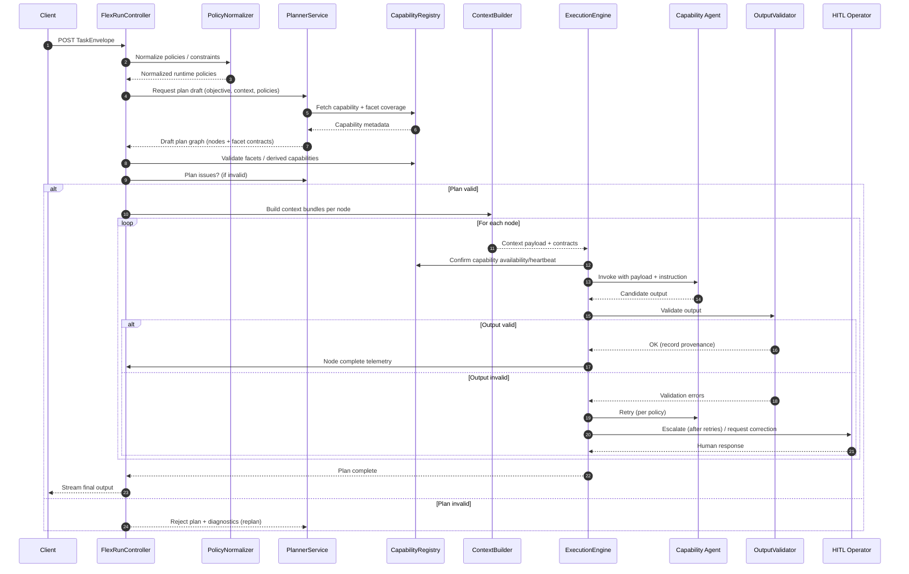

# Flex Agents Server — Architecture Specification

_Last updated: 2025-03-02_

## 1. Scope & Goals
- Deliver a runtime-adaptable orchestration service where clients submit natural-language objectives and exact JSON output contracts.
- Support planner-driven decomposition that uses an agent capability registry and real-time preferences rather than hard-coded workflows.
- Preserve human-in-the-loop (HITL) interrupts, rehydration, and streaming telemetry already trusted in the existing agents server.
- Provide a drop-in backend for the new “Create Post” popup while staying generically useful for future marketing and ops use cases.
- Allow new policy needs (for example “produce two variants”) to be satisfied at runtime without shipping server code or configuration changes.

## 2. Non-Goals
- Replace or refactor the current agents server until the flex variant reaches feature parity.
- Redesign the SPA/Nitro API beyond the new flex entry point and popup wiring.
- Introduce new specialist agents that are unrelated to marketing flows; focus first on orchestrator flexibility.
- Deliver comprehensive analytics dashboards; basic logging and metrics parity with the current server is sufficient for launch.

## 3. Key Architectural Decisions (Proposed)
- Clone `packages/agents-server/` into `packages/flex-agents-server/`, retaining the Nitro runtime, shared utilities, and deployment footprint.
- Expose a new SSE endpoint `POST /api/v1/flex/run.stream` that accepts a `TaskEnvelope` containing objectives, constraints, and a client-supplied JSON Schema contract.
- Rely on the `TaskEnvelope` to carry all runtime policies (client-specific variants, brand safety directives, etc.); the orchestrator remains stateless with no separate preference lookup layer.
- Represent agent abilities in a `CapabilityRegistry` (static metadata plus optional embeddings) so the planner can map requested outcomes to available agents/tools.
- Use `Zod + Ajv` validation to enforce the client schema before emitting final responses, returning structured validation errors over the stream if expectations are not met.
- Keep persistence and HITL semantics compatible with the existing schema, extending tables where necessary rather than starting a separate database.

## 4. High-Level Architecture
The flex server keeps the familiar Nitro deployment but swaps the orchestration core for task envelopes, runtime planning, and dynamic context packaging.

```

#### Planner Lifecycle Events

1. **`plan_requested`** – After policies are normalized the controller emits this frame, capturing the active capability snapshot, normalized policy keys, and the planner attempt number so clients can render a pending state.
2. **`plan_rejected`** – `PlannerValidationService` validates facet coverage, capability availability, and schema compilation. Failures surface as diagnostics inside `plan_rejected`; the controller immediately requests a revised draft while the run remains paused.
3. **`plan_generated`** – On acceptance the finalized `PlanGraph` (version, node summaries, derived metadata) is emitted and execution begins.
4. **`policy_triggered` + `plan_updated`** – Runtime policy breaches (variant limits, operator feedback, enforcement results) emit `policy_triggered`, request a planner delta, persist a new plan version, and stream `plan_updated` so clients reconcile the new graph before dispatch resumes.

+-----------+      +--------------------+      +--------------------+      +------------------+
| Client UI | ---> | Flex Agents API    | ---> | Planner & Policies | ---> | Execution Engine |
+-----------+      +--------------------+      +--------------------+      +------------------+
      ^                     |                              |                          |
      |                     v                              v                          v
      |            +----------------+            +-------------------+      +----------------------+
      +------------| HITL & Resume  |<-----------| Persistence Layer |<-----| Capability Registry  |
                   +----------------+            +-------------------+      +----------------------+
```

## 5. Core Concepts
All canonical types and Zod validators for the concepts below are exported from `@awesomeposter/shared/flex` (source: `packages/shared/src/flex/types.ts`). Planner, agents, and UI code should import from that module to stay in sync.
### 5.1 TaskEnvelope
Canonical request payload containing `objective`, `inputs`, `constraints`, `outputContract`, `policies`, and caller metadata. The orchestrator never assumes fields beyond what the envelope expresses.

### 5.2 OutputContract
Client-supplied JSON Schema plus optional post-processing hints (for example field ordering). The validator enforces the schema before finalizing a run; the orchestrator may also use it to derive intermediate expectations.

### 5.3 RuntimePolicy
Merged view of envelope `policies` and orchestrator-derived context. Since all directives come from the caller, the orchestrator simply normalizes the payload and propagates requirements such as variant counts, tone packs, or mandatory approvals.

### 5.4 PlanGraph
A DAG generated per run describing specialist tasks, dependencies, and guard conditions. Nodes capture the selected agent/tool, expected `ContextBundle`, and the return contract the orchestrator expects (structured schema or free-form instructions the orchestrator can post-process).

### 5.5 ContextBundle
Payload compiled for each agent invocation that includes the relevant slice of the envelope, prior validated outputs, knowledge snippets, and explicit return expectations.

### 5.6 AgentCapability
Registry entries advertising an agent’s competencies, IO expectations, cost profile, and preferred models. The planner matches plan nodes to capabilities at runtime.

#### Facet Definition
- `Facet` objects are the semantic primitives the planner uses when composing contracts. Each facet defines a reusable slice of meaning – tone, brief, compliance rubric – that can be merged into node contracts.
- Author and register facets in `packages/shared/src/flex/facets/catalog.ts` using the shared `FacetCatalog` utilities. The catalog is loaded everywhere via `getFacetCatalog()` so the planner, execution layer, and tests read the same source of truth.
- Core fields:
  - `name` (machine key) and `title` (human label) keep facet identities stable.
  - `description` documents what the facet constrains.
  - `schema` contains the JSON Schema fragment representing the facet’s structure (stored in `FacetDefinition.schema`).
  - `semantics` or `instruction` describes how downstream agents should interpret the facet.
  - `metadata` carries versioning, dependencies, and directionality (`input`, `output`, or bidirectional). Optional `propertyKey` lets multiple facets merge into the same JSON path when required.

Example:

```json
{
  "name": "toneOfVoice",
  "title": "Tone of Voice",
  "description": "Adjusts emotional style and diction of the generated text.",
  "schema": {
    "type": "string",
    "enum": ["friendly", "professional", "inspiring"]
  },
  "semantics": "Agent should skew language, phrasing, word choice to reflect the tone value.",
  "metadata": {
    "version": "v1",
    "directionality": "input"
  }
}
```

#### Facet-Aligned Capabilities
- Each capability declares the facets it consumes via its `inputContract` (array of facet names) and the facets it produces via its `outputContract`.
- Declared facets must remain a subset of what the owning agent can support; this keeps planner reasoning consistent even if the agent serves many roles.
- During planning, the orchestrator can **derive** a capability by checking whether an agent’s supported facets can satisfy the requested facet mix, even if that exact capability was not explicitly registered. Derived capabilities are flagged on the plan node for auditing.
- Contracts are assembled dynamically by merging the schema of all selected facets, so new facets can be introduced without editing planner code.

### 5.6.1 Capability Registration
Agents self-register with the orchestrator during startup (or when hot-loaded). Each agent posts a `CapabilityRegistration` payload describing its identifiers, strengths, supported locales, preferred models, facet coverage (`inputContract`/`outputContract` arrays), and heartbeat metadata. The orchestrator persists the record, tracks health/heartbeat metadata, and updates the `CapabilityRegistry` so planners always operate on live data. Multiple instances of the same capability can register with distinct scopes (for example `writer.en`, `writer.fr`), enabling runtime selection and graceful degradation when one instance is unavailable.

### 5.6.2 Registration Payload
Registration payloads share a stable contract so the orchestrator can validate and cache metadata.

```json
{
  "capabilityId": "writer.en",
  "version": "2025.03.02",
  "displayName": "Content Writer (English)",
  "summary": "Creates long-form and social copy in English with brand-aware tone controls.",
  "inputTraits": {
    "languages": ["en"],
    "formats": ["linkedIn_post", "twitter_thread"],
    "strengths": ["brand_voice_alignment", "cta_generation"],
    "limitations": ["no_paid_ads_claims"]
  },
  "inputContract": ["toneOfVoice", "writerBrief", "audienceProfile"],
  "outputContract": ["copyVariants", "rationaleSummary"],
  "cost": { "tier": "standard", "estimatedTokens": 6000 },
  "preferredModels": ["gpt-5.1"],
  "heartbeat": { "intervalSeconds": 60 },
  "metadata": {
    "owner": "marketing-ai",
    "docsUrl": "https://internal.docs/agents/writer-en"
  }
}
```

**Field overview**
- `capabilityId` (string, required): globally unique identifier used in plan nodes.
- `version` (string, required): semantic or timestamp version of the agent configuration.
- `displayName` (string, required): human-readable name shown in tooling and logs.
- `summary` (string, required): concise capability description.
- `inputTraits` (object, optional): declared coverage such as supported languages, formats, strengths, and limitations.
- `inputContract` (array of strings, required): facet names this capability consumes when invoked.
- `outputContract` (array of strings, required): facet names this capability produces; planner merges them into downstream contracts.
- `cost` (object, optional): estimates around token usage or pricing tier for planner budgeting.
- `preferredModels` (array, optional): ranked list of model IDs the agent is tuned for.
- `heartbeat` (object, optional): heartbeat expectations (intervals/timeout) so the orchestrator can mark stale registrations.
- `metadata` (object, optional): free-form key/value pairs (owner, documentation URLs, rollout flags).
- Legacy JSON Schema contracts are deprecated in favor of facet arrays; remove any freeform payloads during migration.

### 5.7 Facet-Based Plan Assembly
Facet-driven contracts let the planner assemble dynamic graphs without hard-coding role sequences. Every node’s contract is stitched together at runtime by selecting the right facets, merging their schemas, and attaching the semantics needed for downstream agents (or humans) to act predictably.

#### Planning Steps
1. **Select agent and capability.**
   - Prefer an agent that already publishes a matching capability.
   - If none exist, derive a capability by confirming the agent supports the required facets; mark the node as derived for traceability.
2. **Activate the facets to use.**
   - Examine envelope objective, policies, constraints, and prior outputs.
   - For declared capabilities, choose a subset of the published `inputContract`/`outputContract` facets.
   - For derived capabilities, pick the facet mix that best covers the requested outcome.
3. **Merge schemas into contracts.**
   - `inputSchema = FacetContractCompiler.compileContracts(selectedInputFacets)`
   - `outputSchema = FacetContractCompiler.compileContracts(selectedOutputFacets)`
   - Preserve facet provenance so validators and telemetry can explain where each schema fragment originated. The compiler already returns provenance metadata and Ajv validators via `CompiledFacetSchema`.
4. **Compose the system instruction.**
   - Concatenate guidance from the selected facets’ `semantics`.
   - Example: “Use toneOfVoice to adjust diction; apply writerBrief context; emit copyVariants output.”
5. **Annotate the plan node.**
   - Store `agentId`, `capabilityId` (or `derivedFrom`), the selected facet arrays, resolved schemas, merged system instruction, retry/fallback policy, and a rationale blob for debugging.

#### Story 8.8 Dynamic Assembly Details
- **Live registry hydration:** During planning the orchestrator hydrates the latest capability snapshot (strategy, generation, QA, transformation helpers) and facet catalog definitions. Capability selections record coverage gaps so derived nodes are transparent.
- **Capability scoring:** Candidates are scored on facet alignment, scenario metadata, channel/language support, and declared costs. A configurable cutoff prevents low-confidence matches from entering the graph; derived selections are annotated when the planner borrows a capability outside its declared scenarios.
- **Plan taxonomy:** Generated plan graphs now include `structuring`, optional `branch`, `execution`, `transformation`, `validation`, and `fallback` nodes. Each node carries compiled input/output schemas (via `FacetContractCompiler`), provenance arrays, and expectations the execution engine reuses for validation.
- **Branch expansion:** Pre-execution branch directives (e.g., `policies.branchVariants`) produce dedicated branch nodes linked between strategy and execution nodes. Branch nodes inherit facet provenance and node metadata so downstream tooling can visualise the branch origin.
- **Normalization nodes:** When caller output contracts require JSON schema enforcement the planner injects a `transformation` node after the execution stage. The node is virtual (orchestrator-managed) but records provenance, instructions, and plan wiring so downstream services can normalise outputs without custom glue code.
- **Fallback wiring:** Every plan terminates with a fallback/HITL node that references the terminal execution node. The fallback node captures escalation instructions, facet rationale, and policy triggers so the execution engine can enter HITL mode without regenerating the plan.
- **PlannerService (LLM-backed):** Planner prompts an LLM for draft nodes, capturing `plannerRuntime`/`plannerModel` metadata. A deterministic fallback draft keeps runs functional when the model is unavailable.
- **Metadata & versioning:** Plans include `planVersion`, `planVersionTag`, branch counts, derived capability lists, and a `normalizationInjected` flag. Telemetry surfaces this metadata alongside SSE `plan_generated` events, enabling UI clients to highlight active branches, derived nodes, and policy wiring.

#### Execution Runtime
1. **Validate inputs.** Reject immediately if the payload fails the resolved `inputSchema`; do not call the agent.
2. **Invoke the agent or human.** Provide the payload, merged instruction, and any facet-specific metadata.
3. **Validate outputs.** Run contract checks against the resolved `outputSchema`; on failure, follow node retry strategy, then fallback (alternate capability or HITL) once retries exhaust.
4. **Persist state.** Record inputs, outputs, validation errors, derived capability markers, and node status to support rehydration and audits.
5. **Propagate downstream.** On success, hand the validated output to dependent nodes. For fallbacks, follow the alternate edges defined during planning.

> Intermediate artifacts (writer briefs, rubric scores, normalization transforms) are represented as facet-driven contracts just like client deliverables. When transformation or post-processing is required, the planner injects dedicated nodes so conversions remain in-band and fully traceable.

### 5.8 Planner vs Orchestrator: Hybrid Collaboration
The flex stack pairs the LLM-backed `PlannerService` with the deterministic orchestration layer (`FlexRunController`, `PolicyNormalizer`, `CapabilityRegistry`, `ContextBuilder`, `ExecutionEngine`, `OutputValidator`, `PersistenceService`, `TelemetryService`). The planner excels at interpreting fuzzy objectives; the orchestration layer guarantees contracts, execution order, and safety. Planner proposes; orchestrator compiles, enforces, and executes.

#### Roles & Responsibilities

| Component | Role | Strengths / Why Use It | Boundaries / Constraints |
| --- | --- | --- | --- |
| `PlannerService` (LLM-backed) | Interpret objectives, decompose into subtasks, recommend agent + capability pairings, suggest facet activation, and draft system instructions. | Flexible reasoning, rapid adaptation to new objectives, can infer structure from context. | Must not commit irreversible state changes; every plan is validated before execution. |
| Orchestration Layer (`FlexRunController` + `PolicyNormalizer` + `CapabilityRegistry` + `ContextBuilder` + `ExecutionEngine` + `OutputValidator`) | Validate the draft plan, compile explicit contracts, enforce constraints, route tasks, coordinate retries/fallbacks/HITL, and drive execution while persisting telemetry. | Predictable, auditable, reliable; maintains invariants and compliance. | Must not guess beyond deterministic rules; rejects invalid plans or sends them back for revision. |

#### Interaction Sequence
1. **Objective submission.** Client posts a `TaskEnvelope` containing the objective, context, and constraints.
2. **Planning phase (`PlannerService`).**
   - `PlannerService` inspects objective, context, facet registry, and capability metadata (via `CapabilityRegistry` read APIs).
   - It assembles a draft plan graph: nodes include `agentId`, `capabilityId` (declared or derived), `inputContract`/`outputContract` facet arrays, and proposed system instructions.
3. **Plan validation & compilation (orchestration layer).**
   - `FlexRunController`, working with `CapabilityRegistry`, merges facets into explicit input/output schemas.
   - `CapabilityRegistry` confirms the agent supports every referenced facet; derived capability safeguards are applied when needed.
   - Contracts are compiled with Ajv/Zod; `PlannerService` receives rejection diagnostics if inconsistencies surface.
4. **Execution (`ContextBuilder` + `ExecutionEngine` + `OutputValidator`).**
   - `ContextBuilder` prepares inputs for each node; `ExecutionEngine` validates them before dispatch.
   - `ExecutionEngine` invokes the agent (or human) with payload + compiled instruction.
   - `OutputValidator` checks outputs, applies retry policy, and escalates to fallbacks or HITL through `ExecutionEngine` when retries exhaust.
   - `PersistenceService` and `TelemetryService` capture status, inputs, outputs, and diagnostics.
5. **Replanning (optional).**
   - `ExecutionEngine` or `PolicyNormalizer` can request a revised plan when constraints shift or nodes fail.
   - `PlannerService` returns deltas; orchestration components revalidate, patch the graph, and resume.
6. **Completion.**
   - `ExecutionEngine` confirms terminal nodes succeeded, `OutputValidator` verifies caller contracts, and `FlexRunController` emits the final response.

#### Collaboration Patterns
- **Plan-and-Solve:** Planner generates the full plan up front; orchestrator executes sequentially. High predictability, lower adaptability mid-run.
- **Interleaved / ReAct style:** Planner and orchestrator alternate—plan a node, execute, reassess. Adapts quickly but requires stronger guardrails.
- **Fallback proposals:** Planner may pre-encode alternates or fallbacks; orchestrator chooses the best candidate at runtime based on health, cost, or performance.

#### Derived Capability Handling
- Planner may target an agent for an unlisted capability by proposing facet arrays.
- `CapabilityRegistry` verifies facet support, `ExecutionEngine` flags the node as derived, tightens retries/logging, and routes through HITL if needed.
- Stable success across runs is a signal to formalize the pairing as a declared capability owned by the responsible agent team.

#### Failure Modes & Recovery

| Failure Mode | Detection Point | Recovery Strategy |
| --- | --- | --- |
| Invalid facet combination | `CapabilityRegistry` / `PlannerService` validation | Reject node, return diagnostics to `PlannerService` for regeneration. |
| Schema compilation conflict | `FlexRunController` / contract compiler | Filter conflicting facets or request planner revisions. |
| Input validation failure | `ExecutionEngine` pre-dispatch | Fail fast, surface to planner or caller; optionally replan upstream. |
| Output validation failure | `OutputValidator` post-dispatch | Retry per policy, then fallback to alternate agent or HITL. |
| Agent crash / runtime error | `ExecutionEngine` runtime | Retry, switch to fallback, or escalate to human operator. |
| Mid-flow constraint drift | `ExecutionEngine` / `TelemetryService` monitoring | Trigger replanning to insert corrective nodes or adjust routing. |

#### Why the Hybrid Model Matters
- **Balanced flexibility and control:** Planner adapts to ambiguous objectives while orchestrator enforces invariants.
- **Safety net for generative systems:** All planner proposals are validated before any side effects occur.
- **Traceability:** Every node records provenance, instructions, and validation outcomes for auditing.
- **Iterative evolution:** Responsibilities can shift over time—formalize successful patterns deterministically or give the planner more autonomy once guardrails prove effective.

> The sequence below illustrates planner ↔ orchestrator loops, highlighting guardrails, validation gates, and replanning hooks.

#### Planner ↔ Orchestrator Sequence (Mermaid)



## 6. Component Responsibilities
- `FlexRunController`: validates envelopes, seeds correlation IDs, and emits initial SSE frames.
- `PolicyNormalizer`: validates and normalizes caller-supplied policies (personas, variant counts, compliance rules) before the planner consumes them.
- `CapabilityRegistry`: accepts registration payloads from agents, persists capability metadata, performs similarity search, and resolves fallbacks when the ideal agent is unavailable.
- `PlannerService`: synthesizes `PlanGraph` nodes from the objective, policies, and capabilities, and updates the plan if policies change mid-run.
  - The planner prompt now provides **capability contract schemas** (input/output JSON Schema or facet lists) so the planner can reason about required fields and enumerations before emitting nodes.
  - Normalisation nodes (`kind: transformation`) are injected only when the planner detects a contract mismatch; if the capability already satisfies the caller schema the plan omits the extra node and execution proceeds directly.
- `ContextBuilder`: assembles `ContextBundle` instances, redacting sensitive inputs when necessary, and attaches return schemas.
- `ExecutionEngine`: resolves capabilities via the registry, sequences node execution, streams `flex_capability_dispatch_*` telemetry, handles retries, and coordinates with the HITL gateway for approval-required tasks.
- `OutputValidator`: runs Ajv against caller contracts and capability defaults, emits structured `validation_error` frames with scope/context, and prompts rewrites when agents fail validation.
- `PersistenceService`: stores run metadata, plan graphs, and variant outputs to support rehydration, analytics, and audit trails.
- `TelemetryService`: streams normalized `FlexEvent` frames (`plan_requested`, `plan_rejected`, `plan_generated`, `plan_updated`, `policy_triggered`, `node_*`, `hitl_request`, `validation_error`, `complete`) for UI consumption.

## 7. Execution Flow
1. Client submits `TaskEnvelope` to `run.stream`; controller authenticates, normalizes, and persists an initial `flex_runs` record.
2. `PolicyNormalizer` validates caller-supplied policies (persona defaults, experiment toggles) and injects the result into the execution context.
3. `PlannerService` generates a `PlanGraph` after the controller emits a `plan_requested` frame. The prompt includes capability facets and JSON Schema snippets so the planner only chooses capabilities whose contracts it can satisfy (adding upstream structuring nodes if required). `PlannerValidationService` compiles facet contracts and either allows the draft to proceed (emitting `plan_generated`) or returns diagnostics that surface as `plan_rejected` over SSE before any execution begins.
4. `ExecutionEngine` walks the graph, building `ContextBundle`s per node, validating inputs against capability metadata, and dispatching them to agents via the shared runtime.
5. Agents respond with payloads; `OutputValidator` enforces facet-derived capability contracts alongside the caller schema, emits scoped errors when expectations are not met, and prompts retries or HITL escalation before persisting results.
6. HITL interrupts pause the run; operator responses trigger plan resumption. Policy deltas or operator feedback can emit `policy_triggered`, request a revised planner draft, and stream `plan_updated` once a new version is persisted. Rehydration rebuilds remaining graph state and context bundles.
7. Once all terminal nodes succeed, the engine composes the final response by combining the validated or normalized artifacts that fulfill the envelope schema and ends the SSE stream.

## 8. HITL and Rehydration Strategy
- Maintain existing HITL tables (`hitl_requests`, `hitl_events`) while adding `flex_plan_snapshot` to capture outstanding nodes and context checksums.
- When a HITL request fires, the engine serializes the pending node, the contract for the expected artifact, and a recommended operator prompt so the UI can render precise actions.
- Rehydration reconstructs the `PlanGraph` from `flex_plan_snapshot` plus persisted outputs; policy refresh runs before execution resumes so newly introduced runtime rules take effect mid-flight.

## 9. Data Model & Persistence
- `flex_runs`: mirrors `orchestrator_runs` but records envelope metadata (`objective`, `schema_hash`, `persona`, `variant_policy`).
- `flex_plan_nodes`: stores node-level state, selected capability IDs, context hashes, and validation status for auditing and resumption.
- `flex_capabilities`: stores registered agent metadata, heartbeat timestamps, availability state, and facet coverage hints.
- Reuse `agent_messages` and `hitl_requests` tables, adding `flex_run_id` foreign keys for joint reporting.
- Persist final outputs in `flex_run_outputs` with the validated JSON blob plus a copy of the client schema for downstream verification.

## 9.1 Capability Registration Flow
1. Agent instance boots and gathers its metadata (capability ID, name, summary, supported locales/tones/formats, preferred models, facet coverage arrays, cost tier, health status).
2. Agent calls `POST /api/v1/flex/capabilities/register` with that payload and an auth token issued for agent services.
3. Orchestrator validates the payload, upserts the record in `flex_capabilities`, and emits an internal event so the in-memory `CapabilityRegistry` refreshes.
4. Periodic heartbeats (either repeated registrations or lightweight `PATCH` calls) keep availability status current; stale capabilities are marked `inactive` so the planner can fall back automatically.
5. When an agent shuts down gracefully, it deregisters (optional) so capacity metrics stay accurate.

## 10. API Surface (Initial)
- `POST /api/v1/flex/run.stream`: primary SSE entry point; accepts `TaskEnvelope`, streams `FlexEvent` frames, and enforces output schema validation.
- `POST /api/v1/flex/run.resume`: resumes paused runs after HITL resolution; accepts the run ID and operator payload.
- `POST /api/v1/flex/hitl/resolve`: records operator decisions that originate from the SPA; reuses existing auth model.
- `POST /api/v1/flex/capabilities/register`: agents call this on boot to advertise or refresh their `CapabilityRegistration`; orchestrator updates the registry and acknowledges health status.
- `GET /api/v1/flex/runs/:id`: debugging endpoint returning persisted envelope, plan graph, and outputs (auth-gated).

### 10.0.1 Flex Run Streaming Contract
The `/api/v1/flex/run.stream` controller validates the incoming envelope, persists an initial `flex_runs` row, and streams `FlexEvent` frames for planner lifecycle updates. Frames conform to `{ type, id?, timestamp, payload?, message?, runId?, nodeId? }`. Supported event types in this release:

- `start`: emitted after persistence with `payload.runId` and optional `threadId`.
- `plan_requested`: planner handshake has started; payload includes attempt number, normalized policy keys, and capability snapshot metadata.
- `plan_rejected`: validation failed; payload surfaces structured diagnostics aligned with planner feedback loops.
- `plan_generated`: contains trimmed plan metadata (`nodes[{ id, capabilityId, label }]`).
- `plan_updated`: new plan version persisted after replanning; payload includes `previousVersion`, `version`, and summary node statuses.
- `node_start` / `node_complete` / `node_error`: per-node execution lifecycle.
- `policy_triggered`: emitted when runtime policies force a replan; payload describes the triggering directive.
- `hitl_request`: surfaced when policies require human approval; downstream UI pauses the run.
- `validation_error`: Ajv validation failures (payload contains `scope` and `errors[]` for structured UI handling).
- `complete`: final frame containing `payload.output` that satisfies the caller schema.
- `log`: informational/debug messages.

Each frame carries `runId` (and `nodeId` for node-scoped events) at the top level, allowing consumers to correlate updates without re-parsing payloads.

**Resume after HITL:** Once `/api/hitl/resume` records operator approval, the client should open a fresh stream with the same `threadId` and set `constraints.resumeRunId` to the previous `runId`. The coordinator will rehydrate the persisted plan, emit `plan_generated`/`node_complete` frames, validate the stored output, and finish with `complete`.

Example `curl` invocation:

```bash
curl -N \
  -H "Content-Type: application/json" \
  -H "Accept: text/event-stream" \
  -H "Authorization: Bearer $FLEX_TOKEN" \
  -d @envelope.json \
  http://localhost:3003/api/v1/flex/run.stream
```

Sample envelope payload (`envelope.json`):

```json
{
  "objective": "Create LinkedIn post variants promoting AwesomePoster",
  "inputs": {
    "channel": "linkedin",
    "goal": "attract_new_employees",
    "variantCount": 2,
    "contextBundles": [
      {
        "type": "company_profile",
        "payload": {
          "companyName": "AwesomePoster",
          "coreValue": "Human-first automation",
          "recentEvent": "Summer retreat in Tahoe"
        }
      }
    ]
  },
  "policies": {
    "brandVoice": "inspiring",
    "requiresHitlApproval": false
  },
  "specialInstructions": [
    "Variant A should highlight team culture.",
    "Variant B should highlight career growth opportunities."
  ],
  "outputContract": {
    "mode": "json_schema",
    "schema": {
      "type": "object",
      "required": ["copyVariants"],
      "properties": {
        "copyVariants": {
          "type": "array",
          "minItems": 2,
          "maxItems": 2,
          "items": {
            "type": "object",
            "required": ["headline", "body", "callToAction"],
            "properties": {
              "headline": { "type": "string" },
              "body": { "type": "string" },
              "callToAction": { "type": "string" }
            }
          }
        }
      }
    }
  }
}
```

### 10.1 Sample TaskEnvelope
```json
{
  "objective": "Generate LinkedIn post variants promoting Akkuro's AI compliance tooling launch.",
  "inputs": {
    "companyProfile": {
      "name": "Akkuro",
      "positioning": "AI compliance copilots for regulated teams"
    },
    "toneOfVoice": ["confident", "supportive"],
    "contentBrief": "Launch announcement focused on risk reduction."
  },
  "policies": {
    "persona": "marketer",
    "variantCount": 2,
    "hitlRequiredFor": ["final_publish"]
  },
  "specialInstructions": [
    "Highlight the new real-time audit trail feature.",
    "Avoid claims about replacing human reviewers."
  ],
  "outputContract": {
    "schema": {
      "type": "object",
      "properties": {
        "copyVariants": {
          "type": "array",
          "minItems": 2,
          "items": {
            "type": "object",
            "properties": {
              "headline": { "type": "string" },
              "body": { "type": "string" },
              "callToAction": { "type": "string" }
            },
            "required": ["headline", "body", "callToAction"]
          }
        }
      },
      "required": ["copyVariants"]
    }
  }
}
```

## 11. Capability Registry & Agent Contracts
- Capability metadata now lives alongside each agent (for example `packages/flex-agents-server/src/agents/strategy-manager.ts`); the module exports the capability payload with facet-based `inputContract` / `outputContract` arrays alongside prompt assets.
- A Nitro startup plugin consumes these exports and POSTs them to `/api/v1/flex/capabilities/register`, exercising the same validation/logging path as external registrants, and re-registers on an interval (`FLEX_CAPABILITY_SELF_REGISTER_REFRESH_MS`, default 5 minutes) to keep heartbeat status active.
- `PlannerService` uses the registry to resolve capabilities by scenario tags declared in capability metadata (`metadata.scenarios`) and by matching facet coverage.
- `ContextBuilder` translates high-level objectives (for example “two variants”) into per-agent instructions so strategists craft briefs and writers fill slots without code changes.
- Agents continue to rely on natural-language prompts but receive machine-readable facet contracts and validation hints alongside human context.
- The registry service (`packages/flex-agents-server/src/services/flex-capability-registry.ts`) caches active entries in memory with a configurable TTL (`FLEX_CAPABILITY_CACHE_TTL_MS`) and automatically marks records inactive once their heartbeat timeout elapses.
- Facet declarations are validated against the shared catalog at registration time; the registry compiles merged JSON Schemas, persists `input_facets` / `output_facets` coverage hints, and rejects unknown facets or direction mismatches before capabilities become available.
- Legacy `defaultContract` fallbacks have been removed—registrations must provide explicit facet-backed `outputContract` payloads and the registry persists the compiled JSON Schema as the single source of truth.
- The database layer persists metadata to the shared `flex_capabilities` table (Drizzle schema + migration), keyed by `capability_id` with timestamps for `registered_at`, `last_seen_at`, and rolling `status` (`active`/`inactive`).
- Each agent module schedules a self-registration with the capability registry during bootstrap so the flex server advertises its capabilities without relying on a separate startup plugin.
- Planner consumers should retrieve capabilities via the registry service (`listActive`, `getCapabilityById`) to honour cache/heartbeat semantics instead of querying the database directly.
- SSE telemetry for `plan_generated` events now echoes per-node contract modes and facet coverage so downstream consumers can observe the facet-derived contract model in real time.

### Facet Catalog

Facet definitions are centralised in `packages/shared/src/flex/facets/catalog.ts`. The exported `FacetCatalog` supplies typed lookups (`get`, `list`, `resolveMany`) while enforcing directionality (`input`, `output`, `bidirectional`) and uniqueness. Extend this module whenever new facets are introduced—planner helpers automatically start serving the new schema fragments without additional wiring.

| Facet | Direction | Description | Schema Sketch |
| --- | --- | --- | --- |
| `objectiveBrief` | input | Structured summary of the client’s stated objective, constraints, and success criteria. | Object with `objective` (string), optional `successCriteria[]` (string). |
| `audienceProfile` | input | Audience attributes (personas, segments, geography) that influence strategy and tone. | Object with `persona` (string), `segments[]` (string), optional `regions[]`. |
| `toneOfVoice` | input | Desired emotional/style tone for downstream copy. | Enum string (`friendly`, `professional`, `inspiring`, etc.). |
| `assetBundle` | input | Links or embedded assets (docs, images) to ground planning. | Array of `{ type, payload }` objects with typed payload per asset. |
| `writerBrief` | input/output | Narrative direction, key points, blockers for writers; produced by strategy, consumed by execution. | Object with `angle`, `keyPoints[]`, `constraints[]`. |
| `planKnobs` | input/output | Normalised levers the orchestrator can tweak (variant counts, CTA emphasis, length). | Object with numeric/string knobs (`variantCount`, `ctaFocus`, `length`). |
| `strategicRationale` | output | Strategy justification and high-level narrative reasoning. | Object with `northStar`, `whyItWorks`, optional `risks`. |
| `copyVariants` | input/output | Structured set of draft variants for distribution downstream. | Array of `{ headline, body, callToAction }` objects. |
| `qaRubric` | input | Policy and quality rubric settings QA should enforce. | Object with `checks[]` (enum), `thresholds` (object). |
| `qaFindings` | output | QA results with scores and compliance flags. | Object with `scores`, `issues[]`, `overallStatus`. |
| `recommendationSet` | output | Normalised follow-up actions for editors or writers. | Array of `{ severity, recommendation, rationale }`. |

### Current Inventory

| Capability ID | Display Name | Responsibilities | Input Facets | Output Facets | Source |
| --- | --- | --- | --- | --- | --- |
| `StrategyManagerAgent.briefing` | Strategy Manager | Plans rationale, writer brief, and knob configuration with asset analysis support. | `objectiveBrief`, `audienceProfile`, `toneOfVoice`, `assetBundle` | `writerBrief`, `planKnobs`, `strategicRationale` | `packages/flex-agents-server/src/agents/strategy-manager.ts`, `packages/flex-agents-server/src/tools/strategy.ts` |
| `ContentGeneratorAgent.linkedinVariants` | Copywriter – LinkedIn Variants | Generates 1–5 LinkedIn-ready variants with platform optimisations. | `writerBrief`, `planKnobs`, `toneOfVoice`, `audienceProfile` | `copyVariants` | `packages/flex-agents-server/src/agents/content-generator.ts`, `packages/flex-agents-server/src/services/flex-execution-engine.ts` |
| `QualityAssuranceAgent.contentReview` | Quality Assurance | Scores drafts for readability, clarity, objective fit, and policy risk; normalises recommendations. | `copyVariants`, `writerBrief`, `qaRubric` | `qaFindings`, `recommendationSet` | `packages/flex-agents-server/src/agents/quality-assurance.ts`, `packages/flex-agents-server/src/tools/qa.ts` |

> Capability metadata, facet coverage, costs, and heartbeat settings are the source of truth—update the tables above and the corresponding agent module together during future agent work. Add new facets to the catalog before referencing them in capabilities.

#### Contract Compiler & Validation Helpers

- `packages/shared/src/flex/facets/contract-compiler.ts` exposes `FacetContractCompiler`, which composes deterministic `inputSchema` / `outputSchema` payloads, tracks provenance, and hands back Ajv validators for the execution engine.
- Planner-facing helpers live in `packages/flex-agents-server/src/utils/facet-contracts.ts`; use `buildFacetAwareNodeContracts` to attach compiled facet contracts to plan nodes and derive human-readable instructions.
- Fixtures under `packages/flex-agents-server/src/utils/__fixtures__/facet-node.fixture.ts` illustrate how nodes carry compiled schemas for testing and planner prototyping.
- Validation helpers (`validateFacetInputs`/`validateFacetOutputs`) surface `FacetValidationError` objects that include the originating facet, JSON pointer, and Ajv keyword—ExecutionEngine and OutputValidator can adopt them without additional plumbing.

### Supporting Utilities

- Strategy analysis tools (`packages/flex-agents-server/src/tools/strategy.ts`) expose `strategy_analyze_assets` and `strategy_plan_knobs` for achievable-format detection and knob planning.
- Content helpers (`packages/flex-agents-server/src/tools/content.ts`) handle format rendering and platform optimisation.
- QA tooling (`packages/flex-agents-server/src/tools/qa.ts`) provides rubric scoring and recommendation normalisation.
- HITL adapters (`packages/flex-agents-server/src/tools/hitl.ts`) bridge agent escalations into the shared HITL service.

### Maintenance Checklist

1. Update the capability payload inside the relevant agent module when prompts, facet coverage, or preferred models change.
2. Mirror those edits in the facet catalog and capability inventory tables so downstream teams know where source lives and what constraints apply.
3. Run `npm run test:unit -- packages/shared/__tests__/flex/facet-contract-compiler.spec.ts packages/flex-agents-server/__tests__/facets/facet-contracts.spec.ts packages/flex-agents-server/__tests__/capability-registry-facets.spec.ts packages/flex-agents-server/__tests__/docs/facet-inventory.spec.ts` (plus the capability registry suite) to confirm catalog integrity, registry validation, and documentation alignment before hand-off.
4. If heartbeat expectations change, adjust `FLEX_CAPABILITY_REFRESH_INTERVAL_MS` or the per-capability heartbeat fields so registry status stays accurate.

## 12. UI & Client Integration
- Introduce a feature-flagged “Create Post (Flex)” popup (gated via env var such as `USE_FLEX_AGENTS_POPUP`) that targets `/api/v1/flex/run.stream`, keeping legacy flows untouched.
- The popup constructs `TaskEnvelope`s from existing brief forms, plus any marketing persona defaults resolved by the SPA.
- SSE frames preserve the current envelope signature (`type`, `id`, `timestamp`, `payload`), so the existing `useHitlStore` wiring continues to parse events; only the event `type` values expand to cover new planner states (`FlexEvent` namespace).
- Upon HITL prompts, the UI redirects operators to the same approval modal, now carrying the node artifact contract so reviewers see exactly what is pending.

## 13. Migration & Rollout Strategy
- Phase 0: clone repository package, share utilities via `packages/shared`, and stub the new endpoint returning mocked events for UI integration.
- Phase 1: implement planner, policy normalization, and dynamic bundling for the create-post use case; run dual writes to existing agents server for comparison.
- Phase 2: enable HITL + rehydration parity, then allow selected operator accounts to use the flex popup in production via feature flag.
- Phase 3: migrate additional workflows (brief creation, QA scoring) once parity confidence is high; plan eventual retirement of legacy orchestrator.

## 14. Risks & Open Questions
- Planner correctness: dynamic graph generation increases complexity; we need strong telemetry and debug tooling to trace decisions.
- Policy conflicts: inconsistent caller-supplied directives (for example variant counts versus schema `minItems`) can break runs; conflict resolution rules must be explicit.
- Validation cost: Ajv on large schemas may slow runs; consider caching compiled schemas and streaming partial validation errors.
- Capability drift: registry metadata must stay synchronized with actual agent prompts to avoid mismatched expectations.
