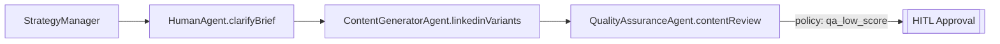

# 15. Supporting Human Agents
## 15.1 Concept Overview
- Human agents perform tasks side-by-side ai agents, fulfilling work.
- HITL remains a policy-triggered governance layer. Runtime policies still issue `Action.type === "hitl"` events for approvals, rejections, and compliance checkpoints that pause the run until an operator responds. 

## 15.x HITL Clarify Extension
> *Extension of existing HITL mechanism — adds node-initiated clarify flow.*

- Nodes can call `hitl.clarify()` when missing or ambiguous inputs block forward progress. The call captures a single textual question and suspends execution until a human supplies a single textual response.
- The ExecutionEngine emits a `hitl_request` with `kind: "clarify"`, persists the active snapshot, and pauses the run. When `/api/v1/flex/run.resume` returns, the engine **reruns the same node that issued the clarify call** so it can evaluate the answer with no topology changes.
- Clarify requests never create a new plan version and do not mutate the `PlanGraph`; they are treated as deterministic pauses against the existing node contract.
- `/api/v1/flex/run.resume` validates the supplied textual answer, appends an entry to `runContext.hitlClarifications[]`, and restarts the issuing node with the enriched context. Multiple clarification cycles can accumulate in this array over the lifetime of a run.
- Each clarification entry is stored with rich metadata so downstream LLM executions can map answers back to the exact questions they asked:

```ts
interface ClarificationEntry {
  nodeId: string
  capabilityId?: string
  questionId: string
  question: string
  answer?: string
  createdAt: string
  answeredAt?: string
}
```

- The metadata (`nodeId`, `questionId`, etc.) ensures the LLM processing a rerun node can identify which outstanding clarifications it requested and which answers are now available.
- Division of responsibilities remains clean: **policies continue to trigger approve/reject HITL for output governance**, while **nodes initiate clarify HITL when they require missing or ambiguous inputs resolved by a human**.

- Human Agents extend the CapabilityRegistry with `agentType: "human"` entries so the planner can emit plan nodes that resolve to human-executed capabilities. The ExecutionEngine dispatches them like any other capability node.
- These nodes target work that demands human judgment, creative input or work that we want to be performed by humans. They are deterministic plan graph nodes with explicit inputs/outputs, not ad-hoc runtime pauses.
- Pause/resume semantics, schema compilation, and validation operate identically across AI and human nodes, preserving deterministic execution and a complete audit trail.

## 15.2 Design Principles
- HITL governs; agents perform. Runtime policies still gate plan progress, while agent nodes (AI or human) fulfill structured work.
- Human agents adopt the same capability model—`capabilityId`, `inputContract`, `outputContract`, and facet metadata—ensuring registry, planner, and execution code paths stay uniform.
- Governance events continue to route through HITL flows; Human Agent nodes execute structured tasks under the planner’s control.
- Plan topology is immutable. Once compiled, Human Agent nodes resume deterministically after output validation, just like AI nodes.
- All human interaction uses structured schema contracts defined by facets; no untyped or freeform fields are accepted.

## 15.3 Implementation Alignment
- Register human operators in the CapabilityRegistry with `agentType: "human"`, facet-driven contracts, and instruction templates that mirror AI entries.
- When the planner emits `HumanAgent.*` nodes, the ExecutionEngine raises the standard node lifecycle events (`node_start`, `node_complete`, `node_error`); no HITL-specific events are produced for these nodes.
- `node_start` payloads include `executorType: "human"` plus the compiled node contract: node ID, capability ID, input/output facets, schemas, and instruction text.
- The SPA or operator UI subscribes to these lifecycle events to render a facet-driven task surface whenever a human node begins execution.
- On submission, the UI POSTs structured JSON to `/api/v1/flex/run.resume`; the orchestrator validates against the node’s `outputContract` and emits `node_complete` when validation passes.
- Resume handling and contract validation reuse the same deterministic pipeline that already powers AI agent nodes.

## 15.4 Facet-Driven Task Surfaces
- Facets now double as UI composition primitives. Each facet definition contributes schema fragments and semantic hints so the UI can render and validate human input appropriately.
- A facet widget registry (for example `PostVisualWidget`, `CompanyInformationWidget`) maps facet names to reusable UI components that assemble into the task surface.
- Each widget owns one facet’s schema slice; the framework composes widgets according to the paused node’s facet list to build the end-to-end task view.
- Adding a new facet automatically enriches planner reasoning and the available human task interfaces—the UI evolves alongside the facet catalog without manual form building.
- Flex human task UI lives in a distinct module (`flexTasks` Pinia store plus `FlexTaskPanel.vue` host) separate from legacy HITL approval flows; shared utilities (SSE bridge, notification helpers) may be reused, but state machines and components MUST stay isolated so approvals remain binary while flex tasks render facet-driven forms.

### 15.4.1 Facet Widget Namespace Convention
- Facets that need different UX on the read-only (input) side versus the authoring (output) side register widgets under namespaced keys: `facetName.input` for the contextual surface humans consume, and `facetName.output` for any authoring surface that writes back to the node payload.
- Namespaced entries allow the registry to coexist with legacy single-surface widgets; if no suffix is provided the base `facetName` key continues to resolve to the existing widget until it is migrated.
- The `company_information` facet is the first adopter: the registry now resolves `company_information.input` to `CompanyInformationWidget`, which renders the contextual brief for Story 10.7 while leaving any future output experience isolated under `company_information.output`.
- `flexTasks` store helpers must pass the facet identifier with the namespace suffix so that Pinia state, analytics, and toast telemetry can differentiate input versus output flows without additional branching.
- Upcoming output-focussed stories will migrate write surfaces to the `.output` namespace; until then, default fallbacks remain under their original facet keys.
- Example facet/widget mappings:

| Facet | Example Widget | User Role |
| --- | --- | --- |
| `post_visual` | Post visual asset manager | Designer |
| `company_information.input` | Company Information widget (name, tone, assets) | Marketing operators |

## 15.5 Notification and Assignment Model
- `node_start` events for human-executed nodes include capability metadata (`capabilityId`, `kind`, `inputFacets`, `outputFacets`, `rationale`) plus optional `dueAt` hints so downstream tooling can route work using information already present in the plan graph.
- The SPA or a notification service subscribes to these events and surfaces tasks via in-app queues, email, or chat integrations.
- Operators query their backlog with `GET /api/v1/flex/tasks?capabilityId=HumanAgent.clarifyBrief` (or status-only filters) and launch the facet-driven task surface to work the node.
- Once structured output is submitted, the orchestrator validates it, marks the node resolved, and the plan continues.
- Declines call `POST /api/v1/flex/tasks/:taskId/decline` with structured reason codes, triggering policy-driven failure paths without altering node contracts or assignment metadata.
- This approach adds traceability and capability-aligned routing without altering the orchestrator’s core execution loop.

> **Endpoint Boundary:** `/api/v1/flex/tasks` serves the human work queue. Legacy `/api/hitl/*` endpoints remain reserved for policy approvals/declines; if compatibility is required, they may proxy into the flex task APIs without exposing HITL semantics to routine human work.

## 15.6 Planner Behavior
- The planner can inject `HumanAgent.*` nodes explicitly when replanning requires human clarification (for example rationale: “Need clarification on objective”).
- Validator and runtime treat these nodes the same as AI capabilities—facet coverage, schema compilation, and dependency checks all run through the shared pathways.

## 15.7 Benefits and Alignment
- Unified participation model for human and AI agents—both live in the CapabilityRegistry and execute under the same lifecycle semantics.
- Facet-aware, schema-driven UIs evolve automatically with the facet catalog, reducing bespoke form work.
- Governance boundaries stay clear: HITL handles policy-triggered approvals, while Human Agents execute planned work.
- Deterministic pause/resume semantics and full audit trails persist across human participation.
- Minimal new infrastructure: reuse existing HITL persistence, telemetry streams, and validation plumbing.

## 15.8 Example



## 15.9 Offline and Notification Semantics
- If no operator UI is connected, execution suspends deterministically when a Human Agent node starts; the run enters an `awaiting_human` state persisted in `flex_plan_nodes`.
- Telemetry frames (`node_start`, `executorType: "human"`) still emit, but live delivery is optional; durable state in the database keeps the run recoverable.
- Pending tasks remain discoverable through APIs such as `GET /api/v1/flex/tasks?status=pending` or via services monitoring `flex_plan_nodes`.
- The orchestrator does not require active SSE listeners—it idles safely until `/api/v1/flex/run.resume` receives valid output.
- Optional runtime policies (for example `onTimeout`, `onMetricBelow`) can detect long-idle human tasks and trigger replanning or escalation actions without duplicating records.
- Persistent execution plus eventual UI delivery keeps the system resilient to operator downtime and ensures safe resumption once human input arrives.

## 15.10 Registration & Governance Notes
- Human capabilities register via `/api/v1/flex/capabilities/register` with `agentType: "human"`; the registry compiles facet-backed contracts identically to AI entries.
- Capability payloads include `instructionTemplates` for UI copy and `assignmentDefaults` so operator tooling can render consistent guidance without custom configuration.
- Response SLAs derive from the `FLEX_HUMAN_ASSIGNMENT_TIMEOUT_SECONDS` environment variable (default 15 minutes). Missed SLAs fail the active run with a recorded rationale.
- Each assignment sends a single notification (`maxNotifications: 1`). Operators are expected to complete all clarifications in one submission.
- Declining any clarification item triggers `onDecline: "fail_run"`, causing the orchestrator to terminate the run and surface the decline reason for follow-up triage.
