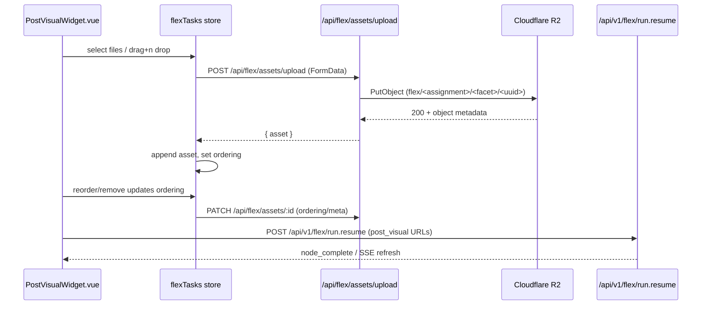

# 15.11 Post Visual R2 Endpoint Patterns

## Summary
- Establishes how the post visual widget (Story 10.6) uploads and manages assets in Cloudflare R2 using a flex-specific pipeline that avoids legacy client coupling.  
- Flex uploads use `/api/flex/assets/upload` and persist records in the new `flex_assets` table, while the legacy `/api/assets` endpoints continue to power brief/client asset flows.  
- Documents storage key conventions, request payloads, and Pinia store hooks so development can begin without revisiting higher-level architecture decisions.  

> References: `docs/architecture/flex-agents-server.md#facet-post_visual`, `docs/architecture/flex-agents-server/512-reference-facet-catalog.md`, `server/api/assets/upload.post.ts`

## Goals
- Describe client ↔ server ↔ R2 interactions for post visual assets.  
- Define the additional metadata needed to associate uploads with a flex run node + facet.  
- Provide implementation notes for wiring uploads, deletions, and ordered persistence into `flexTasks` and `/api/v1/flex/run.resume`.  

## Non-Goals
- Redesigning asset persistence tables (reuses `assets` with flex metadata in `metaJson`).  
- Introducing presigned PUTs direct from the browser (continues to stream via Nitro).  
- Defining thumbnail rendering or UI composition details (covered by Story 10.6 component tasks).  

## Existing Pattern: Brief Uploads
| Step | Component | Notes |
|------|-----------|-------|
| 1 | `BriefsNewView.vue` | Collects assets via `<input type="file">`, posts `FormData` with `clientId` to `/api/assets/upload`. |
| 2 | `server/api/assets/upload.post.ts` | Validates R2 env, stores file under `clients/{clientId}/…`, records row in `assets`. |
| 3 | `server/api/assets/[id]/index.patch.ts` | Associates upload to an entity (`briefId`) after main form submission. |
| 4 | `server/utils/storage.ts` | Normalizes endpoint + bucket, streams to R2, returns public HTTPS URL. |

Flex uploads intentionally diverge from this flow: they never provide a `clientId`, rely on assignment + facet identifiers, and persist into `flex_assets`.

## Flex Post Visual Flow
### Storage Key & Metadata
- When `clientId` is provided (e.g., legacy brief uploads), keep the existing layout `clients/<clientId>/<uuid>.<ext>`.
- Flex widgets can omit `clientId`; in that case the handler prefixes keys with `flex/<assignmentId>/<facet>/<uuid>.<ext>` so every assignment owns an isolated namespace. Use the `assignmentId` surfaced by `/api/v1/flex/tasks`.  
- Persist association inside `assets.metaJson` (existing JSON column) instead of adding new columns.

```json
{
  "scope": "flex.post_visual",
  "clientId": null,
  "flexRunId": "run_123",
  "nodeId": "node_designer_1",
  "facet": "post_visual",
  "assignmentId": "task_789", // unique task identifier surfaced to the widget
  "uploadedBy": "<userId>",
  "ordering": 0
}
```

> `ordering` reflects the drag-and-drop index when the widget persists state; update on reorder.

### Endpoint Contracts
| Endpoint | Method | Payload | Response | Notes |
|----------|--------|---------|----------|-------|
| `/api/flex/assets/upload` | `POST` (multipart) | `file`, `assignmentId`, `facet`, optional `flexRunId`, `nodeId`, `uploadedBy` | `{ ok, asset }` | Stores objects under `flex/<assignment>/<facet>/…`, writes to `flex_assets`, and returns public URL + metadata. |
| `/api/flex/assets/:id` | `PATCH` (JSON) | `{ ordering?, metaOverrides? }` | `{ ok }` | Updates ordering or metadata for the flex asset (used by drag-and-drop reordering). |
| `/api/flex/assets/:id` | `DELETE` | — | `{ ok }` | Removes database record and purges the corresponding R2 object. |
| `/api/v1/flex/run.resume` | `POST` | Existing payload + `post_visual` facet array using stored HTTPS URLs | `{ ok }` | Widget submits ordered URLs from local Pinia state (synced with `metaJson.ordering`). |

### Sequence


## Implementation Notes
- **Flex Upload Handler (`server/api/flex/assets/upload.post.ts`)**  
  - Requires `assignmentId` + `facet`; optionally records run/node metadata and uploader identifier.  
  - Generates keys under `flex/<assignmentId>/<facet>/…` and stores rows in `flex_assets` with facet-scoped metadata.  
  - Returns the public HTTPS URL (already produced by `putAssetObject`) together with the persisted asset payload so Pinia state can stay in sync.
- **Legacy Upload Handler (`server/api/assets/upload.post.ts`)**  
  - Continues to back brief/client workflows with `clientId` + `assets` table persistence.
- **Pinia Store (`src/stores/flexTasks.ts`)**  
  - Mirror `uploadedAssets` array pattern from `BriefsNewView`, but store `{ assetId, url, ordering, meta }`.  
  - Persist ordering updates via PATCH. On deletes, issue `DELETE /api/assets/:id` before pruning local state.  
  - Keep state source of truth for the widget; SSE refresh merges on `assetId`.
- **Resume Submission**  
  - During `/api/v1/flex/run.resume`, derive the outbound `post_visual` array by sorting assets by `ordering` and mapping to HTTPS URLs.  
  - Include `assetId` list in `metaJson` within the resume payload to facilitate auditing or later asset reconciliation.
- **Retention**  
  - Assets remain in R2 after completion; cleanup will be handled in a future story.

## Error Handling & Observability
- Upload failures should bubble `Asset storage is not configured` or validation messages already produced by the shared handler.  
- Widget surfaces toast notifications; Store logs errors to `debugLog` using existing Toast utilities.  
- Server logs include key prefixes and outcome (`putAssetObject` already logs) so operations can trace R2 issues.  
- On delete failures, follow the brief pattern: log server-side, keep client optimistic removal but surface warning toast.

## Open Questions
- **Bandwidth:** if uploads become large, consider presigned direct PUTs; out of scope for Story 10.6 but noted here.
