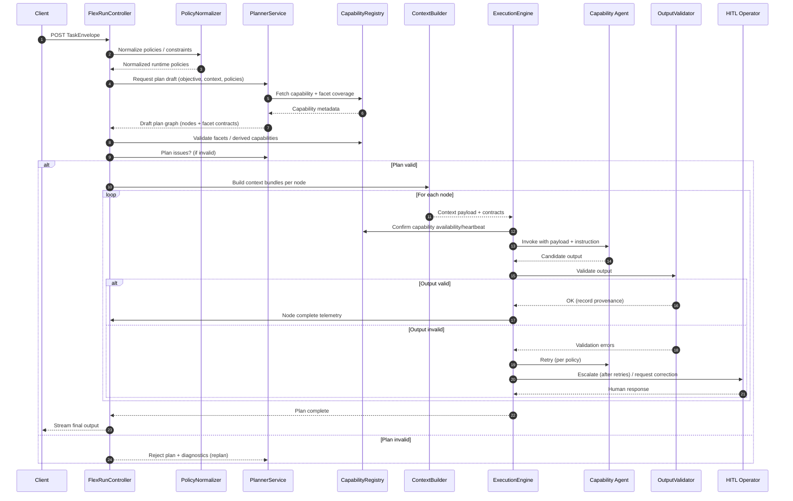

# 5. Core Concepts
All canonical types and Zod validators for the concepts below are exported from `@awesomeposter/shared/flex` (source: `packages/shared/src/flex/types.ts`). Planner, agents, and UI code should import from that module to stay in sync.
## 5.1 TaskEnvelope
Canonical request payload containing `objective`, `inputs`, `constraints`, `outputContract`, `policies`, and caller metadata. The orchestrator never assumes fields beyond what the envelope expresses.

## 5.2 OutputContract
Client-supplied JSON Schema plus optional post-processing hints (for example field ordering). The validator enforces the schema before finalizing a run; the orchestrator may also use it to derive intermediate expectations.

## 5.3 TaskPolicies
`TaskEnvelope.policies` carries caller-authored guidance that shapes both the graph the planner proposes and the way the runtime reacts while executing it. The payload is strictly declarative – the orchestrator never infers hidden defaults – and is normalized before any planning begins.

```ts
export interface TaskPolicies {
  /** Policies that influence how the plan is generated. */
  planner?: PlannerPolicy;

  /** Policies that govern runtime behavior after planning. */
  runtime?: RuntimePolicy[];
}
```

All helpers inside `@awesomeposter/shared/flex` import these definitions, keeping the planner, runtime, and UI in lockstep.

### PlannerPolicy
Planner policies constrain graph generation (structure, required capabilities, optimisation goals) and surface free-form hints the planner can serialize directly into prompts.

```ts
export interface PlannerPolicy {
  /** Structural constraints on the plan itself */
  topology?: {
    variantCount?: number;
    maxDepth?: number;
    requiredKinds?: string[];
    forbiddenKinds?: string[];
  };

  /** Unified capability and node selection preferences */
  selection?: {
    require?: string[];
    forbid?: string[];
    prefer?: string[];
    avoid?: string[];
  };

  /** High-level optimisation intent */
  optimisation?: {
    objective?: "speed" | "quality" | "diversity" | "token_efficiency";
    maxTokens?: number;
  };

  /** Free-form hints for planner prompt injection */
  directives?: Record<string, unknown>;
}
```

### RuntimePolicy
Runtime policies watch execution signals and request a unified `Action` when their trigger criteria match. The orchestrator evaluates these policies deterministically, records the trigger metadata, and hands control to the requested action handler.

```ts
export type Action =
  | { type: "goto"; next: string; maxAttempts?: number }
  | { type: "replan"; rationale?: string }
  | {
      type: "hitl"
      rationale?: string
      approveAction?: Action
      rejectAction?: Action
    }
  | { type: "fail"; message?: string }
  | { type: "pause"; reason?: string }
  | { type: "emit"; event: string; payload?: Record<string, any> };

export interface RuntimePolicy {
  id: string
  enabled?: boolean
  trigger: PolicyTrigger
  action: Action
}

export type PolicyTrigger =
  | { kind: "onStart" }
  | { kind: "onNodeComplete"; selector?: NodeSelector; condition?: Record<string, any> }
  | { kind: "onValidationFail"; selector?: NodeSelector; condition?: Record<string, any> }
  | { kind: "onTimeout"; ms: number }
  | { kind: "onMetricBelow"; metric: string; threshold: number }
  | { kind: "manual" };

export interface NodeSelector {
  nodeId?: string;
  kind?: string;
  capabilityId?: string;
}
```

Runtime policy validation now rejects unknown action names with migration hints (for example `hitl_pause → hitl`) so callers only reference the canonical union above. `goto` handlers track per-policy attempt counts and stop retrying once `maxAttempts` (default `1`) is exhausted. `hitl` directives can chain follow-up `Action`s that execute once the operator approves or rejects a request; approval defaults to “resume” when no nested action is supplied while rejection falls back to a terminal `fail`. `pause` actions persist the full execution snapshot – including policy state – so resumptions continue deterministically without re-planning.

Example payload:

```json
{
  "policies": {
    "planner": {
      "topology": { "variantCount": 3 },
      "selection": {
        "require": ["QualityAssuranceAgent.contentReview"],
        "forbid": ["LegacyGeneratorAgent"],
        "prefer": ["ContentGeneratorAgent.linkedinVariants"]
      },
      "optimisation": { "objective": "quality" }
    },
    "runtime": [
      {
        "id": "low_quality_replan",
        "trigger": {
          "kind": "onNodeComplete",
          "selector": { "kind": "validation" },
          "condition": { "<": [{ "var": "qaFindings.overallScore" }, 0.6] }
        },
        "action": { "type": "replan", "rationale": "Low QA score" }
      },
      {
        "id": "medium_quality_hitl",
        "trigger": {
          "kind": "onNodeComplete",
          "selector": { "kind": "validation" },
          "condition": {
            "and": [
              { ">=": [{ "var": "qaFindings.overallScore" }, 0.6] },
              { "<": [{ "var": "qaFindings.overallScore" }, 0.9] }
            ]
          }
        },
        "action": { "type": "hitl", "rationale": "Medium quality requires review" }
      }
    ]
  }
}
```

> **Note:** Action verb names (`hitl`, `fail`, `emit`, etc.) reflect the canonical shared enum. Execution stories (8.23, 8.24) will align dispatcher terminology so runtime wiring matches these identifiers.

> **Adapter Today:** The orchestrator emits canonical `Action.type` values in telemetry and attaches the policy ID that triggered a replan. Internal handlers still translate to legacy dispatcher verbs (`hitl_pause`, `fail_run`, ...) until Stories 8.23/8.24 land.

## 5.4 PlanGraph
A DAG generated per run describing specialist tasks, dependencies, and guard conditions. Nodes capture the selected agent/tool, expected `ContextBundle`, and the return contract the orchestrator expects (structured schema or free-form instructions the orchestrator can post-process).

## 5.5 ContextBundle
Payload compiled for each agent invocation that includes the relevant slice of the envelope, prior validated outputs, knowledge snippets, and explicit return expectations.

## 5.6 AgentCapability
Registry entries advertising an agent’s competencies, IO expectations, cost profile, and preferred models. The planner matches plan nodes to capabilities at runtime.

### Facet Definition
- `Facet` objects are the semantic primitives the planner uses when composing contracts. Each facet defines a reusable slice of meaning – tone, brief, compliance rubric – that can be merged into node contracts.
- Author and register facets in `packages/shared/src/flex/facets/catalog.ts` using the shared `FacetCatalog` utilities. The catalog is loaded everywhere via `getFacetCatalog()` so the planner, execution layer, and tests read the same source of truth.
- Core what
Example:

```json
{
  "name": "toneOfVoice",
  "title": "Tone of Voice",
  "description": "Adjusts emotional style and diction of the generated text.",
  "schema": {
    "type": "string",
    "enum": ["friendly", "professional", "inspiring"]
  },
  "semantics": "Agent should skew language, phrasing, word choice to reflect the tone value.",
  "metadata": {
    "version": "v1",
    "directionality": "input"
  }
}
```

### Facet-Aligned Capabilities
- Each capability declares the facets it consumes via its `inputContract` (array of facet names) and the facets it produces via its `outputContract`.
- Declared facets must remain a subset of what the owning agent can support; this keeps planner reasoning consistent even if the agent serves many roles.
- During planning, the orchestrator can **derive** a capability by checking whether an agent’s supported facets can satisfy the requested facet mix, even if that exact capability was not explicitly registered. Derived capabilities are flagged on the plan node for auditing.
- Contracts are assembled dynamically by merging the schema of all selected facets, so new facets can be introduced without editing planner code.

## 5.6.1 Capability Registration
Agents self-register with the orchestrator during startup (or when hot-loaded). Each agent posts a `CapabilityRegistration` payload describing its identifiers, strengths, supported locales, preferred models, facet coverage (`inputContract`/`outputContract` arrays), and heartbeat metadata. The orchestrator persists the record, tracks health/heartbeat metadata, and updates the `CapabilityRegistry` so planners always operate on live data. Multiple instances of the same capability can register with distinct scopes (for example `writer.en`, `writer.fr`), enabling runtime selection and graceful degradation when one instance is unavailable.

## 5.6.2 Registration Payload
Registration payloads share a stable contract so the orchestrator can validate and cache metadata.

```json
{
  "capabilityId": "writer.en",
  "agentType": "ai",
  "version": "2025.03.02",
  "displayName": "Content Writer (English)",
  "summary": "Creates long-form and social copy in English with brand-aware tone controls.",
  "inputTraits": {
    "languages": ["en"],
    "formats": ["linkedIn_post", "twitter_thread"],
    "strengths": ["brand_voice_alignment", "cta_generation"],
    "limitations": ["no_paid_ads_claims"]
  },
  "inputContract": ["toneOfVoice", "writerBrief", "audienceProfile"],
  "outputContract": ["copyVariants", "rationaleSummary"],
  "cost": { "tier": "standard", "estimatedTokens": 6000 },
  "preferredModels": ["gpt-5.1"],
  "heartbeat": { "intervalSeconds": 60 },
  "metadata": {
    "owner": "marketing-ai",
    "docsUrl": "https://internal.docs/agents/writer-en"
  }
}
```

**Field overview**
- `capabilityId` (string, required): globally unique identifier used in plan nodes.
- `agentType` (string, required "human" | "ai")
- `version` (string, required): semantic or timestamp version of the agent configuration.
- `displayName` (string, required): human-readable name shown in tooling and logs.
- `summary` (string, required): concise capability description.
- `inputTraits` (object, optional): declared coverage such as supported languages, formats, strengths, and limitations.
- `inputContract` (array of strings, required): facet names this capability consumes when invoked.
- `outputContract` (array of strings, required): facet names this capability produces; planner merges them into downstream contracts.
- `cost` (object, optional): estimates around token usage or pricing tier for planner budgeting.
- `preferredModels` (array, optional): ranked list of model IDs the agent is tuned for.
- `heartbeat` (object, optional): heartbeat expectations (intervals/timeout) so the orchestrator can mark stale registrations.
- `metadata` (object, optional): free-form key/value pairs (owner, documentation URLs, rollout flags).
- Legacy JSON Schema contracts are deprecated in favor of facet arrays; remove any freeform payloads during migration.

## 5.7 Facet-Based Plan Assembly
Facet-driven contracts let the planner assemble dynamic graphs without hard-coding role sequences. Every node’s contract is stitched together at runtime by selecting the right facets, merging their schemas, and attaching the semantics needed for downstream agents (or humans) to act predictably.

### Planning Steps
1. **Select agent and capability.**
   - Prefer an agent that already publishes a matching capability.
   - If none exist, derive a capability by confirming the agent supports the required facets; mark the node as derived for traceability.
2. **Activate the facets to use.**
   - Examine envelope objective, policies, constraints, and prior outputs.
   - For declared capabilities, choose a subset of the published `inputContract`/`outputContract` facets.
   - For derived capabilities, pick the facet mix that best covers the requested outcome.
3. **Merge schemas into contracts.**
   - `inputSchema = FacetContractCompiler.compileContracts(selectedInputFacets)`
   - `outputSchema = FacetContractCompiler.compileContracts(selectedOutputFacets)`
   - Preserve facet provenance so validators and telemetry can explain where each schema fragment originated. The compiler already returns provenance metadata and Ajv validators via `CompiledFacetSchema`.
4. **Compose the system instruction.**
   - Concatenate guidance from the selected facets’ `semantics`.
   - Example: “Use toneOfVoice to adjust diction; apply writerBrief context; emit copyVariants output.”
5. **Annotate the plan node.**
   - Store `agentId`, `capabilityId` (or `derivedFrom`), the selected facet arrays, resolved schemas, merged system instruction, retry/fallback policy, and a rationale blob for debugging.

### Story 8.8 Dynamic Assembly Details
- **Live registry hydration:** During planning the orchestrator hydrates the latest capability snapshot (strategy, generation, QA, transformation helpers) and facet catalog definitions. Capability selections record coverage gaps so derived nodes are transparent.
- **Capability scoring:** Candidates are scored on facet alignment, envelope-derived channel/format hints, language support, and declared costs. A configurable cutoff prevents low-confidence matches from entering the graph; derived selections are annotated when the planner leans on a capability outside its highest-confidence traits.
- **Plan taxonomy:** Generated plan graphs now include `structuring`, optional `branch`, `execution`, `transformation`, `validation`, and `fallback` nodes. Each node carries compiled input/output schemas (via `FacetContractCompiler`), provenance arrays, and expectations the execution engine reuses for validation.
- **Branch expansion:** Pre-execution branch directives (e.g., `policies.branchVariants`) produce dedicated branch nodes linked between strategy and execution nodes. Branch nodes inherit facet provenance and node metadata so downstream tooling can visualise the branch origin.
- **Normalization nodes:** When caller output contracts require JSON schema enforcement the planner injects a `transformation` node after the execution stage. The node is virtual (orchestrator-managed) but records provenance, instructions, and plan wiring so downstream services can normalise outputs without custom glue code.
- **Fallback wiring:** Every plan terminates with a fallback/HITL node that references the terminal execution node. The fallback node captures escalation instructions, facet rationale, and policy triggers so the execution engine can enter HITL mode without regenerating the plan.
- **PlannerService (LLM-backed):** Planner prompts an LLM for draft nodes, capturing `plannerRuntime`/`plannerModel` metadata. A deterministic fallback draft keeps runs functional when the model is unavailable.
- **Metadata & versioning:** Plans include `planVersion`, `planVersionTag`, branch counts, derived capability lists, and a `normalizationInjected` flag. Telemetry surfaces this metadata alongside SSE `plan_generated` events, enabling UI clients to highlight active branches, derived nodes, and policy wiring.

### Execution Runtime
1. **Validate inputs.** Reject immediately if the payload fails the resolved `inputSchema`; do not call the agent.
2. **Invoke the agent or human.** Provide the payload, merged instruction, and any facet-specific metadata.
3. **Validate outputs.** Run contract checks against the resolved `outputSchema`; on failure, follow node retry strategy, then fallback (alternate capability or HITL) once retries exhaust.
4. **Persist state.** Record inputs, outputs, validation errors, derived capability markers, and node status to support rehydration and audits.
5. **Propagate downstream.** On success, hand the validated output to dependent nodes. For fallbacks, follow the alternate edges defined during planning.

> Intermediate artifacts (writer briefs, rubric scores, normalization transforms) are represented as facet-driven contracts just like client deliverables. When transformation or post-processing is required, the planner injects dedicated nodes so conversions remain in-band and fully traceable.

## 5.8 Planner vs Orchestrator: Hybrid Collaboration
The flex stack pairs the LLM-backed `PlannerService` with the deterministic orchestration layer (`FlexRunController`, `PolicyNormalizer`, `CapabilityRegistry`, `ContextBuilder`, `ExecutionEngine`, `OutputValidator`, `PersistenceService`, `TelemetryService`). The planner excels at interpreting fuzzy objectives; the orchestration layer guarantees contracts, execution order, and safety. Planner proposes; orchestrator compiles, enforces, and executes.

### Roles & Responsibilities

| Component | Role | Strengths / Why Use It | Boundaries / Constraints |
| --- | --- | --- | --- |
| `PlannerService` (LLM-backed) | Interpret objectives, decompose into subtasks, recommend agent + capability pairings, suggest facet activation, and draft system instructions. | Flexible reasoning, rapid adaptation to new objectives, can infer structure from context. | Must not commit irreversible state changes; every plan is validated before execution. |
| Orchestration Layer (`FlexRunController` + `PolicyNormalizer` + `CapabilityRegistry` + `ContextBuilder` + `ExecutionEngine` + `OutputValidator`) | Validate the draft plan, compile explicit contracts, enforce constraints, route tasks, coordinate retries/fallbacks/HITL, and drive execution while persisting telemetry. | Predictable, auditable, reliable; maintains invariants and compliance. | Must not guess beyond deterministic rules; rejects invalid plans or sends them back for revision. |

### Interaction Sequence
1. **Objective submission.** Client posts a `TaskEnvelope` containing the objective, context, and constraints.
2. **Planning phase (`PlannerService`).**
   - `PlannerService` inspects objective, context, facet registry, and capability metadata (via `CapabilityRegistry` read APIs).
   - It assembles a draft plan graph: nodes include `agentId`, `capabilityId` (declared or derived), `inputContract`/`outputContract` facet arrays, and proposed system instructions.
3. **Plan validation & compilation (orchestration layer).**
   - `FlexRunController`, working with `CapabilityRegistry`, merges facets into explicit input/output schemas.
   - `CapabilityRegistry` confirms the agent supports every referenced facet; derived capability safeguards are applied when needed.
   - Contracts are compiled with Ajv/Zod; `PlannerService` receives rejection diagnostics if inconsistencies surface.
4. **Execution (`ContextBuilder` + `ExecutionEngine` + `OutputValidator`).**
   - `ContextBuilder` prepares inputs for each node; `ExecutionEngine` validates them before dispatch.
   - `ExecutionEngine` invokes the agent (or human) with payload + compiled instruction.
   - `OutputValidator` checks outputs, applies retry policy, and escalates to fallbacks or HITL through `ExecutionEngine` when retries exhaust.
   - `PersistenceService` and `TelemetryService` capture status, inputs, outputs, and diagnostics.
5. **Replanning (optional).**
   - `ExecutionEngine` or `PolicyNormalizer` can request a revised plan when constraints shift or nodes fail.
   - `PlannerService` returns deltas; orchestration components revalidate, patch the graph, and resume.
6. **Completion.**
   - `ExecutionEngine` confirms terminal nodes succeeded, `OutputValidator` verifies caller contracts, and `FlexRunController` emits the final response.

### Collaboration Patterns
- **Plan-and-Solve:** Planner generates the full plan up front; orchestrator executes sequentially. High predictability, lower adaptability mid-run.
- **Interleaved / ReAct style:** Planner and orchestrator alternate—plan a node, execute, reassess. Adapts quickly but requires stronger guardrails.
- **Fallback proposals:** Planner may pre-encode alternates or fallbacks; orchestrator chooses the best candidate at runtime based on health, cost, or performance.

### Derived Capability Handling
- Planner may target an agent for an unlisted capability by proposing facet arrays.
- `CapabilityRegistry` verifies facet support, `ExecutionEngine` flags the node as derived, tightens retries/logging, and routes through HITL if needed.
- Stable success across runs is a signal to formalize the pairing as a declared capability owned by the responsible agent team.

### Failure Modes & Recovery

| Failure Mode | Detection Point | Recovery Strategy |
| --- | --- | --- |
| Invalid facet combination | `CapabilityRegistry` / `PlannerService` validation | Reject node, return diagnostics to `PlannerService` for regeneration. |
| Schema compilation conflict | `FlexRunController` / contract compiler | Filter conflicting facets or request planner revisions. |
| Input validation failure | `ExecutionEngine` pre-dispatch | Fail fast, surface to planner or caller; optionally replan upstream. |
| Output validation failure | `OutputValidator` post-dispatch | Retry per policy, then fallback to alternate agent or HITL. |
| Agent crash / runtime error | `ExecutionEngine` runtime | Retry, switch to fallback, or escalate to human operator. |
| Mid-flow constraint drift | `ExecutionEngine` / `TelemetryService` monitoring | Trigger replanning to insert corrective nodes or adjust routing. |

### Why the Hybrid Model Matters
- **Balanced flexibility and control:** Planner adapts to ambiguous objectives while orchestrator enforces invariants.
- **Safety net for generative systems:** All planner proposals are validated before any side effects occur.
- **Traceability:** Every node records provenance, instructions, and validation outcomes for auditing.
- **Iterative evolution:** Responsibilities can shift over time—formalize successful patterns deterministically or give the planner more autonomy once guardrails prove effective.

> The sequence below illustrates planner ↔ orchestrator loops, highlighting guardrails, validation gates, and replanning hooks.

### Planner ↔ Orchestrator Sequence (Mermaid)


