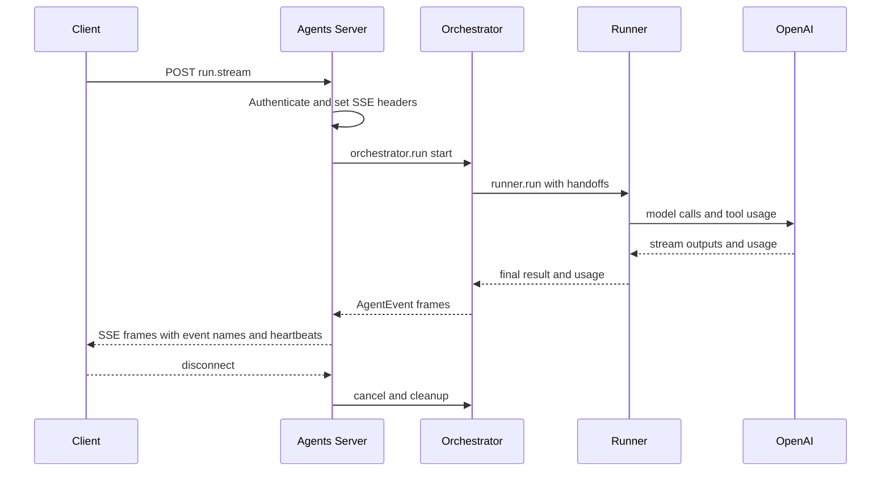

# Agents Server Hardening Guide

Status: Draft
Last updated: 2025-09-04

This guide hardens the agents server with security, SSE transport, metrics, and tracing aligned to reminders 5–18. It is specific to the current codebase and references concrete files and constructs.

Contents
- Prioritized roadmap (P0–P3)
- Inventory and current state
- Security hardening
- SSE transport standardization
- Metrics and telemetry
- Tracing
- Versioning and deprecation headers
- Guardrails
- Test plan
- Performance and backpressure
- Implementation checklist mapped to reminders 5–18

Prioritized roadmap (P0–P3)

P0 — Security and streaming reliability
- Enforce authentication in production via [server/middleware/auth.ts](awesomeposter/packages/agents-server/server/middleware/auth.ts:1); fail fast if API_KEY is missing; standardize error responses.
- Standardize SSE in [run.stream.post.ts](awesomeposter/packages/agents-server/routes/api/v1/agent/run.stream.post.ts:14) and [execute-with-progress.post.ts](awesomeposter/packages/agents-server/routes/api/v1/workflow/execute-with-progress.post.ts:7): strict [AgentEventSchema](awesomeposter/packages/shared/src/agent-run.ts:26) envelope, event field, headers, 15s heartbeats, disconnect cleanup, and backpressure.
- Minimal metrics: emit a final metrics event per run with durationMs and tokens; include correlationId; ensure tool_result events include durationMs in [AgentRuntime.runWithTools()](awesomeposter/packages/agents-server/src/services/agent-runtime.ts:97) and aggregate in [OrchestratorAgent.run()](awesomeposter/packages/agents-server/src/services/orchestrator-agent.ts:15).
- Error normalization for SSE and REST; do not leak stack traces or internal details.

P1 — Streaming features and observability
- Streaming triage run in app mode; map SDK stream events to AgentEvent frames and surface handoffs.
- Plumb AgentRunRequest.options across runtime and orchestrator: temperature, toolsAllowlist, toolPolicy, schemaName, trace in [AgentRuntime.getAgentTools()](awesomeposter/packages/agents-server/src/services/agent-runtime.ts:56) and [OrchestratorAgent.run()](awesomeposter/packages/agents-server/src/services/orchestrator-agent.ts:15).
- Optional tracing behind options.trace using OpenTelemetry; spans for HTTP request, orchestration, runner/model, tool calls, and DB queries. (NOT)
- CORS allowlist for browser clients; restrict methods/headers to required set.

P2 — Tests, versioning, and performance tuning
- Scope v1 deprecation headers to /api/v1/workflow/* only in [server/middleware/v1-deprecation.ts](awesomeposter/packages/agents-server/server/middleware/v1-deprecation.ts:1).
- Route tests for SSE framing, event order, and disconnect handling; add smoke tests for agent run and health.
- Concurrency limits (simple semaphore) and proxy buffering header (X-Accel-Buffering: no); monitor memory and adjust backpressure.
- Optional /metrics endpoint for basic counters.

P3 — Documentation and optional features
- API docs for /api/v1/agent/run.stream and health with example frames and error cases.
- Minimal input/output guardrails warnings surfaced as AgentEvent warning.
- Optional per-run session persistence with in-memory retrieval by id.

Mapping of reminders 5–18 to priority
- 5 Streaming triage run: P1
- 6 Surface handoff events: P1
- 7 Comprehensive metrics: P1
- 8 Plumb options (temperature, toolsAllowlist, toolPolicy, schemaName, trace): P1
- 9 SSE transport standardization: P0
- 10 Consolidate agent initialization: P2
- 11 Scope v1 deprecation to workflow only: P2
- 12 Optional tracing integration: P1
- 13 Minimal input/output guardrails: P1
- 14 Smoke tests and SSE route tests: P2
- 15 Document /api/v1/agent/run.stream and health endpoints: P3
- 16 Optional per-run session persistence: P3
- 17 Security hardening (input size limits, sanitized logging, enforce API key outside dev): P0
- 18 Performance tuning and backpressure: P2

Inventory and current state

Endpoints and handlers
- Agent run SSE: [routes/api/v1/agent/run.stream.post.ts](awesomeposter/packages/agents-server/routes/api/v1/agent/run.stream.post.ts:1)
- Workflow progress SSE: [routes/api/v1/workflow/execute-with-progress.post.ts](awesomeposter/packages/agents-server/routes/api/v1/workflow/execute-with-progress.post.ts:1)
- Health checks: [routes/api/v1/health/openai.get.ts](awesomeposter/packages/agents-server/routes/api/v1/health/openai.get.ts:1)

Core services and schema
- Orchestrator: [OrchestratorAgent.run()](awesomeposter/packages/agents-server/src/services/orchestrator-agent.ts:15)
- Runtime: [AgentRuntime.runChatStream()](awesomeposter/packages/agents-server/src/services/agent-runtime.ts:118), [AgentRuntime.runWithTools()](awesomeposter/packages/agents-server/src/services/agent-runtime.ts:97)
- Agent event envelope: [AgentEventSchema](awesomeposter/packages/shared/src/agent-run.ts:26)

Middleware and plugins
- API key auth: [server/middleware/auth.ts](awesomeposter/packages/agents-server/server/middleware/auth.ts:1)
- v1 Deprecation headers: [server/middleware/v1-deprecation.ts](awesomeposter/packages/agents-server/server/middleware/v1-deprecation.ts:1)
- Correlation and logging: [server/plugins/logging.ts](awesomeposter/packages/agents-server/server/plugins/logging.ts:1)
- Env bootstrap: [server/plugins/env.ts](awesomeposter/packages/agents-server/server/plugins/env.ts:1)

Observations
- SSE endpoints set Content-Type and write JSON frames but lack heartbeats, disconnect handling, and backpressure control.
- Streams do not include event names or ids; only data lines are sent.
- Agent events are shaped in Orchestrator and Runtime, but routes do not validate or normalize frames to the shared envelope.
- Logging includes correlation ids; auth is optional if API_KEY unset; v1 Deprecation applies to all /api/v1/*.
- No explicit tracing yet; metrics are partially emitted as events from tools and runs.

Security hardening

1) API authentication and environment policy
- Enforce API key in production: middleware already exists in [server/middleware/auth.ts](awesomeposter/packages/agents-server/server/middleware/auth.ts:1). Require API_KEY to be set for NODE_ENV production; reject if missing. In dev, allow unset for local testing.
- Return 401 for missing bearer and 403 for invalid token.
- Acceptance: Requests to /api/* without valid Bearer token fail in production; health routes may be optionally exempted.

2) CORS and allowed origins
- Define explicit allowed origins for browser clients. In Nitro, add a small CORS middleware or route rule to set Access-Control-Allow-Origin, -Methods, and -Headers for expected origins. Deny others.
- Acceptance: Browser preflight succeeds for configured origins only; others receive 403.

3) Request body and input limits
- Validate using zod: already present for agent run and workflow. Add length caps:
  - objective: max 4000 chars
  - systemPromptOverride: max 8000 chars (already enforced)
  - toolsAllowlist: max 50 entries
  - maxTurns: cap at 16
- Set server body size limits to prevent oversized posts.
- Acceptance: Oversized inputs receive 413 or 400 with structured error.

4) Rate limiting and abuse protection
- Introduce per-IP and per-API-key rate limits on streaming endpoints. Consider a simple in-memory token bucket or an edge provider. Exempt health.
- Acceptance: Bursty clients are throttled with 429 responses; logs capture rate limit hits with cid and ip.

5) Logging hygiene and redaction
- Ensure no secrets or payloads are logged. Current request logs exclude headers and bodies; keep it that way. Avoid logging env values. R2 storage logs currently print bucket and endpoint; keep but consider reducing verbosity in production.
- Include correlation id in all structured logs; already set by [server/plugins/logging.ts](awesomeposter/packages/agents-server/server/plugins/logging.ts:1).
- Acceptance: No PII or secrets appear in logs under typical flows; logs carry cid consistently.

6) Error handling and response shapes
- Normalize errors to { ok: false, error: code, message } in REST; for SSE, emit an AgentEvent with type error and terminate stream.
- Acceptance: Known errors map to stable codes; unknown errors return sanitized messages.

7) Production env preflight
- Fail-fast at boot if OPENAI_API_KEY missing in production; warn in dev. See runtime constructor.
- Acceptance: Server refuses to start without required keys in production.

SSE transport standardization

Goals
- Strict envelope using [AgentEventSchema](awesomeposter/packages/shared/src/agent-run.ts:26)
- Event semantics: use SSE event field to name frames by AgentEvent.type
- Heartbeats and disconnect handling
- Backpressure safety and flush
- Consistent headers across endpoints

Standard headers
- Content-Type: text/event-stream
- Cache-Control: no-cache
- Connection: keep-alive
- X-Accel-Buffering: no  for NGINX
- Content-Encoding: none  ensure no compression
- Transfer-Encoding: chunked  default under streaming

Unified envelope and writer
- Each frame should be written as:
  - event: <AgentEvent.type>
  - id: <monotonic integer or cid-scoped counter>
  - data: <JSON AgentEvent payload>
  - blank line
- Correlation id must be included in the data to match logs.
- Implement a helper sseWrite event res writer and reuse across routes.
- Acceptance: Frames carry event names; clients can filter by type; resuming is possible with Last-Event-ID if implemented later.

Heartbeats
- Send event: heartbeat with minimal data every 15s while the stream is idle.
- Use a setInterval and clear it on close.
- Acceptance: Idle connections receive heartbeats; ELB and proxies keep the connection alive.

Disconnect and abort handling
- Register on close and on aborted to stop upstream work and free resources.
- On disconnect, stop timers, unsubscribe from runners, and ensure res.end is not called twice.
- Acceptance: Long-running tasks stop promptly when clients disconnect; no leaked timers or promises.

Backpressure
- Respect res.write return value; if false, await drain before writing more.
- Acceptance: High-frequency deltas do not crash the process; memory remains bounded in load tests.

Example standardized frames

start
event: start
data: {"type":"start","message":"Run started","correlationId":"cid_123"}

phase
event: phase
data: {"type":"phase","phase":"planning","message":"Structured run started","correlationId":"cid_123"}

tool
event: tool_call
data: {"type":"tool_call","message":"io_list_assets","data":{"args":{"briefId":"..."}}, "correlationId":"cid_123"}

delta
event: delta
data: {"type":"delta","message":"partial text ...","correlationId":"cid_123"}

metrics
event: metrics
data: {"type":"metrics","tokens":1234,"durationMs":9876,"correlationId":"cid_123"}

complete
event: complete
data: {"type":"complete","data":{"result":{}},"durationMs":12345,"correlationId":"cid_123"}

error
event: error
data: {"type":"error","message":"Message","correlationId":"cid_123"}

Metrics and telemetry

Event-level metrics
- Tool calls and results already emit events in [AgentRuntime.getAgentTools()](awesomeposter/packages/agents-server/src/services/agent-runtime.ts:56) and [AgentRuntime.runWithTools()](awesomeposter/packages/agents-server/src/services/agent-runtime.ts:97).
- Ensure tokens and durationMs are included where available. Aggregate per run in Orchestrator and emit a final metrics frame.
- Acceptance: For each run, we see a final metrics event with totals; tool events include per-call latency.

Server-level metrics
- Optionally expose a lightweight /metrics JSON with counters  runs, errors, average duration  and rely on logs for long-term storage.
- Acceptance: Health tooling can scrape or query basic stats without opening SSE.

Token accounting
- Prefer SDK-provided usage fields; if missing, estimate roughly by content sizes for directional metrics only.
- Acceptance: Token counts present for supported models; zero or omitted when unavailable.

Tracing

Goals
- Optional tracing behind options.trace flag on the request; default off.
- Spans for request, orchestrator run, tool calls, DB queries, and model run.

Proposed integration
- Add an OpenTelemetry provider and OTLP or console exporter.
- Use correlation id as trace id or part of attributes.
- Span naming
  - http.request /api/v1/agent/run.stream
  - orchestrator.run
  - runner.run model
  - tool io_list_assets
  - db query assets by brief
- Acceptance: When options.trace is true, spans are emitted for the end to end flow and include cid, briefId, and tool names.

Suggested link points
- Orchestrator entry: [OrchestratorAgent.run()](awesomeposter/packages/agents-server/src/services/orchestrator-agent.ts:15)
- Runtime runner calls: [AgentRuntime.runChatStream()](awesomeposter/packages/agents-server/src/services/agent-runtime.ts:118), [AgentRuntime.runWithTools()](awesomeposter/packages/agents-server/src/services/agent-runtime.ts:97)
- Tool handlers are defined via runtime.registerTool in agents and tools packages.

Versioning and deprecation headers

Current behavior
- Middleware sets Deprecation for any /api/v1/* when configured: [server/middleware/v1-deprecation.ts](awesomeposter/packages/agents-server/server/middleware/v1-deprecation.ts:1)

Hardening rule
- Scope deprecation to workflow only: /api/v1/workflow/*; leave /api/v1/agent/* and /api/v1/health/* untouched.
- Acceptance: Deprecation and Sunset headers appear only on workflow routes; smoke tests confirm agent and health are unaffected.

Guardrails

Input guardrails
- Validate and cap objective length, tools list size, and numeric ranges as above.
- For chat mode, apply basic bad content filters where appropriate on server side only as warnings.

Output guardrails
- Inspect final outputs for obviously invalid JSON in app mode; if invalid, deliver a warning event and either attempt a safe parse or fall back to synthesis path already present in Orchestrator.
- Acceptance: Warnings show as AgentEvent warning and metrics maintain visibility into corrections.

Test plan

SSE framing and order
- Route tests to assert headers, event names, envelope validity, and expected order: start, phase, deltas or handoffs, metrics, complete.
- Disconnect tests: client abort leads to server cleanup within 2s.

Health and auth
- Health endpoints reachable without auth if policy requires; otherwise require auth consistently.
- Auth middleware rejects unauthorized API calls in production.

Metrics and tracing
- When enabled, trace spans exist for core steps; metrics events present and aggregated.

Performance and backpressure

Concurrency limits
- Apply a simple in-memory semaphore for concurrent runs to protect the process; return 503 when saturated.

Backpressure and buffering
- Respect write backpressure and disable proxy buffering using X-Accel-Buffering: no.

Memory observation
- Load test with N concurrent streams and ensure RSS remains within target; log GC pressure and long frames.

Implementation checklist mapped to reminders 5–18

5. Streaming triage run: implement app mode streaming and map SDK events to AgentEvent frames; acceptance: end to end stream with phase and handoff markers.
6. Handoff events: map SDK handoff_occurred into phase or handoff events; acceptance: at least one handoff event appears in triage flows.
7. Metrics: emit tokens and durations per tool and per run; acceptance: final metrics frame with totals.
8. Options plumb: honor temperature, toolsAllowlist, toolPolicy, schemaName, trace; acceptance: values observed in runtime and agents.
9. SSE transport: heartbeat, disconnect, strict envelope; acceptance: route tests pass and long connections remain healthy.
10. Agent init consolidation: choose plugin or container; avoid duplicate registration; acceptance: single path to agents in prod.
11. v1 deprecation scoping: only workflow; acceptance: headers absent on agent and health.
12. Tracing optional: TraceProvider and exporter behind options.trace; acceptance: spans present only when requested.
13. Guardrails: input caps and output checks; acceptance: warnings emitted and errors safe.
14. Tests: smoke and SSE framing; acceptance: CI passes and event order verified.
15. API docs: document /api/v1/agent/run.stream and health with examples; acceptance: markdown updated and linked.
16. Session persistence optional: per-run ids in memory for retrieval; acceptance: retrieve by id within TTL.
17. Security: size limits, sanitized logging, enforce API key; acceptance: prod locked down.
18. Performance: concurrency and backpressure tuning; acceptance: load targets achieved.

Suggested API docs excerpts

Endpoint: POST /api/v1/agent/run.stream
Request body: AgentRunRequest with mode app or chat, objective, briefId optional, options optional.
Response: SSE with AgentEvent envelope as above.
Example curl:
curl -N -H "Content-Type: application/json" -H "Authorization: Bearer $API_KEY" -X POST \ 
  https://host/api/v1/agent/run.stream \ 
  -d '{"mode":"app","objective":"Write a product launch post","briefId":"..."}'

Endpoint: GET /api/v1/health/openai
Response JSON: ok, configured, model, durationMs, reply or error.
Implementation: [routes/api/v1/health/openai.get.ts](awesomeposter/packages/agents-server/routes/api/v1/health/openai.get.ts:1)

Architecture overview

Mermaid sequence

References
- SSE write site: [run.stream.post.ts](awesomeposter/packages/agents-server/routes/api/v1/agent/run.stream.post.ts:14)
- SSE write site: [execute-with-progress.post.ts](awesomeposter/packages/agents-server/routes/api/v1/workflow/execute-with-progress.post.ts:7)
- Orchestrator entry: [OrchestratorAgent.run()](awesomeposter/packages/agents-server/src/services/orchestrator-agent.ts:15)
- Runtime streaming: [AgentRuntime.runChatStream()](awesomeposter/packages/agents-server/src/services/agent-runtime.ts:118)
- Event schema: [AgentEventSchema](awesomeposter/packages/shared/src/agent-run.ts:26)
- Auth: [server/middleware/auth.ts](awesomeposter/packages/agents-server/server/middleware/auth.ts:1)
- Deprecation: [server/middleware/v1-deprecation.ts](awesomeposter/packages/agents-server/server/middleware/v1-deprecation.ts:1)
- Logging plugin: [server/plugins/logging.ts](awesomeposter/packages/agents-server/server/plugins/logging.ts:1)

Next steps
- Implement SSE writer helper and adopt in both SSE routes.
- Plumb options to runtime and orchestration.
- Add tracing provider and exporters gated by options.trace.
- Add tests and smoke coverage.
- Revisit concurrency settings after initial load tests.
