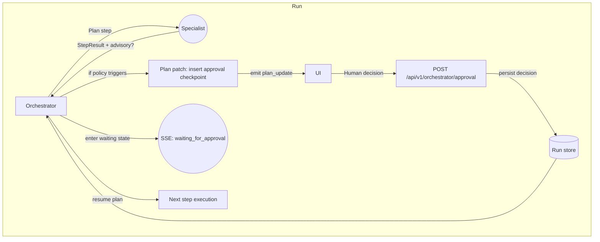

# Human-in-the-Loop Approval Architecture — Orchestrator-Initiated

Status: Proposed; Owner: Platform team; Target release: Q3 FY25

## Goals
- Keep the orchestrator as the single source of truth for plan progression while enabling humans to approve or block critical transitions.
- Allow specialist agents (strategy, content, QA, future agents) to **advise** when human review is needed without directly halting execution.
- Provide enterprise-grade observability (SSE, run history) so operators understand why a run is paused and what evidence is available.
- Maintain resumability and deterministic replay through the existing `threadId` persistence model.

## Success Metrics
- ≥90% of runs that require approvals resume automatically within 5 minutes of human action.
- Human reviewers receive complete context (artifacts, rationale, advisories) in ≤2 seconds after the orchestrator enters `waiting_for_approval`.
- No increase in failed runs attributable to resume/approval race conditions over a 14-day rolling window.

## Operating Principles
1. **Orchestrator-controlled checkpoints**: only the orchestrator can insert, escalate, or clear HITL checkpoints in the plan.
2. **Advisory-driven**: specialists emit structured `approvalAdvisory` payloads; the orchestrator translates them into plan updates or telemetry.
3. **Non-blocking specialists**: specialists never wait for humans; they return control to the orchestrator with advisory metadata.
4. **Idempotent resumption**: approvals are persisted outside transient process memory so a restart can resume either side of a checkpoint.
5. **UI parity**: Sandbox and production UIs share the same approval primitives (actions, evidence, status badges).

## High-level Flow


## Components & Contracts

### 1. Approval Policy Engine
- **Location**: `packages/agents-server/src/services/orchestrator-engine.ts`.
- **Inputs**: current plan step result (`StepResult`), advisory metadata (optional), run constraints, tenant-level policy (config).
- **Outputs**:
  - `ApprovalCheckpoint` structure `{ checkpointId, reason, advisorySource, requiredRoles[], expiresAt?, autoFailAt? }`.
  - Plan patch to insert `approval.wait` step before continuing.
  - SSE `message` frames describing why approval is required.
- **Behavior**:
  - Inspect `StepResult.approvalAdvisory?` plus global rules (e.g., high-risk objectives, regulatory keywords).
  - Deduplicate existing checkpoints (idempotent) and collapse repeated advisories.
  - Provide hints for UI: severity, recommended reviewers, assets to display.

### 2. Specialist Advisory Schema
- Extend `StepResult` in `packages/shared/src/agent-run.ts` with optional `approvalAdvisory`:
  ```ts
  type ApprovalAdvisory = {
    severity: 'info' | 'warn' | 'block';
    reason: string;
    evidenceRefs: string[]; // asset IDs, doc handles, plan step IDs
    suggestedRoles?: ('marketing_manager' | 'legal' | 'compliance' | 'executive')[];
    autoEscalate?: boolean; // true forces orchestrator to require approval
  };
  ```
- Specialists populate this field when returning `StepResult` (content risk, QA failure, etc.).
- Advisory is immutable history data; stored alongside `StepResult` for analytics.

### 3. Plan Representation
- Add plan step type `approval.wait` with payload `{ checkpointId, reason, requestedBy, requiredRoles[], evidenceRefs[] }`.
- When the orchestrator schedules this step, it emits a `plan_update` SSE patch and transitions to phase `approval` (new phase) or reuse `analysis` with `status='waiting'` (final choice below).
- `waiting_for_approval` state is persisted in `RunStore` alongside plan/history for resume.

### 4. Persistence & Resume
- Extend run persistence (currently `RESUME_STORE` in `orchestrator-engine.ts`) to record `pendingApprovals: Record<checkpointId, { status: 'waiting' | 'approved' | 'rejected', decidedBy?, decidedAt? }>`.
- Approvals API writes decisions into this store (backed by Redis/Postgres via `packages/server` persistence adapter).
- On resume, orchestrator checks pending approvals:
  - If status is `waiting`, orchestrator re-emits SSE `waiting_for_approval` and idles until decision.
  - If `approved`, plan step is marked complete and execution resumes.
  - If `rejected`, orchestrator emits `warning` and either replans or finalizes with failure (policy-defined).

### 5. API & Transport
- New route `POST /api/v1/orchestrator/approval` (Nitro server):
  - Payload `{ threadId, checkpointId, decision: 'approve' | 'reject', reviewerId, notes? }`.
  - Validates idempotency by storing `decisionId` (UUID) to ignore duplicates.
  - Emits SSE `message` frames to inform subscribers of the decision.
- Optional GET route for listing pending approvals for dashboards.

### 6. SSE and Telemetry
- Add new SSE frame types:
  - `phase` with `phase='approval'` when orchestrator enters waiting state.
  - `message` frame `waiting_for_approval` containing checkpoint metadata.
  - `approval_decision` (new `message` variant) to broadcast approvals/rejections.
- Metrics frames include dwell time spent waiting and reviewer identity (hashed) for audit.

### 7. UI/UX Surfaces
- **Sandbox (`src/views/SandboxView.vue`)**:
  - Render approval banners when `phase === 'approval'`.
  - Show checklist of pending checkpoints with evidence links (plan step context, artifacts from `StepResult` references).
  - Provide approve/reject buttons (calls new API) gated by environment role.
- **AgentResultsPopup.vue / CreatePostPopup.vue**:
  - Display final approval trail in the run summary.
- **Notifications**: optional toast via SSE to alert when runs need human action.

### 8. Security & Compliance
- Approvals require authenticated reviewers; reuse existing auth session from the app.
- Audit trail stored with reviewer ID, timestamp, decision, notes.
- Optional policy to auto-fail if no decision before `expiresAt`.
- Rate limit approval API to prevent brute force.

### 9. Configuration & Policy
- Tenant-level configuration stored in DB (e.g., `clients` table) or config service:
  - `autoApprovalRoles`, `riskKeywords`, `alwaysRequireApproval` flags.
- Exposed via orchestrator payload builder (`buildPayloadForCapability`) to inform specialists so they can surface advisories proactively.

### 10. Backward Compatibility
- Default behavior (no advisories + policy disabled) results in zero approval checkpoints; orchestrator runs as today.
- API and UI routes guard behind feature flag `ENABLE_HITL_APPROVALS`.

### 11. Observability
- Logs: structured events `approval.wait`, `approval.decision` with correlationId.
- Metrics: track approvals requested vs completed, dwell time, rejection rate.
- Dashboards: ability to list pending approvals and root causes.

### 12. Open Questions
- Should approvals support multi-step gating (e.g., separate legal + marketing sign-off)? Proposed: yes via `requiredRoles` array; orchestrator waits for all roles before resuming.
- How to handle partial approvals when replan is needed? Option: orchestrator transitions to replanning step with human feedback appended to next specialist payload.
- What is the UX for mobile reviewers? (Future scope: email or Slack notifications using same API.)
