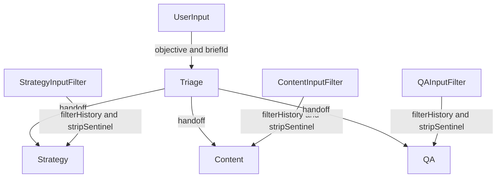

# Prompt filtering and handoff scoping plan

> **Legacy Notice**  
> This document captured the legacy orchestrator prompt-filtering backlog. The Flex runtime now scopes prompts through capability-specific instruction templates, TaskEnvelope facets, and runtime policies managed by `FlexRunCoordinator`. References to `orchestrator-engine.ts` remain for historical traceability only. See `docs/flex-agentic-architecture201025.md` and `docs/architecture/flex-agents-server/11-capability-registry-agent-contracts.md` for current behaviour.

Status
- Goal: ensure Strategy Manager only sees Strategy‑scoped context while using OpenAI Agents SDK handoffs and filtering.
- Constraint: both system and user messages propagate across handoffs by default; rely on handoff inputFilter, not only on how the local prompt is assembled.

Why this was needed (legacy context)
- Cross‑role guidance appeared in Strategy traces because the Triage agent’s system prompt and orchestration details propagated on handoff.
- Even when the legacy orchestrator avoided injecting system text directly, user messages and earlier system prompts still travelled with the handoff.
- The mitigation was to attach an inputFilter to each handoff so that only role-appropriate context survived.

Key references in this codebase
- **Legacy**: Orchestrated run loop and Triage agent creation lived in `packages/agents-server/src/services/orchestrator-agent.ts`.
- **Current**: Capability-specific instructions and tool allowlists live alongside marketing capability modules under `packages/flex-agents-server/src/agents/marketing/**`.
- **Current**: Runtime tool registration is centralised in `packages/flex-agents-server/src/services/agent-runtime.ts`; per-capability allowlists only expose `hitl_request`.

Design overview (legacy)

1) Sentinel boundary markers for orchestrator system instructions
- Introduce explicit boundary markers that wrap orchestrator‑authored system guidance, so they’re trivial to strip in filters:
  - <<<AP_ORCH_SYS_START>>>
  - <<<AP_ORCH_SYS_END>>>
- Place ALL orchestrator system guidance, final delivery spec, thresholds, and cross‑role notes strictly between these markers inside [buildSystemPrompt()](awesomeposter/packages/agents-server/src/services/orchestrator-agent.ts:483).

2) Handoff inputFilter pipeline (legacy)
- Use the SDK’s handoff inputFilter to curate history passed to Strategy, Content, QA.
- Pipeline stages:
  - Stage A: filterHistory to remove system messages and cap depth.
  - Stage B: remove or redact any message chunks containing sentinel‑bounded text.
  - Stage C: drop tool or orchestration artifacts not meant for the next role.
- Result: Strategy receives only the user objective plus relevant contextual user messages and its own role‑scoped system instructions; no orchestrator system sections or cross‑role tool mentions.

3) Role‑scoped allowlists remain authoritative
- Strategy, Content, QA already have strict tool allowlists. Keep these as the primary enforcement, and rely on filters to reduce prompt leakage for reliability and trace clarity.

Developer ergonomics (legacy)

- Boundaries by construction:
  - Developers never manually paste cross‑role guidance outside the sentinel section. This makes the filter rule simple and robust.
- Single utility for filtering:
  - Centralize all filtering in a small helper to avoid drift in different handoffs and enforcement prompts.

Legacy implementation steps

A) Wrap orchestrator system prompt in sentinel markers
- Edit [buildSystemPrompt()](awesomeposter/packages/agents-server/src/services/orchestrator-agent.ts:483):
  - Before returning the final string, wrap all orchestrator guidance lines between the two markers:
    - <<<AP_ORCH_SYS_START>>>
    - <<<AP_ORCH_SYS_END>>>
- Example structure (illustrative):
  - <<<AP_ORCH_SYS_START>>>
  - Follow flow lines
  - Quality thresholds
  - Final delivery spec
  - Output schema lines
  - <<<AP_ORCH_SYS_END>>>

B) Add filtering utilities
- New file: [prompt-filters.ts](awesomeposter/packages/agents-server/src/utils/prompt-filters.ts) with:
  - export const ORCH_SYS_START = '<<<AP_ORCH_SYS_START>>>'
  - export const ORCH_SYS_END = '<<<AP_ORCH_SYS_END>>>'
  - function stripSentinelSections(text: string): string
    - Removes any content between the markers, inclusive, across multi‑line text.
  - function redactSentinelSections(text: string): string
    - Optional alternative: replaces content between the markers with a placeholder to preserve formatting if needed.
  - function dropOrchestrationArtifacts(msg): boolean
    - Removes messages that contain only orchestrator meta, tool schemas, or approval prompts not meant for the next role.
  - function composeInputFilter(baseFilter): (history) => filteredHistory
    - Applies base filterHistory first, then maps part content with stripSentinelSections, then filters with dropOrchestrationArtifacts.

C) Convert raw handoffs to filtered Handoffs
- In Triage creation, replace the raw agents array with Handoff objects that use inputFilter; location: the handoffs array near [orchestrator-agent.ts](awesomeposter/packages/agents-server/src/services/orchestrator-agent.ts:168).
- Pattern (illustrative):
  - new Handoff({
    agent: strategyAgent,
    inputFilter: composeInputFilter(filterHistory({ maxMessages: 6, filterSystemMessages: true }))
  })
  - Repeat for Content and QA with the same composeInputFilter. If role‑specific differences are needed later, accept a parameter.

D) Keep per‑agent allowlists strict
- Ensure Strategy invocation passes requestAllowlist matching [STRATEGY_TOOLS](awesomeposter/packages/agents-server/src/agents/strategy-manager.ts:8) via [createStrategyAgent()](awesomeposter/packages/agents-server/src/agents/strategy-manager.ts:37). This is already done, but retain as invariant.

E) Optional: minimize redundant injection in programmatic enforcement
- When the Orchestrator force‑delegates to Content or QA inside [OrchestratorAgent.run()](awesomeposter/packages/agents-server/src/services/orchestrator-agent.ts:15), prefer not to embed orchestrator system text in cPrompt and qaPrompt. Their OAAgents already provide role‑scoped system instructions.
- Relevant sites: content prompt assembly [orchestrator-agent.ts](awesomeposter/packages/agents-server/src/services/orchestrator-agent.ts:361), QA prompt assembly [orchestrator-agent.ts](awesomeposter/packages/agents-server/src/services/orchestrator-agent.ts:432).

F) Logging hygiene
- We keep agent event tracing as is. Because handoffs apply inputFilter before the next agent runs, the trace for that agent will not contain sentinel content or cross‑role sections.
- If desired, logs may additionally redact sentinel sections for safety by post‑processing emitted text deltas.

Filtering details (legacy)

Sentinel strategy
- Markers:
  - Start: <<<AP_ORCH_SYS_START>>>
  - End: <<<AP_ORCH_SYS_END>>>
- Requirements:
  - Only the Orchestrator introduces these markers.
  - Do not use these markers anywhere else.
  - Keep all global orchestration content strictly inside these markers.

Regex sketch for removal
- Multiline, greedy removal between sentinels:
  - /<<<AP_ORCH_SYS_START>>>[\\s\\S]*?<<<AP_ORCH_SYS_END>>>/g
- Apply to each text chunk in messages. If a message becomes empty after stripping, drop it.

Input filter composition
- Base filter: filterHistory({ maxMessages: 6, filterSystemMessages: true })
- Then:
  - For each message part of type text or output_text: stripSentinelSections(part.text)
  - Drop messages consisting only of orchestration artifacts or empty text.
- Keep the most recent briefId context user line when present; it is safe and needed for tools.

Mermaid diagram

Legacy test plan

1) Unit test filters
- Given text with sentinel‑bounded sections, stripSentinelSections removes all such sections and leaves other text intact.
- Given a mixed history with system messages, tool artifacts, and user lines, composeInputFilter returns only allowed messages without sentinel content.

2) Integration: triage to strategy
- Run [OrchestratorAgent.run()](awesomeposter/packages/agents-server/src/services/orchestrator-agent.ts:15) with an objective and briefId.
- Verify the Strategy agent trace excludes orchestrator system guidance and cross‑role tool mentions.
- Confirm Strategy can still call IO tools via its allowlist.

3) Integration: full flow
- Triage → Strategy → Content → QA using handoffs with inputFilter.
- Validate Content and QA traces similarly exclude sentinel sections.
- Confirm final output conforms to app result schema.

4) Edge case
- If a user restates orchestrator instructions in their own words, they may still propagate. This is acceptable; Guardrails are enforced by allowlists and QA. We are filtering only orchestrator‑authored system guidance and orchestration meta.

Legacy risks and mitigations

- Risk: Over‑filtering drops needed context
  - Mitigate via maxMessages tuning and adding explicit allow rules for briefId context lines.
- Risk: Developers forget to wrap new orchestrator guidance in sentinels
  - Add a lint or test that asserts the system prompt returned by [buildSystemPrompt()](awesomeposter/packages/agents-server/src/services/orchestrator-agent.ts:483) contains both markers.

Legacy rollout plan

- Phase 1: Add sentinels in [buildSystemPrompt()](awesomeposter/packages/agents-server/src/services/orchestrator-agent.ts:483).
- Phase 2: Introduce [prompt-filters.ts](awesomeposter/packages/agents-server/src/utils/prompt-filters.ts) and convert handoffs to Handoff with inputFilter at [orchestrator-agent.ts](awesomeposter/packages/agents-server/src/services/orchestrator-agent.ts:168).
- Phase 3: Optional minimization of programmatic Content and QA prompts at [orchestrator-agent.ts](awesomeposter/packages/agents-server/src/services/orchestrator-agent.ts:361) and [orchestrator-agent.ts](awesomeposter/packages/agents-server/src/services/orchestrator-agent.ts:432).
- Phase 4: Tests and trace validation; enable in production.

Backout plan
- Revert handoffs to plain agents array without inputFilter.
- Remove sentinel markers from [buildSystemPrompt()](awesomeposter/packages/agents-server/src/services/orchestrator-agent.ts:483).
- Keep allowlists unchanged.

Checklist for implementation PR

- [ ] Wrap orchestrator system prompt in sentinel markers in [buildSystemPrompt()](awesomeposter/packages/agents-server/src/services/orchestrator-agent.ts:483)
- [ ] Add [prompt-filters.ts](awesomeposter/packages/agents-server/src/utils/prompt-filters.ts) utilities
- [ ] Convert Triage handoffs to Handoff with inputFilter at [orchestrator-agent.ts](awesomeposter/packages/agents-server/src/services/orchestrator-agent.ts:168)
- [ ] Ensure Strategy allowlist remains strict via [createStrategyAgent()](awesomeposter/packages/agents-server/src/agents/strategy-manager.ts:37) and [STRATEGY_TOOLS](awesomeposter/packages/agents-server/src/agents/strategy-manager.ts:8)
- [ ] Optional: remove orchestrator system text in enforced Content and QA prompts at [orchestrator-agent.ts](awesomeposter/packages/agents-server/src/services/orchestrator-agent.ts:361) and [orchestrator-agent.ts](awesomeposter/packages/agents-server/src/services/orchestrator-agent.ts:432)
- [ ] Add unit tests for filters and integration run assertions for trace redaction

Appendix: SDK patterns from Context7 research

- Handoffs with inputFilter: use filterHistory with filterSystemMessages true, and optionally cap maxMessages. Then apply custom redaction for sentinel ranges.
- You can also provide onHandoff callbacks to log handoff metadata without exposing orchestrator system content to the next agent.
- For MCP tool exposure, use static tool filters on servers if needed, but this plan relies primarily on per‑agent allowlists and handoff inputFilter.
