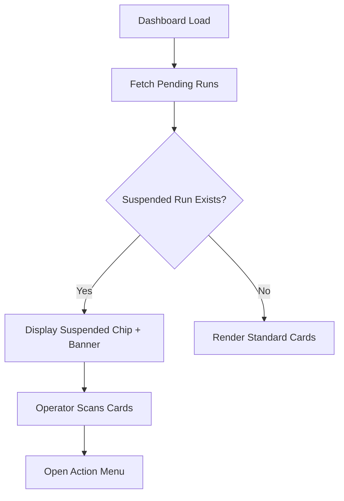
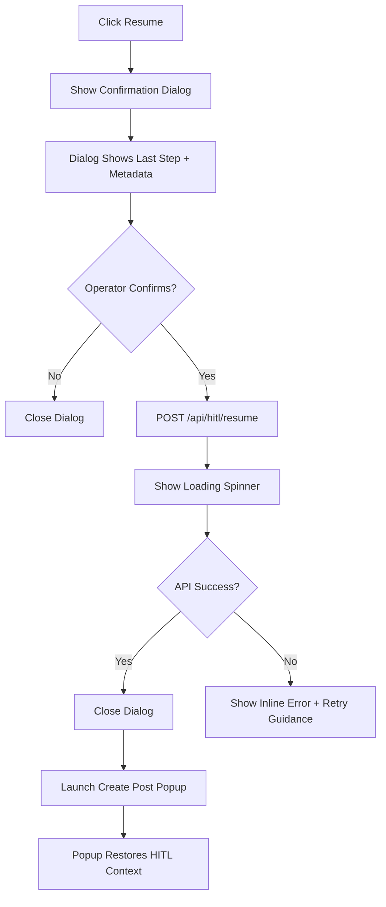

## Epic HITL-1 UI/UX Specification

This document defines the user experience goals, information architecture, user flows, and visual design specifications for AwesomePoster's human-in-the-loop create-post experience. It covers Story 1.3’s in-popup prompt handling and extends to Story 1.4’s restart recovery controls so internal operators can safely resume or remove suspended runs after service restarts.

## Overall UX Goals & Principles

### Target User Personas

- **Orchestration Operator:** Workflow power users monitoring multiple briefs who need fast, keyboard-friendly interactions and clear status cues.
- **Content Strategist:** Occasional users who review paused posts to inject brand voice; they require guidance, explanatory text, and guardrails against mistakes.
- **Support Lead (Secondary Stakeholder):** Supervisors auditing HITL interventions to ensure compliance and training quality.

### Usability Goals

- Orient any operator to the HITL prompt context (what/why) in under 10 seconds.
- Keep total response time—including validation—to under 30 seconds for approving/answering a prompt.
- Maintain single-active-task clarity even during real-time updates, preventing double responses or conflicting actions.
- Achieve error recovery within one interaction cycle by surfacing actionable messaging for backend failures.

### Design Principles

1. **Context at a glance** – Prompt metadata and request intent must be immediately visible to reduce cognitive reset.
2. **Guided flexibility** – Offer multiple response modalities (approve/reject/options/free-form) while steering users with inline validation and helper text.
3. **Calm real-time feedback** – State changes (arrive/resolved/error) should animate subtly, never startling or overwhelming operators already in flow.
4. **Resilient UI** – Design for network/API hiccups with optimistic updates and clear rollback cues so trust in the system remains high.

### Change Log

| Date | Version | Description | Author |
|------|---------|-------------|--------|
| 2025-09-24 | 0.1 | Initial UX spec outline for Story 1.3 | UX Expert |
| 2025-09-25 | 0.2 | Added Story 1.4 restart recovery IA, flows, and UX guidance | UX Expert |

## Information Architecture (IA)

```mermaid
graph TD
    A[Briefing Dashboard] --> B[Brief Card]
    B --> B1[Status Indicator]
    B --> B2[Action Menu]
    B2 --> C[Resume Suspended Run]
    B2 --> D[Remove Suspended Run]
    C --> E[Resume Confirmation Dialog]
    D --> F[Remove Confirmation Dialog]
    E --> G[Create Post Popup (Resumed Context)]
    F --> H[Audit Confirmation Toast]
    A --> I[Run History Drawer]
```

**Primary Navigation:** Operators begin on the briefing dashboard. Suspended runs surface directly on each brief card via a status chip (e.g., “Suspended · Action required”). The action menu exposes “Resume creating post” and “Remove running create post” when Story 1.2 reports a pending thread.

**Secondary Navigation:** From the action menu, operators can open a run history drawer to review recent activity before committing. Within the confirmation dialogs a contextual link (“View HITL runbook guidance”) supports operator education without leaving the dashboard.

**Breadcrumb Strategy:** Dashboard breadcrumbs remain unchanged (“Briefings > {Brief Name}”). The create-post popup only opens after the operator explicitly chooses Resume; it inherits Story 1.3’s panel layout and ribbon without additional breadcrumb layers. Removal confirmations occur inline (dialog + toast), so no breadcrumb adjustments are required.

## User Flows

### Detect Suspended Run on Dashboard

**User Goal:** Spot a briefing that stalled during a restart and understand what action is required.

**Entry Points:** Operator opens the briefing dashboard post-restart or returns from another task; Story 1.2 surfaces `pendingRequestId` via the brief card data.

**Success Criteria:** Operator identifies the suspended briefing within five seconds and opens the action menu to continue.



**Edge Cases & Error Handling:**

- API latency → show skeleton/loading shimmer before rendering suspension details.
- No suspended runs → chips remain hidden to avoid noise.
- Multiple suspended runs → optional dashboard banner summarises counts with a “Filter to suspended” link.
- Run state flips to active while viewing → chip disappears, toast informs “Resumed by Jane Doe”.

**Notes:** Suspended chip uses primary color for visibility; tooltip explains reason (“Service restart detected—action required”).

### Resume Suspended Run

**User Goal:** Restart the orchestration exactly where it left off after the service restart.

**Entry Points:** Operator selects “Resume creating post” from the brief card action menu.

**Success Criteria:** Confirmation dialog communicates last known step, operator confirms, backend resumes successfully, and create-post popup relaunches with restored context.



**Edge Cases & Error Handling:**

- 404 (run missing) → show info banner suggesting refresh; chip clears automatically.
- 409 (another operator resumed) → disable confirm button with message “Already resumed by <name>”.
- Network failure → keep dialog open, highlight retry button, ensure suspension state remains.
- Optional audit note field can capture operator rationale before confirming.

**Notes:** Confirmation dialog should quote the last completed step (“Will resume from ‘Generate caption draft’”) to build trust before reopening the popup.

### Remove Suspended Run

**User Goal:** Safely cancel the stalled orchestration, freeing the briefing for a new run and capturing audit metadata.

**Entry Points:** Operator chooses “Remove running create post” from the action menu.

**Success Criteria:** Operator acknowledges permanence, backend clears persisted records, toast confirms removal with operator and timestamp.

```mermaid
graph TD
    A[Click Remove] --> B[Warning Dialog]
    B --> C[Optional Audit Note Input]
    C --> D{Operator Confirms?}
    D -->|No| E[Close Dialog]
    D -->|Yes| F[POST /api/hitl/remove]
    F --> G[Display Loading State]
    G --> H{API Success?}
    H -->|Yes| I[Show Success Toast]
    I --> J[Update Brief Card (Chip Removed)]
    H -->|No| K[Show Error Banner + Retry Guidance]
```

**Edge Cases & Error Handling:**

- 409 (already removed) → show info toast and clean up locally.
- 422 (audit note required) → inline validation prevents confirm until filled.
- Permission errors → action menu entry disabled with tooltip referencing access policy.
- SSE update arriving during removal → ensure card reconciles with latest backend state post-request.

**Notes:** Success toast should include operator name and timestamp (e.g., “Removed suspended run · Alex Chen · 12:04”). Dialog copy must warn that plan artifacts and HITL records will be deleted.

## Wireframes & Mockups

**Primary Design Files:** Markdown-driven spec; capture quick sketches under `docs/ui/` as PNG/MD exports when ready.

### Suspended Brief Card

**Purpose:** Highlight that a briefing has a suspended orchestration requiring attention directly within the dashboard list/grid.

**Key Elements:**

- Brief card with “Suspended · Action required” chip beneath title
- Secondary line displaying last activity timestamp (“Paused 14m ago”)
- Alert banner (optional) summarizing how many briefs are suspended with CTA to filter
- Action menu icon highlighted when suspension present

**Interaction Notes:** Chip clickable to open action menu; ensure high-contrast text on dark surface.

**Design File Reference:** `docs/ui/hitl-suspended-card.md` (placeholder)

### Resume Confirmation Dialog

**Purpose:** Explain what resuming will do and capture optional audit note before reopening the create-post popup.

**Key Elements:**

- Dialog title “Resume creating post” with brief name
- Summary box showing last completed step, agent responsible, and paused timestamp
- Optional textarea for operator note (character counter)
- Primary button “Resume run”, secondary “Cancel”

**Interaction Notes:** On confirm, button shows inline spinner and disables; success triggers popup launch animation.

**Design File Reference:** `docs/ui/hitl-resume-dialog.md` (placeholder)

### Remove Confirmation Dialog

**Purpose:** Safely guide operators through canceling the suspended run and communicate permanence.

**Key Elements:**

- Warning icon with copy “Removing deletes plan artifacts and HITL records”
- Audit note textarea (required if governance demands)
- Checkbox “I understand this cannot be undone” (optional if policy requires double acknowledgement)
- Destructive primary button “Remove run”

**Interaction Notes:** Button remains disabled until acknowledgements satisfied; success toast appears near card.

**Design File Reference:** `docs/ui/hitl-remove-dialog.md` (placeholder)

### Success Toast / Audit Banner

**Purpose:** Provide immediate confirmation with audit details post action.

**Key Elements:**

- Toast message e.g., “Resumed run · Alex Chen · 12:04”
- Link “View run history” for deeper inspection
- Dismiss icon accessible via keyboard

**Interaction Notes:** Auto-dismiss after 6 seconds, but persistent audit banner appears on brief card until state changes.

**Design File Reference:** `docs/ui/hitl-recovery-toast.md` (placeholder)

## Component Library / Design System

**Design System Approach:** Continue leveraging the AwesomePoster Vuetify dark theme; reuse Story 1.3 HITL panel components and add a recovery-focused set for Story 1.4.

### Suspended Status Chip

**Purpose:** Signal that a briefing requires operator attention due to a suspended run.

**Variants:** Default (suspended), Warning (multiple suspensions), Disabled (permissions restricted).

**States:** Idle, hover/focus, pressed (opens action menu).

**Usage Guidelines:** Place directly under brief title; ensure text is accessible on dark background and attach tooltip explaining suspension reason.

### Brief Action Menu Items

**Purpose:** Provide contextual controls for resuming or removing a suspended run.

**Variants:** Resume, Remove, View history (if available); hidden when no suspension.

**States:** Enabled, disabled (permission denied), loading (while API call in flight).

**Usage Guidelines:** Keep destructive action labeled with icon + text (`mdi-restore`, `mdi-trash-can`). Add confirmation wrappers instead of executing immediately.

### Recovery Confirmation Dialogs

**Purpose:** Collect operator intent and optional audit details before calling backend resume/remove endpoints.

**Variants:** Resume dialog, Remove dialog, Error dialog (fallback when state is stale).

**States:** Default, loading (API in progress), success (auto-close), error (display inline message).

**Usage Guidelines:** Content area should summarize last known run step. Buttons use primary/destructive colors from theme; maintain consistent width with other dialogs.

### Audit Toast & Banners

**Purpose:** Confirm action outcomes and provide quick access to run history for auditing.

**Variants:** Success (green accent), Warning (orange for conflicting state), Info (when someone else acted first).

**States:** Showing, auto-dismiss countdown, persistent (if action requires follow-up).

**Usage Guidelines:** Anchor near right edge of dashboard. Include operator name, timestamp, and link to run history drawer. Avoid stacking more than two toasts; queue additional messages.

## Branding & Style Guide

**Brand Guidelines:** Leverage the existing AwesomePoster dark Vuetify theme; propose extensions only after validation with design leadership.

### Color Palette

| Color Type | Hex Code | Usage |
|------------|----------|-------|
| Primary | `#6EA8FE` | Primary actions (Submit), focus rings, highlight accents |
| Background | `#0B1020` | Global app background; maintain dark ambiance |
| Surface | `#121A33` | Create-post popup body, HITL panel container |
| On-Surface | `#E6E8EF` | Primary text/icons ensuring contrast |
| Surface Variant | `#243055` | Borders, divider lines, subtle outlines |
| On-Surface Variant | `#9AA3B2` | Muted metadata, helper text |
| Success / Warning / Error | Use Vuetify defaults; extend only if operator testing reveals ambiguity |

### Typography

- **Primary:** Roboto (Vuetify default stack)
- **Secondary:** None; rely on Roboto weights (400/500/700)
- **Monospace:** Vuetify default monospace stack (for payload snippets if needed)

| Element | Size | Weight | Line Height |
|---------|------|--------|-------------|
| Heading (Prompt Title) | 20px | 500 | 28px |
| Subheading (Metadata) | 16px | 400 | 24px |
| Body | 16px | 400 | 24px |
| Caption / Helper Text | 14px | 400 | 20px |

## Accessibility Requirements

**Standard:** WCAG 2.1 AA (consistent with existing AwesomePoster commitment)

**Visual:**

- Maintain ≥4.5:1 contrast for chip text and dialog copy on dark surfaces (#121A33).
- Focus indicators use Vuetify primary color rings at ≥2px to remain visible on brief cards and dialog buttons.
- Keep base body size at 16px; dialogs must remain readable if user zooms to 150%.

**Interaction:**

- Keyboard order: Brief card → status chip → action menu → resume/remove options → dialogs (confirm/cancel). Ensure ESC closes dialogs reliably.
- Screen reader announcements: Use ARIA live region for success/failure toasts (“Resumed run completed”). Provide descriptive labels for action menu entries (“Resume suspended run for Brief XYZ”).
- Touch targets: 44x44px minimum for chips, menu items, dialog buttons to prevent mis-taps, especially on tablet views.

**Content:**

- Add `aria-label` or `aria-describedby` explaining suspension reasons and destructive outcomes.
- Dialog headings use semantic `<h2>`; summary boxes use lists to support screen reader parsing.
- Audit note textarea requires explicit label and helper text; validation errors announced inline.

**Testing Strategy:** Combine automated scans (axe, Vuetify lint) with manual keyboard runs on dashboard and dialogs, plus screen reader verification (VoiceOver/NVDA) covering detection, resume, remove, and toast messaging.

## Responsiveness Strategy

| Breakpoint | Min Width | Max Width | Target Devices |
|------------|-----------|-----------|----------------|
| Mobile | 320px | 599px | Phone portrait briefing list |
| Tablet | 600px | 959px | Tablet landscape, small laptops |
| Desktop | 960px | 1439px | Standard desktop dashboard |
| Wide | 1440px | – | Large monitors; multi-column brief grid |

**Layout Changes:**

- Mobile: Suspended chip sits above action menu button; dialogs expand full-screen with sticky confirm bar.
- Tablet: Brief cards display in two-column grid; action menu converts to inline buttons for quicker access.
- Desktop+: Toasts anchor to bottom-right; run history drawer slides in from right without covering entire grid.

**Navigation Changes:** Mobile introduces bottom sheet for action menu options to respect small screens; desktop keeps menu dropdown anchored to card.

**Content Priority:** Mobile summarises suspension reason with single line; details accessible via “More info” link in dialog. Desktop surfaces full metadata (timestamp, last agent) directly on card.

**Interaction Changes:** Ensure swipe gestures for closing dialogs on mobile; keyboard shortcuts (e.g., `R` for resume when card focused) can be added later but not required MVP.

## Animation & Micro-interactions

**Motion Principles:**

- Subtle, purposeful movement only on state change (chip reveal, dialog entry, toast). Avoid distracting loops on the dashboard.
- Follow Vuetify easing curves (`standard`, `decelerate`) and respect `prefers-reduced-motion` by disabling non-essential transitions.
- Motion should reinforce causality: action menu → dialog → toast.

**Key Animations:**

- **Suspended Chip Fade-In:** Chip fades in with 8px upward slide when suspension detected (Duration: 160 ms, Easing: `ease-out`).
- **Dialog Scale:** Resume/remove dialogs scale from 0.94 to 1 with opacity fade (Duration: 180 ms, Easing: `cubic-bezier(0.2, 0, 0, 1)`). Reduced motion users receive instant display.
- **Destructive Warning Shake:** Remove dialog confirm button performs a subtle 4px shake on validation failure (Duration: 220 ms, `ease-in-out`).
- **Audit Toast Slide:** Toast slides up from bottom with fade (Duration: 140 ms, `ease-out`) and reverses on dismissal.

## Performance Considerations

- **Dashboard Detection:** Suspended state check adds <300 ms over standard dashboard load; prefer background fetch with skeleton states.
- **Resume/Remove Actions:** Show inline progress within 200 ms; if API exceeds 500 ms, display explicit “Still working…” message to avoid uncertainty.
- **Animation FPS:** Keep chip/dialog/toast animations at 60 fps on mid-tier laptops; avoid blur-heavy overlays on the dashboard.

**Design Strategies:** Debounce suspended-state updates to avoid chip flicker; prefetch resume dialog copy when hovering action menu; reuse Story 1.2 polling/SSE utilities instead of introducing new intervals.

## Next Steps

1. Review Story 1.4 flows with product/engineering to validate action menu availability, audit requirements, and Story 1.2 data contracts.
2. Produce lightweight mockups (markdown or Excalidraw) for suspended card, resume dialog, and remove dialog and commit under `docs/ui/`.
3. Align with development on API error messaging map (404/409/422) and ensure toasts/logging align with Story 1.2 run history.
4. Track open questions: whether audit note is mandatory, how to expose run history drawer, and if keyboard shortcuts should be introduced for resume/remove.

### Design Handoff Checklist

- [x] All user flows documented
- [x] Component inventory complete
- [x] Accessibility requirements defined
- [x] Responsive strategy clear
- [x] Brand guidelines incorporated
- [x] Performance goals established
